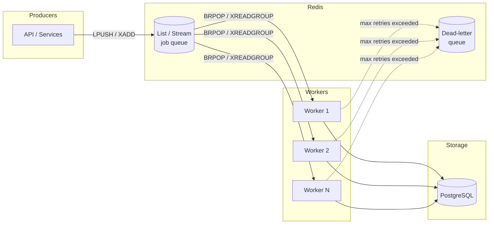

# 2026-05-21 — Redis Queue Architecture

> Decouple HTTP request handlers from slow background work without dropping jobs when traffic spikes.

## Problem

A synchronous API that sends emails, generates PDFs, or calls third-party webhooks during the request path will:

- Blow past latency SLAs under load (p99 spikes)
- Time out when downstream services are slow
- Lose work if the process crashes mid-task

At **10k+ requests/minute**, you need request handlers to enqueue work and return immediately, with durable workers processing the backlog.

## Constraints

- **Scale:** 10k enqueue ops/min, burst to 50k
- **SLA:** API p99 < 100ms; jobs processed within 5 minutes under normal load
- **Delivery:** At-least-once (idempotent workers)
- **Infra:** Redis already in stack; no new message broker yet

## Architecture



Diagram source: [`diagrams/2026-05-21-redis-queue-architecture.mmd`](../diagrams/2026-05-21-redis-queue-architecture.mmd)

### Components

| Component | Role |
|-----------|------|
| **Producer (API)** | Validates payload, serializes job JSON, `LPUSH` or `XADD`, returns 202 |
| **Redis List** | Simple FIFO via `LPUSH` + `BRPOP` — good for single-consumer-per-job |
| **Redis Stream** | Consumer groups, acks, pending entries — better for fan-out and replay |
| **Workers** | Horizontally scaled processes; idempotent handlers; exponential backoff on failure |
| **Dead-letter queue** | Jobs that fail after N retries; alert + manual replay |
| **PostgreSQL** | Source of truth for job outcome / business state |

### Flow

1. Client hits `POST /orders` → API writes order to DB, enqueues `{ type: "send_receipt", orderId }` to Redis
2. API returns `202 Accepted` with `orderId` in < 50ms
3. Worker blocks on `BRPOP queue 0` (or reads from stream consumer group)
4. Worker processes job, updates DB, acks (streams) or simply completes (lists)
5. On failure: retry with backoff; after 5 attempts → push to DLQ, page on-call

### Implementation sketch

```typescript
// Producer
await redis.lpush('jobs:email', JSON.stringify({ orderId, attempt: 0 }));

// Worker
while (true) {
  const [, payload] = await redis.brpop('jobs:email', 0);
  const job = JSON.parse(payload);
  try {
    await sendReceipt(job.orderId);
  } catch (err) {
    if (job.attempt >= 5) await redis.lpush('jobs:email:dlq', payload);
    else await redis.lpush('jobs:email', JSON.stringify({ ...job, attempt: job.attempt + 1 }));
  }
}
```

## Trade-offs

| Choice | Pros | Cons |
|--------|------|------|
| **Redis List** | Simple, fast, well understood | No built-in ack; job lost if worker dies after pop |
| **Redis Stream + consumer group** | Acks, pending reclaim, observability | More complex; need to handle XPENDING |
| **vs RabbitMQ / SQS** | No new infra if Redis exists | Redis is memory-bound; not ideal for huge backlogs |
| **Sync in request** | Strongest consistency story | Doesn't scale; bad UX under load |

**Mitigation for List pop-and-crash:** use `RPOPLPUSH` to a processing list, delete on success (BRPOPLPUSH pattern), or prefer Streams for production.

## When to use

- ✅ Background work that can be async (email, webhooks, thumbnails, search indexing)
- ✅ You already run Redis and backlog fits in memory (or you cap queue depth + shed load)
- ✅ Workers are idempotent (duplicate delivery is OK)

- ❌ Don't use when you need strict ordering across all jobs globally
- ❌ Don't use when backlog is unbounded GB-scale — use SQS/Kafka instead
- ❌ Don't use Redis as sole durability layer for financial ledger events

## References

- [Redis reliable queue pattern (BRPOPLPUSH)](https://redis.io/docs/manual/patterns/distributed-locks/)
- [Redis Streams intro](https://redis.io/docs/data-types/streams/)

---

**Tags:** `#redis` `#queues` `#async` `#scaling` `#background-jobs`
