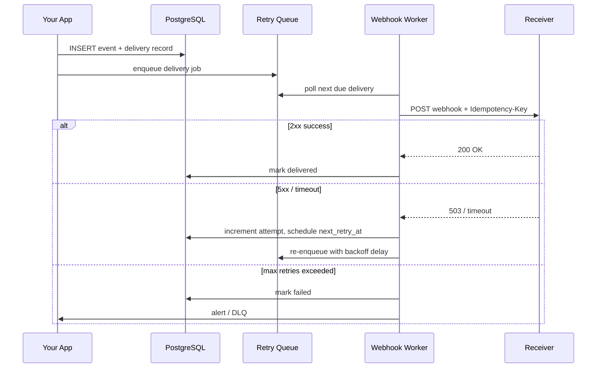

# 2026-05-22 — Webhook Retry Systems

> Deliver webhooks reliably when receivers are down, slow, or return 5xx — without blocking your API or double-charging customers.

## Problem

Your SaaS notifies customer systems via HTTP callbacks (`order.paid`, `user.created`). Receivers:

- Return **503** during deploys
- **Timeout** on slow handlers
- Go **offline** for hours

Fire-and-forget HTTP from the request path loses events. Naive immediate retries hammer dead endpoints and cause **retry storms**. Customers expect **at-least-once delivery** with deduplication on their side.

## Constraints

- **Scale:** 50k webhook deliveries/day, bursts after bulk imports
- **SLA:** 99% delivered within 24h; expose delivery status in dashboard
- **Delivery:** At-least-once; include `Idempotency-Key` header
- **Backoff:** Exponential with jitter; cap at 24h between attempts

## Architecture



Diagram source: [`diagrams/2026-05-22-webhook-retry-systems.mmd`](../diagrams/2026-05-22-webhook-retry-systems.mmd)

### Components

| Component | Role |
|-----------|------|
| **Delivery record** | DB row per attempt: URL, payload hash, status, `next_retry_at`, attempt count |
| **Retry queue** | Delayed jobs (Redis ZSET by score, SQS delay, or DB poll) |
| **Worker** | Signs payload (HMAC), POSTs with timeout, classifies response |
| **DLQ / failed state** | After N attempts; customer can replay from dashboard |

### Flow

1. Business event occurs → persist delivery row + enqueue job (same transaction or outbox)
2. Worker POSTs with `X-Webhook-Id`, `X-Idempotency-Key`, `X-Signature`
3. **2xx** → mark `delivered`
4. **429/503/timeout** → schedule retry: `min(base * 2^attempt + jitter, max_delay)`
5. **410 / disabled endpoint** → stop retrying, notify customer
6. Customer replays manually → new delivery id, same idempotency key optional

### Implementation sketch

```typescript
const delays = [60, 300, 900, 3600, 14400, 86400]; // seconds

async function scheduleRetry(delivery: Delivery, error: string) {
  const attempt = delivery.attempt + 1;
  if (attempt > delays.length) return markFailed(delivery);
  const nextAt = Date.now() + delays[attempt - 1] * 1000 * (0.8 + Math.random() * 0.4);
  await db.update(delivery.id, { attempt, nextRetryAt: nextAt, lastError: error });
  await queue.schedule(delivery.id, nextAt);
}
```

## Trade-offs

| Choice | Pros | Cons |
|--------|------|------|
| **DB polling on `next_retry_at`** | Simple, durable, easy to query status | Poll interval vs latency trade-off |
| **Redis delayed queue** | Fast scheduling | Another durability concern |
| **SQS + visibility timeout** | Managed, scales | Less flexible backoff curves |
| **Sync webhook in request** | Immediate feedback | Doesn't scale; blocks users |

## When to use

- ✅ You expose webhooks to third parties (Stripe-style integrations)
- ✅ Receivers are unreliable; you own delivery guarantees
- ✅ You sign payloads and document idempotency for customers

- ❌ Don't retry **4xx** (except 429) — fix the payload or stop
- ❌ Don't retry forever — cap attempts and surface failures
- ❌ Don't skip signing — receivers must verify authenticity

## References

- [Stripe webhooks best practices](https://stripe.com/docs/webhooks/best-practices)
- [Standard Webhooks specification](https://www.standardwebhooks.com/)

---

**Tags:** `#webhooks` `#retries` `#idempotency` `#reliability` `#backoff`
