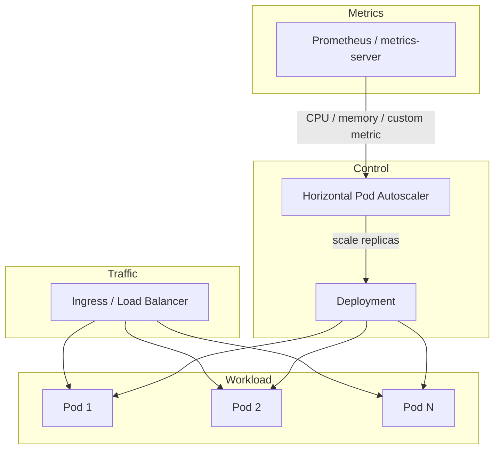

# 2026-05-23 — Kubernetes HPA Scaling

> Scale pod replicas automatically when CPU, memory, or custom metrics cross thresholds — without manual kubectl edits at 2am.

## Problem

Traffic spikes (product launch, viral tweet, batch job overlap) push pod CPU to 100%. Fixed replica counts mean:

- **Under-provisioned:** latency spikes, 503s, HPA-unaware queues grow
- **Over-provisioned:** wasted cloud spend 23 hours/day

Manual scaling doesn't react in time. You need the control plane to add/remove pods based on **observed load**.

## Constraints

- **Scale:** 10 → 200 pods; scale-up in < 2 min, scale-down gradually
- **Metrics:** CPU target 70%; optional custom metric (queue depth, RPS)
- **Cost:** min 3 replicas for HA; max capped to protect budget
- **Infra:** EKS/GKE, metrics-server installed, Deployment already defined

## Architecture



Diagram source: [`diagrams/2026-05-23-kubernetes-hpa-scaling.mmd`](../diagrams/2026-05-23-kubernetes-hpa-scaling.mmd)

### Components

| Component | Role |
|-----------|------|
| **metrics-server** | Aggregates pod CPU/memory for default HPA |
| **HPA** | Compares current vs target utilization; updates Deployment `replicas` |
| **Deployment** | Rolling updates; owns ReplicaSet and pod template |
| **Custom metrics adapter** | Exposes Prometheus metrics (queue lag, RPS) to HPA API |
| **PDB (Pod Disruption Budget)** | Ensures min available during scale-down / node drain |

### Flow

1. HPA loop (every 15s default): `desired = ceil(currentReplicas * (currentMetric / targetMetric))`
2. Scale-up: immediate (can double replicas per 15s window by default)
3. Scale-down: stabilization window (default 5 min) prevents flapping
4. New pods pass readiness probe → receive traffic from Service/Ingress

### Implementation sketch

```yaml
apiVersion: autoscaling/v2
kind: HorizontalPodAutoscaler
metadata:
  name: api-hpa
spec:
  scaleTargetRef:
    apiVersion: apps/v1
    kind: Deployment
    name: api
  minReplicas: 3
  maxReplicas: 200
  metrics:
    - type: Resource
      resource:
        name: cpu
        target:
          type: Utilization
          averageUtilization: 70
  behavior:
    scaleDown:
      stabilizationWindowSeconds: 300
```

## Trade-offs

| Choice | Pros | Cons |
|--------|------|------|
| **CPU-based HPA** | Zero extra setup with metrics-server | Laggy for I/O-bound or event-driven workloads |
| **Custom metric (queue depth)** | Scales before CPU spikes | Requires Prometheus adapter + tuning |
| **KEDA (event-driven)** | Scale to zero, Kafka/SQS triggers | Extra operator to run |
| **VPA (vertical)** | Right-sizes CPU/memory requests | Doesn't replace horizontal scale for RPS |

**Common pitfall:** CPU target on pods with **missing resource requests** → HPA can't compute utilization.

## When to use

- ✅ Stateless HTTP/gRPC services behind a load balancer
- ✅ Load correlates with CPU, memory, or a measurable queue/RPS metric
- ✅ Pods start fast (< 30s to ready)

- ❌ Don't rely on CPU HPA alone for **batch workers** — use KEDA on queue length
- ❌ Don't set `maxReplicas` unbounded without cost alerts
- ❌ Don't scale StatefulSets with local disk without understanding pod identity

## References

- [Kubernetes HPA documentation](https://kubernetes.io/docs/tasks/run-application/horizontal-pod-autoscale/)
- [KEDA scalers](https://keda.sh/docs/scalers/)

---

**Tags:** `#kubernetes` `#hpa` `#autoscaling` `#devops` `#scaling`
