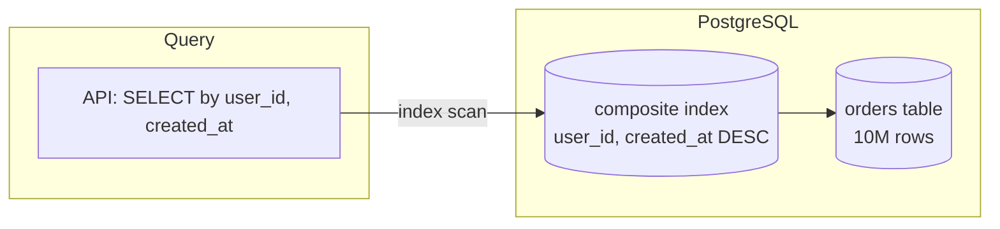

# 2026-05-24 — PostgreSQL Indexing Strategies

> Cut read latency on large tables without turning every write into a full index rebuild.

## Problem

A `SELECT * FROM orders WHERE user_id = ? ORDER BY created_at DESC LIMIT 20` on a **10M-row** table does a sequential scan → **800ms p99**. Adding random indexes "fixes" one query but:

- Slows **INSERT/UPDATE** (every index must be maintained)
- Wastes disk and **buffer cache**
- Creates unused indexes that confuse the planner

You need indexes aligned to **actual query patterns**.

## Constraints

- **Scale:** 10M orders, 50k inserts/day, 500k reads/day
- **SLA:** List-orders p99 < 50ms
- **Writes:** Must not degrade checkout INSERT below 20ms
- **Ops:** `CREATE INDEX CONCURRENTLY` — no long write locks in prod

## Architecture



Diagram source: [`diagrams/2026-05-24-postgresql-indexing-strategies.mmd`](../diagrams/2026-05-24-postgresql-indexing-strategies.mmd)

### Components

| Component | Role |
|-----------|------|
| **Composite index `(user_id, created_at DESC)`** | Covers filter + sort; index-only scan if columns included |
| **Partial index** | Index subset: `WHERE status = 'pending'` for hot paths only |
| **EXPLAIN ANALYZE** | Validates index scan vs seq scan before/after |
| **pg_stat_user_indexes** | Finds unused indexes (`idx_scan = 0`) |

### Flow

1. Capture slow queries via `pg_stat_statements` or APM
2. Run `EXPLAIN (ANALYZE, BUFFERS)` on production-like data
3. Match index column order to **equality filters first**, then **range/sort**
4. Deploy with `CREATE INDEX CONCURRENTLY idx_orders_user_created ON orders (user_id, created_at DESC)`
5. Monitor write latency and index hit rate

### Implementation sketch

```sql
-- Query pattern: user's recent orders
CREATE INDEX CONCURRENTLY idx_orders_user_created
  ON orders (user_id, created_at DESC);

-- Partial: admin dashboard for open tickets only
CREATE INDEX CONCURRENTLY idx_orders_pending
  ON orders (created_at)
  WHERE status = 'pending';

-- Verify
EXPLAIN ANALYZE
SELECT * FROM orders
WHERE user_id = 'uuid-here'
ORDER BY created_at DESC
LIMIT 20;
```

## Trade-offs

| Choice | Pros | Cons |
|--------|------|------|
| **Composite index** | One index serves filter + sort | Wrong column order = useless index |
| **Partial index** | Smaller, faster for hot subset | Only helps queries matching predicate |
| **Covering index (INCLUDE)** | Index-only scans, fewer heap fetches | Wider index, more write cost |
| **GIN for JSONB/full-text** | Fast `@>` / `@@` queries | Large, expensive to update |

**Rule of thumb:** index for queries that run **often** and are **slow** — not every column in the schema.

## When to use

- ✅ Read-heavy paths with clear WHERE + ORDER BY patterns
- ✅ Tables beyond ~100k rows where seq scans hurt
- ✅ You've measured with EXPLAIN, not guessed

- ❌ Don't index low-cardinality columns alone (e.g. `boolean is_active`)
- ❌ Don't duplicate indexes: `(a,b)` often covers `(a)` queries
- ❌ Don't create indexes before you have query volume — measure first

## References

- [PostgreSQL index types](https://www.postgresql.org/docs/current/indexes-types.html)
- [Use The Index, Luke](https://use-the-index-luke.com/)

---

**Tags:** `#postgresql` `#indexing` `#query-performance` `#database` `#scaling`
