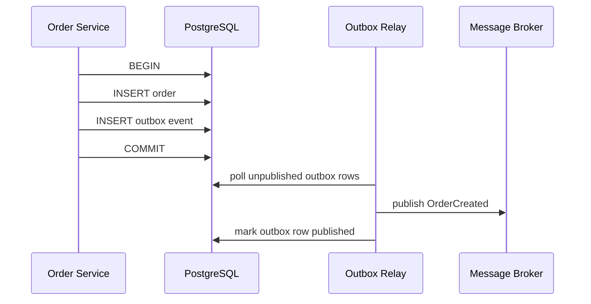

# 2026-05-25 — Transactional Outbox Pattern

> Publish domain events atomically with database writes — eliminate "DB committed but message never sent" dual-write bugs.

## Problem

`createOrder()` must save to PostgreSQL **and** notify inventory/search/email services. Two failure modes:

1. DB commits, **message publish fails** → downstream never hears about the order
2. Message publishes, **DB rolls back** → ghost events, inconsistent state

Naive "write DB then publish to Kafka" is **not atomic**. You need a pattern where both happen in one transaction or an equivalent guarantee.

## Constraints

- **Scale:** 2k orders/sec peak; events must propagate within seconds
- **Consistency:** Event never published without committed write; eventually published after commit
- **Infra:** PostgreSQL + Kafka/RabbitMQ/SNS
- **Consumers:** Idempotent handlers keyed by `event_id`

## Architecture



Diagram source: [`diagrams/2026-05-25-transactional-outbox-pattern.mmd`](../diagrams/2026-05-25-transactional-outbox-pattern.mmd)

### Components

| Component | Role |
|-----------|------|
| **Outbox table** | Same DB: `id`, `aggregate_id`, `type`, `payload`, `created_at`, `published_at` |
| **Application** | Single transaction: business write + outbox insert |
| **Relay (CDC or poller)** | Reads unpublished rows, publishes, marks done |
| **Message broker** | Fan-out to inventory, search, analytics |
| **Debezium (optional)** | CDC from WAL instead of polling — lower latency |

### Flow

1. `BEGIN` → insert `orders` row → insert `outbox` row with JSON payload → `COMMIT`
2. Relay polls `WHERE published_at IS NULL ORDER BY id LIMIT 100 FOR UPDATE SKIP LOCKED`
3. Publish to topic `orders.created` with key = `order_id`
4. On broker ack → `UPDATE outbox SET published_at = now() WHERE id = ?`
5. Crash between publish and mark? **At-least-once** — consumers dedupe by `event_id`

### Implementation sketch

```typescript
await db.transaction(async (tx) => {
  const order = await tx.orders.insert({ ... });
  await tx.outbox.insert({
    aggregateId: order.id,
    type: 'OrderCreated',
    payload: JSON.stringify(order),
  });
});
// separate process relays outbox → Kafka
```

## Trade-offs

| Choice | Pros | Cons |
|--------|------|------|
| **Transactional outbox** | Strong consistency with DB; simple mental model | Relay lag; outbox table growth |
| **Polling relay** | Easy to implement | 1–5s latency typical |
| **CDC (Debezium)** | Near real-time from WAL | Operational complexity |
| **Dual write (no outbox)** | Fewer moving parts | Data loss / inconsistency under failure |

## When to use

- ✅ Microservices notifying each other after local DB commits
- ✅ Event-driven architecture with PostgreSQL as system of record
- ✅ You can tolerate **seconds** of propagation delay

- ❌ Don't use outbox for synchronous read-your-writes across services — use API call or cache
- ❌ Don't forget to **purge/archived** published outbox rows
- ❌ Don't skip idempotent consumers — relay will duplicate

## References

- [Microservices.io — Transactional outbox](https://microservices.io/patterns/data/transactional-outbox.html)
- [Debezium outbox event router](https://debezium.io/documentation/reference/stable/transformations/outbox-event-router.html)

---

**Tags:** `#event-driven` `#outbox` `#consistency` `#microservices` `#postgresql`
