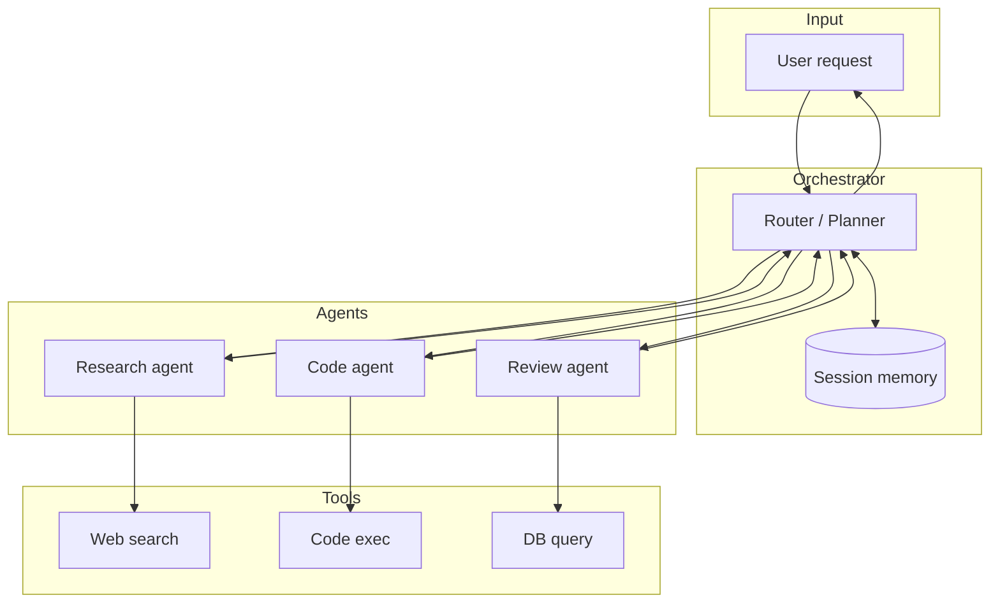

# 2026-05-26 — AI Agent Orchestration

> Route complex tasks across specialized LLM agents with tools, memory, and fallbacks — without one monolithic prompt doing everything poorly.

## Problem

A single chat completion trying to **research**, **write code**, **run tests**, and **summarize** in one shot:

- Hallucinates tool results it never executed
- Blows context limits on long tasks
- Can't recover when one step fails

Production AI features (support bots, codegen assistants, data analysts) need **multi-step orchestration** with bounded responsibility per agent.

## Constraints

- **Scale:** 500 concurrent sessions; p95 turn latency < 15s
- **Cost:** Cap tokens per session; route simple queries to smaller models
- **Safety:** Tool calls sandboxed; human approval for destructive actions
- **Reliability:** Fallback when primary model times out or rate-limits

## Architecture



Diagram source: [`diagrams/2026-05-26-ai-agent-orchestration.mmd`](../diagrams/2026-05-26-ai-agent-orchestration.mmd)

### Components

| Component | Role |
|-----------|------|
| **Orchestrator / router** | Classifies intent, picks agent, manages step loop (ReAct / plan-execute) |
| **Specialized agents** | Narrow system prompts + tool sets per domain |
| **Session memory** | Short-term (conversation) + long-term (vector store for user facts) |
| **Tool layer** | Typed functions with auth, timeouts, structured JSON results |
| **Guardrails** | Output validation, PII filter, max iteration budget |

### Flow

1. User: "Fix the failing test in PR #42 and explain the bug"
2. Router → **Research agent** fetches PR diff via tool
3. Router → **Code agent** proposes patch, runs test tool in sandbox
4. Router → **Review agent** checks diff quality, summarizes for user
5. Orchestrator streams final answer; memory stores PR context for follow-ups

### Implementation sketch

```typescript
async function runAgentLoop(session: Session, userMessage: string) {
  const plan = await router.plan(session, userMessage);
  for (const step of plan.steps) {
    const agent = agents[step.agentId];
    const result = await agent.run({
      messages: session.messages,
      tools: agent.tools,
      maxIterations: 5,
    });
    session.messages.push(...result.messages);
    if (result.status === 'needs_human') break;
  }
  return session.messages.at(-1).content;
}
```

## Trade-offs

| Choice | Pros | Cons |
|--------|------|------|
| **Single agent + many tools** | Simpler deployment | Prompt confusion; worse at long tasks |
| **Multi-agent orchestration** | Specialization, clearer failures | Latency stacks; harder to debug |
| **Plan-then-execute** | Predictable steps | Brittle if plan wrong upfront |
| **ReAct loop** | Adapts mid-flight | Unbounded loops without caps |

## When to use

- ✅ Multi-step workflows: research → act → verify
- ✅ Different models per step (cheap router, strong coder)
- ✅ Tool use is required (APIs, DB, code execution)

- ❌ Don't orchestrate for single-turn FAQ — one small model suffices
- ❌ Don't give all agents all tools — least privilege per agent
- ❌ Don't skip iteration/token limits — runaway loops are expensive

## References

- [LangGraph — stateful agent workflows](https://langchain-ai.github.io/langgraph/)
- [OpenAI function calling guide](https://platform.openai.com/docs/guides/function-calling)

---

**Tags:** `#ai-agents` `#llm` `#orchestration` `#tools` `#architecture`
