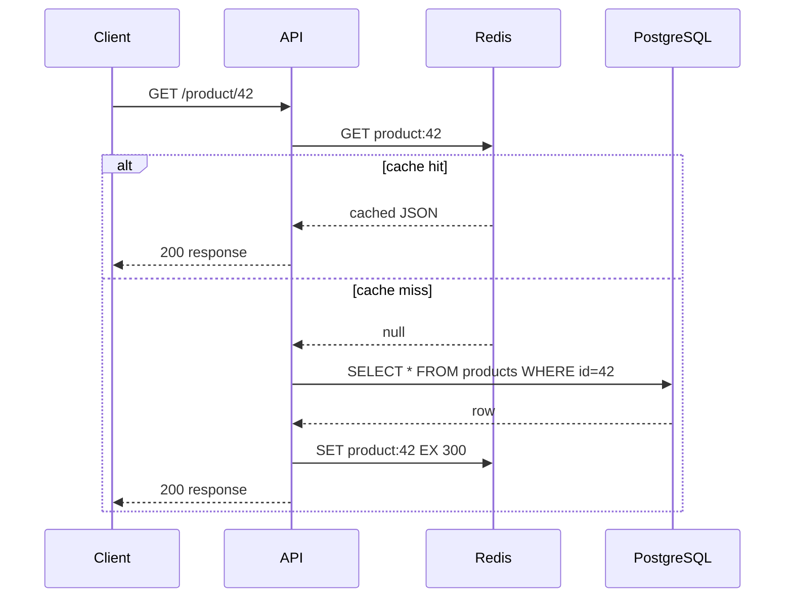

# 2026-05-27 — Cache-Aside with Redis

> Serve hot reads from memory without sacrificing PostgreSQL as the source of truth.

## Problem

Your product detail API hits Postgres on every page view. At **10k RPS**, the same popular SKUs hammer the database:

- Connection pool exhaustion
- Read replicas lag under load
- p99 latency climbs even though data changes rarely

Caching is mandatory — but **who writes the cache** and **what happens on updates** must be explicit.

## Constraints

- **Scale:** 10k reads/sec; 100 writes/sec on catalog
- **SLA:** p99 read < 10ms; stale data OK for ≤ 5 minutes
- **Consistency:** Cache-aside (lazy load); invalidate on write
- **Infra:** Redis cluster; Postgres primary + replica

## Architecture



Diagram source: [`diagrams/2026-05-27-cache-aside-redis.mmd`](../diagrams/2026-05-27-cache-aside-redis.mmd)

### Components

| Component | Role |
|-----------|------|
| **Application (cache-aside)** | App reads cache first; on miss, loads DB and populates cache |
| **Redis** | Key-value with TTL; `product:{id}` → serialized JSON |
| **TTL** | Bound staleness; 300s typical for catalog |
| **Invalidation** | On UPDATE/DELETE: `DEL product:{id}` before or after DB commit |
| **Stampede protection** | Single-flight lock or short-lived "loading" placeholder on miss |

### Flow

1. **Read:** `GET product:42` → hit → return
2. **Miss:** query DB → `SET product:42 json EX 300` → return
3. **Write:** update DB → `DEL product:42` (next read repopulates)
4. **Thundering herd:** use `SETNX lock:product:42` — one worker loads DB, others wait/retry

### Implementation sketch

```typescript
async function getProduct(id: string) {
  const cached = await redis.get(`product:${id}`);
  if (cached) return JSON.parse(cached);

  const lock = await redis.set(`lock:product:${id}`, '1', 'NX', 'EX', 10);
  if (!lock) await sleep(50); return getProduct(id);

  try {
    const row = await db.products.findById(id);
    if (row) await redis.set(`product:${id}`, JSON.stringify(row), 'EX', 300);
    return row;
  } finally {
    await redis.del(`lock:product:${id}`);
  }
}
```

## Trade-offs

| Choice | Pros | Cons |
|--------|------|------|
| **Cache-aside** | App controls logic; cache only what's read | Stale window; miss latency spike |
| **Write-through** | Cache always warm on write | Write path slower; unused keys cached |
| **Read-through (library)** | Cleaner app code | Less control over stampede/ TTL |
| **No TTL + event invalidation** | Stronger freshness | Miss invalidation = stale forever |

## When to use

- ✅ Read-heavy, relatively stable data (profiles, product catalog, config)
- ✅ Occasional staleness is acceptable
- ✅ You can invalidate on every write path

- ❌ Don't cache highly personalized per-request data with low hit rate
- ❌ Don't cache without TTL — memory leaks on unused keys
- ❌ Don't use cache as sole store for financial balances

## References

- [Redis caching patterns](https://redis.io/docs/manual/patterns/)
- [AWS cache-aside pattern](https://docs.aws.amazon.com/whitepapers/latest/database-caching-strategies-using-redis/cache-aside-pattern.html)

---

**Tags:** `#caching` `#redis` `#cache-aside` `#performance` `#scaling`
