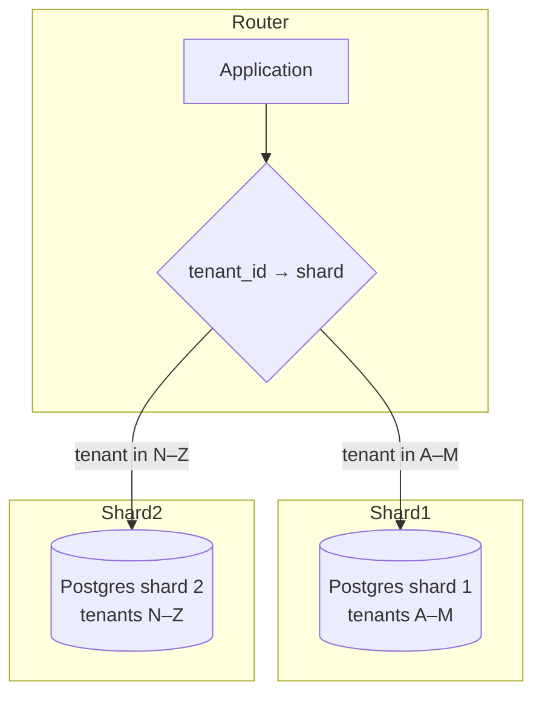

# 2026-05-28 — Database Sharding by Tenant

> Isolate noisy tenants and scale writes beyond a single PostgreSQL instance.

## Problem

Multi-tenant SaaS on one Postgres cluster: one enterprise customer runs heavy reports and **saturates IOPS**. Everyone's p99 degrades. Vertical scaling (bigger instance) hits a ceiling and gets expensive.

You need **horizontal partition** so Tenant A's load doesn't crush Tenant B — and total write throughput can grow with shard count.

## Constraints

- **Scale:** 5k tenants; top 10 = 40% of write load
- **Isolation:** Noisy neighbor must not spike shared tenant p99 > 2x baseline
- **Routing:** O(1) lookup: `tenant_id` → shard
- **Migrations:** Support rebalancing tenants between shards (later problem)

## Architecture



Diagram source: [`diagrams/2026-05-28-database-sharding-by-tenant.mmd`](../diagrams/2026-05-28-database-sharding-by-tenant.mmd)

### Components

| Component | Role |
|-----------|------|
| **Shard map** | Config/DB: `tenant_id → shard_id` (hash or range) |
| **Router middleware** | Resolves connection pool per request from JWT `tenant_id` |
| **Shard DB** | Full schema copy per shard; no cross-shard FKs |
| **Global metadata DB** | Users, billing, shard assignments only |
| **Citizen migrations** | Flyway/Liquibase run per shard |

### Flow

1. Request arrives with `tenant_id` from auth token
2. Router loads shard from map (cached in memory)
3. All queries use that shard's connection: `orders`, `invoices`, etc.
4. Cross-tenant admin reports → fan-out query + merge (or separate analytics warehouse)

### Implementation sketch

```typescript
const shardMap = new Map<string, number>(); // tenantId → shardId

function getPool(tenantId: string): Pool {
  const shardId = shardMap.get(tenantId) ?? hash(tenantId) % SHARD_COUNT;
  return pools[shardId];
}

async function createOrder(tenantId: string, data: OrderInput) {
  const pool = getPool(tenantId);
  return pool.query('INSERT INTO orders ...', [tenantId, ...]);
}
```

## Trade-offs

| Choice | Pros | Cons |
|--------|------|------|
| **Shard by tenant** | Strong isolation; simple queries stay local | Hot tenant still hot on one shard |
| **Hash tenant_id** | Even spread | Hard to colocate enterprise on dedicated hardware |
| **Range by tenant tier** | Free tier shard 0, enterprise shard N | Manual rebalancing |
| **Single DB + RLS** | Simpler ops | Shared resource ceiling; weaker isolation |

**Hot tenant mitigation:** move one `tenant_id` to dedicated shard without changing app query shape.

## When to use

- ✅ Clear tenant boundary in every query (`WHERE tenant_id = ?`)
- ✅ Single Postgres CPU/IOPS maxed; replicas don't fix write bottleneck
- ✅ No cross-tenant transactional requirements

- ❌ Don't shard day one — optimize indexes and connection pooling first
- ❌ Don't allow cross-shard JOINs in OLTP paths
- ❌ Don't forget backup/restore **per shard**

## References

- [Citus multi-tenant sharding](https://docs.citusdata.com/en/stable/use_cases/multi_tenant_applications.html)
- [AWS Aurora Limitless (sharded Postgres)](https://docs.aws.amazon.com/AmazonRDS/latest/AuroraUserGuide/limitless.html)

---

**Tags:** `#sharding` `#multi-tenant` `#scaling` `#postgresql` `#architecture`
