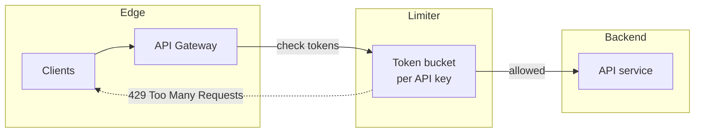

# 2026-05-29 — Token Bucket Rate Limiting

> Protect APIs from abuse and traffic spikes with smooth, burst-tolerant limits per client.

## Problem

Public API endpoints face:

- **Accidental loops** (buggy client retrying 10k/sec)
- **Malicious abuse** (credential stuffing, scraping)
- **Shared capacity** exhaustion affecting paying customers

Fixed "100 req/min" counters reject legitimate bursts (user opens 5 tabs). You need limits that allow **short bursts** but enforce **sustained throughput**.

## Constraints

- **Scale:** 20k RPS aggregate; limit per API key
- **Policy:** 1000 req/min sustained, burst up to 200 immediately
- **Response:** `429 Too Many Requests` + `Retry-After` header
- **Placement:** Edge (API gateway) before app servers

## Architecture



Diagram source: [`diagrams/2026-05-29-token-bucket-rate-limiting.mmd`](../diagrams/2026-05-29-token-bucket-rate-limiting.mmd)

### Components

| Component | Role |
|-----------|------|
| **Token bucket** | Bucket holds max `B` tokens; refill at rate `R` per second |
| **Redis (distributed)** | `INCR` + Lua script or `GCRA` cell for cluster-wide limits |
| **API gateway** | Kong, Envoy, nginx — enforce before backend |
| **Identity key** | API key, user ID, or IP (least preferred) |
| **Headers** | `X-RateLimit-Limit`, `Remaining`, `Reset` |

### Flow

1. Request arrives with `Authorization: Bearer sk_live_...`
2. Limiter key = `ratelimit:{api_key}`
3. If tokens ≥ 1: decrement, forward to backend
4. Else: return 429 with `Retry-After: ceil(seconds_until_token)`
5. Background: refill tokens at configured rate up to burst cap

### Implementation sketch

```lua
-- Redis Lua: token bucket simplified
local tokens = tonumber(redis.call('GET', KEYS[1]) or ARGV[1])
local last = tonumber(redis.call('GET', KEYS[2]) or ARGV[3])
local now = tonumber(ARGV[3])
local rate = tonumber(ARGV[4])
local cap = tonumber(ARGV[1])
tokens = math.min(cap, tokens + (now - last) * rate)
if tokens >= 1 then
  tokens = tokens - 1
  redis.call('SET', KEYS[1], tokens)
  redis.call('SET', KEYS[2], now)
  return 1
end
return 0
```

## Trade-offs

| Choice | Pros | Cons |
|--------|------|------|
| **Token bucket** | Allows controlled bursts | Harder to explain than fixed window |
| **Fixed window** | Simple | Boundary spike at window reset |
| **Sliding window log** | Precise | Memory-heavy per key |
| **Leaky bucket** | Smooth output rate | Less burst-friendly |

| Placement | Pros | Cons |
|-----------|------|------|
| **Edge/gateway** | Protects entire stack | Coarse rules |
| **App middleware** | Business-aware limits | Too late if gateway missing |

## When to use

- ✅ Public or partner APIs with identifiable clients
- ✅ You need burst tolerance (UI loads, batch uploads)
- ✅ Protecting shared DB/backend from overload

- ❌ Don't rate-limit solely by IP behind NAT — unfair to corporate users
- ❌ Don't return 429 without `Retry-After` — clients can't backoff properly
- ❌ Don't forget **global** limit in addition to per-key (total cluster capacity)

## References

- [IETF RateLimit header fields draft](https://datatracker.ietf.org/doc/html/draft-ietf-httpapi-ratelimit-headers)
- [Redis rate limiting patterns](https://redis.io/docs/latest/develop/clients/patterns/rate-limiting/)

---

**Tags:** `#rate-limiting` `#api-gateway` `#redis` `#security` `#scaling`
