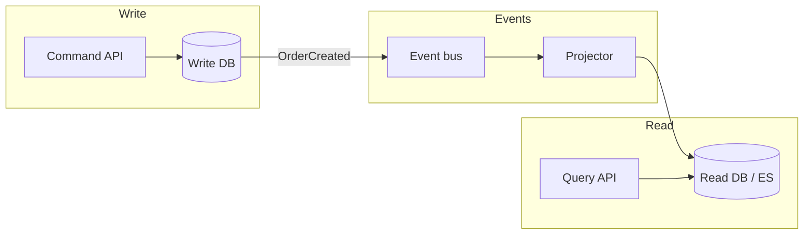

# 2026-05-30 — CQRS Read Models

> Optimize read paths separately when writes and queries have different shapes, scale, and consistency needs.

## Problem

One relational model serves both `POST /orders` (simple insert) and `GET /dashboard` (aggregates across 6 joins, filters, sorts). Optimizing the dashboard:

- Adds indexes that **slow writes**
- Forces complex queries on **OLTP** connection pools
- Couples deploy of read UI changes to write schema migrations

Reads and writes **diverge** — treating them the same doesn't scale past moderate traffic.

## Constraints

- **Scale:** 500 writes/sec orders; 5k reads/sec dashboard/list views
- **Consistency:** Read model **eventually consistent** (< 2s lag acceptable)
- **Team:** Separate frontend dashboard team wants fast iteration on views
- **Storage:** Write DB = Postgres; read = Postgres replica or Elasticsearch

## Architecture



Diagram source: [`diagrams/2026-05-30-cqrs-read-models.mmd`](../diagrams/2026-05-30-cqrs-read-models.mmd)

### Components

| Component | Role |
|-----------|------|
| **Command side** | Validates business rules; writes normalized aggregate to write DB |
| **Domain events** | `OrderCreated`, `OrderShipped` — facts, past tense |
| **Projector / consumer** | Builds denormalized read documents/tables from events |
| **Query API** | Read-only; serves precomputed views — no heavy joins at request time |
| **Read store** | Denormalized: `order_dashboard_view` or ES index `orders_v1` |

### Flow

1. `POST /orders` → command handler → insert `orders` + line items → emit `OrderCreated`
2. Projector consumes event → upsert `order_list_view` with customer name, total, status badge fields
3. `GET /orders?status=shipped` → query API hits read model only — single indexed lookup
4. `OrderShipped` event → projector patches status field in read model

### Implementation sketch

```typescript
// Projector
async function onOrderCreated(event: OrderCreated) {
  await readDb.orderListView.upsert({
    id: event.orderId,
    customerName: event.customerName,
    totalCents: event.totalCents,
    status: 'pending',
    createdAt: event.timestamp,
  });
}

// Query API — no joins
async function listOrders(filters: ListFilters) {
  return readDb.orderListView.find({ status: filters.status })
    .sort({ createdAt: -1 })
    .limit(50);
}
```

## Trade-offs

| Choice | Pros | Cons |
|--------|------|------|
| **CQRS (separate read models)** | Independent scaling; tuned indexes per view | Eventual consistency; more code |
| **Single model + read replicas** | Simpler; strong consistency on read replica lag | Joins still expensive |
| **Materialized views in Postgres** | Less infra | Refresh lag; limited flexibility |
| **Full event sourcing** | Complete audit trail | Steep complexity; not required for CQRS |

**CQRS ≠ Event Sourcing.** You can CQRS with simple outbox events without storing all state as events.

## When to use

- ✅ Read/write ratio heavily skewed (>10:1)
- ✅ Query patterns need denormalization (feeds, dashboards, search)
- ✅ Eventual consistency is acceptable in UI

- ❌ Don't CQRS a CRUD admin with 5 users — YAGNI
- ❌ Don't build 20 read models upfront — add per slow query
- ❌ Don't expose write model directly to reads "temporarily" — it becomes permanent

## References

- [Martin Fowler — CQRS](https://martinfowler.com/bliki/CQRS.html)
- [Microsoft — CQRS pattern](https://learn.microsoft.com/en-us/azure/architecture/patterns/cqrs)

---

**Tags:** `#cqrs` `#read-models` `#event-driven` `#architecture` `#scaling`
