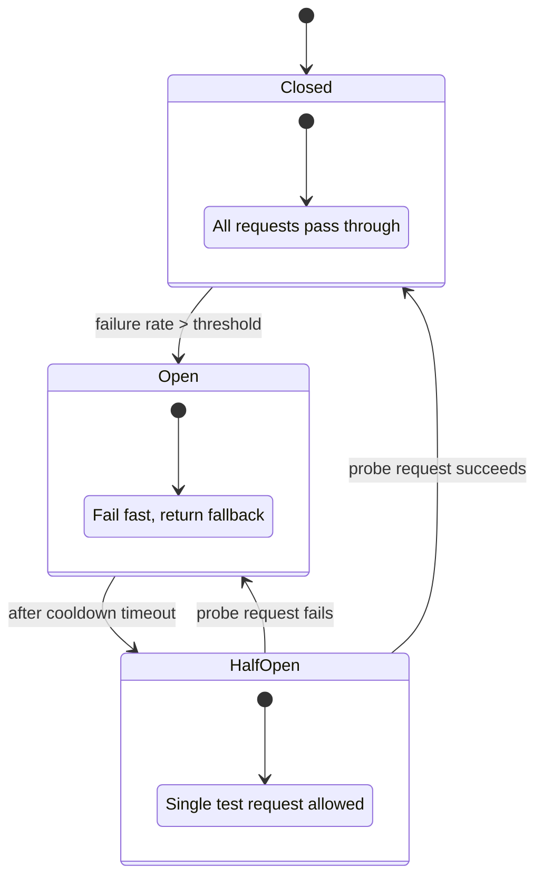

# 2026-05-31 — Circuit Breaker for Downstream Calls

> Fail fast when dependencies are unhealthy instead of cascading timeouts across your entire service mesh.

## Problem

Service A calls Service B calls Service C. C has a **DB outage** — every call hangs for 30s timeout. A's thread pool fills, health checks fail, **your whole API goes down** because of one leaf dependency.

Retries make it worse: 1000 clients × 3 retries × 30s = resource meltdown. You need to **stop calling** known-bad dependencies and recover gracefully.

## Constraints

- **Scale:** 2k RPS to Service A; B fails 50% of requests during incident
- **SLA:** Return degraded response in < 100ms when B is down
- **Recovery:** Auto-probe B after cooldown; no manual restart
- **Scope:** Per dependency (payment, inventory, recommendations)

## Architecture



Diagram source: [`diagrams/2026-05-31-circuit-breaker-downstream-calls.mmd`](../diagrams/2026-05-31-circuit-breaker-downstream-calls.mmd)

### Components

| Component | Role |
|-----------|------|
| **Circuit breaker** | Tracks failure rate in sliding window; state machine Closed/Open/Half-Open |
| **Fallback** | Cached default, stale data, or explicit "payments unavailable" error |
| **Bulkhead** | Separate thread pool / concurrency limit per downstream |
| **Timeout** | Aggressive (1–3s) — breaker triggers before thread exhaustion |
| **Metrics** | `circuit_state`, `fallback_count` for dashboards |

### Flow

1. **Closed:** requests pass through; failures counted in window (e.g. last 10s)
2. Failures > 50% in window → **Open:** immediate fallback, no network call
3. After 30s cooldown → **Half-Open:** one probe request allowed
4. Probe succeeds → **Closed**; fails → **Open** again

### Implementation sketch

```typescript
const breaker = new CircuitBreaker(callPaymentService, {
  timeout: 3000,
  errorThresholdPercentage: 50,
  resetTimeout: 30000,
  volumeThreshold: 10,
});

breaker.fallback(() => ({ status: 'degraded', message: 'Payments temporarily unavailable' }));

async function checkout(req: CheckoutRequest) {
  try {
    return await breaker.fire(req);
  } catch {
    return { queued: true, message: 'Order saved; payment will retry' };
  }
}
```

## Trade-offs

| Choice | Pros | Cons |
|--------|------|------|
| **Circuit breaker** | Protects caller; fast failure | Needs tuning; false opens on blips |
| **Retry only** | Simple | Amplifies outages (retry storm) |
| **Timeout only** | Better than nothing | Still ties up resources until timeout |
| **Service mesh (Istio)** | Centralized policies | Operational overhead |

**Combine:** timeout + limited retries + circuit breaker + bulkhead — not one alone.

## When to use

- ✅ Sync calls to unreliable third parties (payments, SMS, legacy monoliths)
- ✅ Failures should not take down the caller
- ✅ You have a meaningful fallback (cache, queue for later, partial response)

- ❌ Don't open circuit on **4xx client errors** — count only 5xx/timeouts
- ❌ Don't share one breaker for unrelated endpoints — granularity matters
- ❌ Don't skip half-open probes — or you'll never recover automatically

## References

- [Martin Fowler — CircuitBreaker](https://martinfowler.com/bliki/CircuitBreaker.html)
- [opossum (Node.js circuit breaker)](https://github.com/nodeshift/opossum)

---

**Tags:** `#circuit-breaker` `#resilience` `#microservices` `#fault-tolerance` `#architecture`
