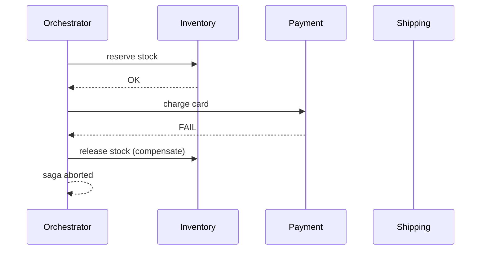

# 2026-06-01 — Saga Pattern for Distributed Transactions

> Coordinate multi-service workflows with compensating actions instead of a single distributed lock that doesn't exist.

## Problem

Checkout spans **inventory**, **payment**, and **shipping** — each owns its database. A two-phase commit (2PC) across microservices:

- Blocks on coordinator failure
- Couples availability (all must be up)
- Doesn't fit most cloud-native stacks

One step fails mid-flow → you need **rollback via business operations** (`releaseStock`), not `ROLLBACK` on a shared transaction.

## Constraints

- **Scale:** 800 checkouts/sec peak; each step 50–200ms
- **Consistency:** Eventually consistent; no cross-DB atomic commit
- **Failure:** Any step can timeout; compensations must be idempotent
- **Observability:** Trace `saga_id` across all steps

## Architecture



Diagram source: [`diagrams/2026-06-01-saga-distributed-transactions.mmd`](../diagrams/2026-06-01-saga-distributed-transactions.mmd)

### Components

| Component | Role |
|-----------|------|
| **Orchestrator** | Runs steps in order; on failure invokes compensations (choreography alternative: each service listens and reacts) |
| **Saga log** | Persists state: `RUNNING`, `COMPENSATING`, `COMPLETED`, `FAILED` |
| **Compensating transaction** | Semantic undo: `releaseStock`, `refundPayment` — not DB rollback |
| **Idempotency** | Each step keyed by `saga_id + step_name` |

### Flow

1. Start saga `saga-abc` → reserve inventory → success
2. Charge payment → **fails**
3. Orchestrator runs compensation: `releaseStock(saga-abc)`
4. Mark saga `FAILED`; return `409` or `422` to client with clear reason
5. On success path: reserve → pay → ship → `COMPLETED`

### Implementation sketch

```typescript
async function runCheckoutSaga(orderId: string) {
  const sagaId = uuid();
  try {
    await inventory.reserve(orderId, { sagaId });
    await payment.charge(orderId, { sagaId });
    await shipping.schedule(orderId, { sagaId });
    await sagaLog.complete(sagaId);
  } catch (err) {
    await compensate(sagaId, orderId);
    throw err;
  }
}

async function compensate(sagaId: string, orderId: string) {
  await payment.refundIfCharged(orderId, { sagaId });
  await inventory.release(orderId, { sagaId });
  await sagaLog.fail(sagaId);
}
```

## Trade-offs

| Choice | Pros | Cons |
|--------|------|------|
| **Orchestration** | Central visibility; easier debugging | Orchestrator is a SPOF without HA |
| **Choreography (events)** | Decoupled services | Harder to trace; implicit flow |
| **2PC / XA** | Strong atomicity | Rarely used in microservices |
| **Monolith transaction** | Simple | Doesn't scale teams or deploys |

## When to use

- ✅ Long-running business processes across bounded contexts
- ✅ Each step has a defined compensating action
- ✅ Eventual consistency is acceptable to users (pending → confirmed)

- ❌ Don't saga a single-database CRUD — use one transaction
- ❌ Don't skip idempotent compensations — retries will double-refund or double-release
- ❌ Don't compensate out of order — define reverse sequence explicitly

## References

- [Microservices.io — Saga](https://microservices.io/patterns/data/saga.html)
- [Chris Richardson — Orchestration vs choreography](https://microservices.io/patterns/data/saga.html)

---

**Tags:** `#saga` `#distributed-transactions` `#microservices` `#compensation` `#architecture`
