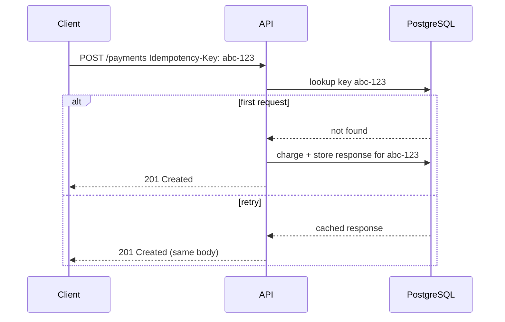

# 2026-06-02 — Idempotency Keys for HTTP APIs

> Make POST/PUT safe to retry so network blips and client retries never double-charge or duplicate orders.

## Problem

Mobile clients retry on timeout. Without idempotency, `POST /payments` twice creates **two charges**. Users see duplicate orders; support tickets spike; reconciliation is painful.

HTTP GET is safe to retry; **POST is not** unless you design it.

## Constraints

- **Scale:** 3k payment POSTs/sec; 5% retry rate on flaky networks
- **Retention:** Store idempotency records 24h (Stripe-style)
- **Response:** Same status + body on replay
- **Conflict:** Same key + different body → `409 Conflict`

## Architecture



Diagram source: [`diagrams/2026-06-02-idempotency-keys-api.mmd`](../diagrams/2026-06-02-idempotency-keys-api.mmd)

### Components

| Component | Role |
|-----------|------|
| **Idempotency-Key header** | Client-generated UUID per logical operation |
| **Idempotency store** | `key`, `request_hash`, `response_body`, `status_code`, `created_at` |
| **Request hash** | Detect same key with different payload → reject |
| **TTL job** | Purge expired keys |

### Flow

1. Client sends `Idempotency-Key: 7f3a...` with payment body
2. API begins transaction: insert key row with `IN_PROGRESS` (optional lock)
3. Process payment → store serialized response
4. Retry with same key → return cached response without re-executing
5. Different body + same key → `409 Conflict`

### Implementation sketch

```typescript
async function handlePayment(req: Request) {
  const key = req.headers['idempotency-key'];
  if (!key) throw new BadRequest('Idempotency-Key required');

  const existing = await store.find(key);
  if (existing?.status === 'completed') {
    return res.status(existing.httpStatus).json(existing.body);
  }
  if (existing?.requestHash !== hash(req.body)) {
    return res.status(409).json({ error: 'Key reused with different body' });
  }

  const result = await charge(req.body);
  await store.save(key, hash(req.body), result);
  return res.status(201).json(result);
}
```

## Trade-offs

| Choice | Pros | Cons |
|--------|------|------|
| **Server-side store** | Correct under concurrency | Storage + cleanup |
| **Client-only dedupe** | No infra | Unreliable across devices |
| **Natural idempotency (PUT by ID)** | Simple | Not all operations fit |

## When to use

- ✅ Payments, orders, transfers, anything with side effects
- ✅ Clients on mobile or unreliable networks
- ✅ Webhook handlers processing external events (use event ID as key)

- ❌ Don't require keys on safe GET/DELETE
- ❌ Don't reuse keys across different operations
- ❌ Don't skip locking — concurrent duplicate POSTs race without `IN_PROGRESS`

## References

- [Stripe — Idempotent requests](https://docs.stripe.com/api/idempotent_requests)
- [RFC 9110 — safe methods](https://www.rfc-editor.org/rfc/rfc9110.html)

---

**Tags:** `#idempotency` `#api-design` `#payments` `#reliability` `#http`
