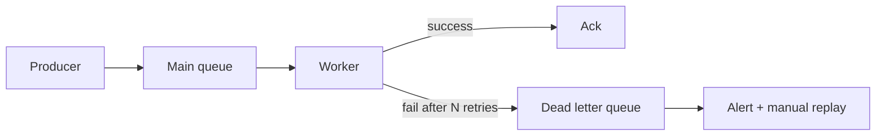

# 2026-06-03 — Dead Letter Queues

> Isolate poison messages that will never succeed so the main queue keeps draining healthy work.

## Problem

One malformed JSON event or bad schema version causes workers to **throw forever**. With at-least-once delivery, the message reappears → infinite retry loop → queue depth grows → **all consumers stall** behind one bad message.

You need a parking lot for failures that need human inspection or a code fix.

## Constraints

- **Scale:** 50k messages/min; <0.1% land in DLQ
- **Retry:** Max 5 attempts with exponential backoff before DLQ
- **Alert:** Pager when DLQ depth > 10 for 5 minutes
- **Replay:** Ops can re-drive messages to main queue after fix

## Architecture



Diagram source: [`diagrams/2026-06-03-dead-letter-queues.mmd`](../diagrams/2026-06-03-dead-letter-queues.mmd)

### Components

| Component | Role |
|-----------|------|
| **Main queue** | SQS, RabbitMQ, Redis Streams — happy path |
| **Retry policy** | Visibility timeout / delay queue increases per attempt |
| **DLQ** | Separate queue; same retention policy, stricter alerts |
| **Redrive** | AWS DLQ redrive, or custom admin tool to republish |
| **Metadata** | Original error, stack trace, attempt count on message attributes |

### Flow

1. Worker processes message → transient DB error → retry (attempt 2)
2. After 5 failures → broker moves to DLQ (no longer blocks main consumers)
3. Alert fires; engineer fixes bug or bad payload
4. Replay: move DLQ messages back to main queue with `replay=true` flag
5. Worker idempotent — safe if message was partially applied

### Implementation sketch

```typescript
async function processMessage(msg: QueueMessage) {
  try {
    await handle(msg.body);
    await msg.ack();
  } catch (err) {
    if (msg.attempt >= MAX_RETRIES) {
      await dlq.publish({ ...msg, error: err.message });
      await msg.ack(); // remove from main — don't infinite loop
    } else {
      await msg.nack({ delayMs: backoff(msg.attempt) });
    }
  }
}
```

## Trade-offs

| Choice | Pros | Cons |
|--------|------|------|
| **Broker-native DLQ** | Built-in (SQS) | Cloud-specific |
| **App-managed DLQ** | Portable | More code |
| **Drop failed messages** | Queue stays fast | Data loss |
| **Infinite retry** | "Eventually works" | Blocks entire pipeline |

## When to use

- ✅ Async workers with at-least-once delivery
- ✅ Heterogeneous payloads (user-generated, webhooks, imports)
- ✅ You have on-call + replay runbooks

- ❌ Don't DLQ without alerting — silent failure
- ❌ Don't replay without fixing root cause — refills DLQ
- ❌ Don't skip idempotency on replay — messages may have partially applied

## References

- [AWS SQS dead-letter queues](https://docs.aws.amazon.com/AWSSimpleQueueService/latest/SQSDeveloperGuide/sqs-dead-letter-queues.html)
- [RabbitMQ dead letter exchanges](https://www.rabbitmq.com/docs/dlx)

---

**Tags:** `#queues` `#dlq` `#messaging` `#reliability` `#ops`
