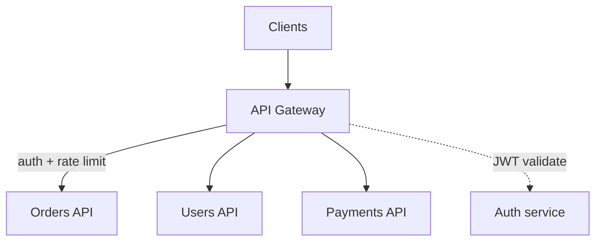

# 2026-06-04 — API Gateway Pattern

> Centralize cross-cutting concerns at the edge so backend services stay focused on domain logic.

## Problem

Every microservice reimplements **JWT validation**, **rate limits**, **CORS**, **request logging**, and **TLS termination**. A security fix requires **N deploys**. Client apps talk to 12 different hostnames with inconsistent error formats.

You need one front door.

## Constraints

- **Scale:** 15k RPS through gateway; p99 add < 5ms
- **Auth:** OAuth2/JWT validated once; user context forwarded as headers
- **Routing:** Path-based `/orders/*` → orders cluster
- **Infra:** Kong, Envoy, AWS API Gateway, or nginx + lua

## Architecture



Diagram source: [`diagrams/2026-06-04-api-gateway-pattern.mmd`](../diagrams/2026-06-04-api-gateway-pattern.mmd)

### Components

| Component | Role |
|-----------|------|
| **API gateway** | Single public hostname; TLS, routing, plugins |
| **Auth plugin** | Validates JWT; injects `X-User-Id`, `X-Tenant-Id` |
| **Rate limiter** | Per API key / tenant (see token bucket note) |
| **BFF variant** | Gateway aggregates multiple backend calls for one mobile screen |
| **Service mesh** | mTLS east-west; gateway handles north-south |

### Flow

1. Client `GET https://api.example.com/orders` with `Authorization: Bearer ...`
2. Gateway validates JWT → rejects 401 if expired
3. Rate limit check → 429 if exceeded
4. Route to `orders-service` upstream with trusted internal headers
5. Response passes through gateway (optional response transform)

### Implementation sketch

```yaml
# Kong-style route (conceptual)
routes:
  - path: /orders
    service: orders-upstream
    plugins:
      - jwt
      - rate-limiting: { minute: 1000 }
      - cors: { origins: ["https://app.example.com"] }
```

## Trade-offs

| Choice | Pros | Cons |
|--------|------|------|
| **Central gateway** | DRY for cross-cutting | Hot path; config sprawl |
| **Per-service auth** | No single choke point | Inconsistent security |
| **BFF per client** | Tailored payloads | Many gateways to maintain |
| **Direct service exposure** | Lowest latency | Leaks internal topology |

## When to use

- ✅ Multiple public clients (web, mobile, partners)
- ✅ Shared auth, rate limits, WAF rules
- ✅ You want to hide internal service topology

- ❌ Don't put business logic in gateway — stays orchestration only
- ❌ Don't gateway internal service-to-service calls — use mesh/mTLS
- ❌ Don't skip gateway HA — it's your single entry point

## References

- [Microsoft — API Gateway pattern](https://learn.microsoft.com/en-us/azure/architecture/microservices/design/gateway)
- [Kong documentation](https://docs.konghq.com/)

---

**Tags:** `#api-gateway` `#microservices` `#security` `#architecture` `#edge`
