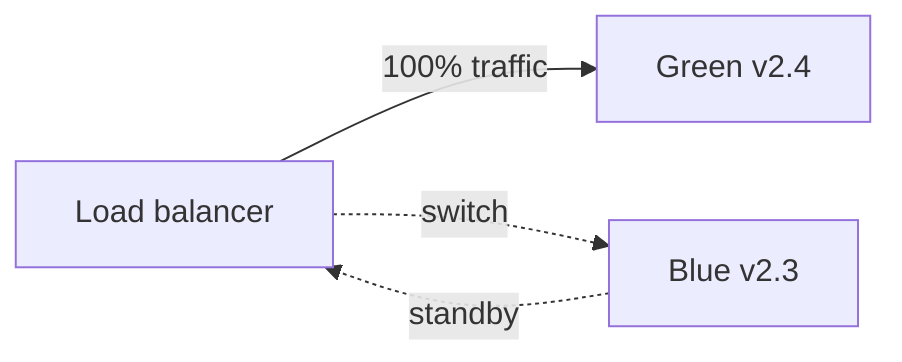

# 2026-06-05 — Blue-Green Deployment

> Cut over traffic between two identical environments to release with instant rollback and minimal downtime.

## Problem

Rolling deploys on Kubernetes gradually replace pods — but **schema migrations** and **breaking API changes** still cause mixed-version traffic. A bad release needs **fast rollback** without rebuilding artifacts from scratch.

Blue-green keeps the old stack **warm** while you validate the new one.

## Constraints

- **Scale:** 200 pods; switch traffic in < 30 seconds
- **Data:** Shared DB requires backward-compatible migrations (expand-contract)
- **Sessions:** Sticky sessions or stateless JWT
- **Cost:** 2x infra during switch window (temporary)

## Architecture



Diagram source: [`diagrams/2026-06-05-blue-green-deployment.mmd`](../diagrams/2026-06-05-blue-green-deployment.mmd)

### Components

| Component | Role |
|-----------|------|
| **Blue environment** | Current production (v2.3) |
| **Green environment** | New release (v2.4) — full stack duplicate |
| **Load balancer / Ingress** | Weighted routes or DNS flip |
| **Smoke tests** | Run against green internal URL before cutover |
| **Rollback** | Point LB back to blue — seconds, not minutes |

### Flow

1. Deploy v2.4 to **green** (0% traffic)
2. Run integration + synthetic checks on green
3. Shift LB 10% → 50% → 100% (or instant flip for small teams)
4. Monitor error rate; on spike → revert to blue
5. Decommission old blue after soak period; green becomes next blue

### Implementation sketch

```yaml
# Kubernetes: two Deployments, Service selector swap
# Before cutover: Service selector app=myapp,version=green
# Rollback: kubectl patch service -p '{"spec":{"selector":{"version":"blue"}}}'
```

## Trade-offs

| Choice | Pros | Cons |
|--------|------|------|
| **Blue-green** | Instant rollback; clean cutover | 2x resources during deploy |
| **Rolling update** | Cheaper | Mixed versions; slower rollback |
| **Canary** | Gradual risk reduction | More routing complexity |
| **Feature flags** | Decouple deploy from release | Doesn't replace infra rollback |

## When to use

- ✅ Zero-downtime requirement with clear environment swap
- ✅ Database migrations are backward-compatible
- ✅ You can afford duplicate capacity during release

- ❌ Don't blue-green stateful systems without shared-storage plan
- ❌ Don't flip 100% without metrics on green first
- ❌ Don't skip DB migration strategy — both colors hit same schema

## References

- [Martin Fowler — BlueGreenDeployment](https://martinfowler.com/bliki/BlueGreenDeployment.html)
- [Kubernetes deployment strategies](https://kubernetes.io/docs/concepts/workloads/controllers/deployment/)

---

**Tags:** `#deployment` `#blue-green` `#devops` `#kubernetes` `#release`
