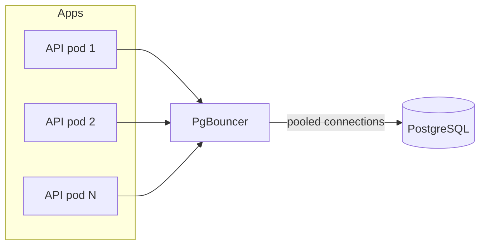

# 2026-06-06 — Connection Pooling with PgBouncer

> Multiplex thousands of app connections onto a small set of real PostgreSQL connections without exhausting `max_connections`.

## Problem

Each API pod opens a pool of 20 connections. **50 pods × 20 = 1000** connections — Postgres default `max_connections` is often 100–300. New pods during scale-up get `FATAL: too many connections` and the whole fleet degrades.

Serverless (Lambda) makes it worse: every cold start opens new connections.

## Constraints

- **Scale:** 80 app instances; target < 100 actual Postgres connections
- **Mode:** Transaction pooling for stateless APIs
- **Latency:** Pooler adds < 1ms on LAN
- **Gotchas:** No session-level features in transaction mode (prepared statements, `LISTEN`)

## Architecture



Diagram source: [`diagrams/2026-06-06-connection-pooling-pgbouncer.mmd`](../diagrams/2026-06-06-connection-pooling-pgbouncer.mmd)

### Components

| Component | Role |
|-----------|------|
| **PgBouncer** | Lightweight pooler; sits between apps and Postgres |
| **Transaction pooling** | Connection returned to pool after each transaction |
| **Session pooling** | Connection held for client session — fewer savings |
| **App pool sizing** | Small per-pod pool (5–10) since PgBouncer multiplexes |
| **RDS Proxy** | Managed alternative on AWS |

### Flow

1. App opens "connection" to PgBouncer (cheap)
2. `BEGIN` → PgBouncer assigns real Postgres backend
3. Queries run → `COMMIT` → backend released to pool
4. Next request may use a different backend — no session state assumed
5. Monitor `SHOW POOLS`, `cl_waiting` for pool exhaustion

### Implementation sketch

```ini
; pgbouncer.ini
[databases]
mydb = host=postgres.internal port=5432 dbname=mydb

[pgbouncer]
pool_mode = transaction
default_pool_size = 50
max_client_conn = 2000
```

```typescript
// App: point DATABASE_URL to pgbouncer:6432
const pool = new Pool({ max: 10, connectionString: process.env.DATABASE_URL });
```

## Trade-offs

| Choice | Pros | Cons |
|--------|------|------|
| **PgBouncer transaction mode** | Max multiplexing | No prepared statements per session |
| **App-side pool only** | Simple | Doesn't fix 1000 pods problem |
| **Session pooling** | Compatible with more PG features | Less connection savings |
| **Bigger max_connections** | No pooler | Memory per connection on PG |

## When to use

- ✅ Many stateless app instances hitting one Postgres
- ✅ Serverless or bursty workloads
- ✅ Connection storms during deploys / HPA scale-up

- ❌ Don't use transaction mode with heavy prepared statements — use session mode or disable prepare
- ❌ Don't set app `max` pool to 100 per pod — defeats the pooler
- ❌ Don't pool across read replicas incorrectly — route reads explicitly

## References

- [PgBouncer documentation](https://www.pgbouncer.org/)
- [AWS RDS Proxy](https://docs.aws.amazon.com/AmazonRDS/latest/UserGuide/rds-proxy.html)

---

**Tags:** `#postgresql` `#pgbouncer` `#connection-pooling` `#scaling` `#infrastructure`
