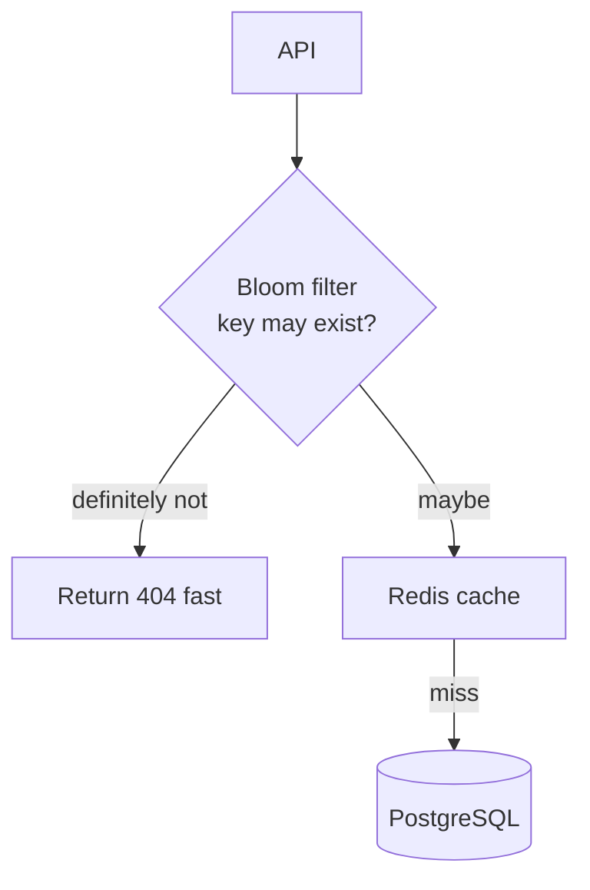

# 2026-06-07 — Bloom Filter for Cache Penetration

> Block guaranteed-miss lookups before they hammer PostgreSQL when bots request random non-existent IDs.

## Problem

**Cache penetration:** attacker requests `GET /product/{random-uuid}` — Redis miss every time → **DB seq scan** on 10M rows. Legitimate traffic suffers; DB CPU spikes.

Cache-aside doesn't help if the key **never exists**. You need a cheap "definitely not in DB" check.

## Constraints

- **Scale:** 2k bogus IDs/sec; 50M valid product IDs
- **False positives:** OK (rare extra DB lookup); **false negatives:** must be zero
- **Memory:** Bloom filter ~10–15 bits per ID for 1% FP rate
- **Updates:** Rebuild or layered filter when new products added

## Architecture



Diagram source: [`diagrams/2026-06-07-bloom-filter-cache-penetration.mmd`](../diagrams/2026-06-07-bloom-filter-cache-penetration.mmd)

### Components

| Component | Role |
|-----------|------|
| **Bloom filter** | Probabilistic set membership; "not in set" is certain |
| **Redis Bloom** | `BF.ADD`, `BF.EXISTS` (RedisBloom module) |
| **Rebuild job** | Nightly sync all valid IDs from DB → filter |
| **Negative cache** | Short TTL cache of known 404s as secondary layer |

### Flow

1. `GET /product/unknown-id`
2. `BF.EXISTS product:unknown-id` → 0 → return **404 immediately** (no DB)
3. Maybe exists → check Redis → on miss query DB
4. DB returns null → cache negative result 60s + optionally don't add to bloom (already maybe)
5. New product created → `BF.ADD` on write path

### Implementation sketch

```typescript
async function getProduct(id: string) {
  if (!(await redis.bf.exists('products', id))) {
    return null; // definite miss
  }
  const cached = await redis.get(`product:${id}`);
  if (cached) return JSON.parse(cached);
  const row = await db.products.findById(id);
  if (!row) await redis.setex(`product:${id}:miss`, 60, '1');
  return row;
}
```

## Trade-offs

| Choice | Pros | Cons |
|--------|------|------|
| **Bloom filter** | Tiny memory; O(1) check | False positives; no deletes (use counting bloom or rebuild) |
| **Negative cache only** | Simple | Attack fills cache with random keys |
| **DB index only** | Accurate | Still hits DB every miss |

## When to use

- ✅ High-cardinality IDs with many invalid lookups
- ✅ Read-heavy; catalog of valid keys changes slowly
- ✅ Combined with cache-aside (see May 27 note)

- ❌ Don't use alone without cache-aside for hot valid keys
- ❌ Don't forget to update bloom on create — or accept delay until rebuild
- ❌ Don't treat "maybe" as "exists" in business logic — always confirm at DB when required

## References

- [Redis Bloom filter commands](https://redis.io/docs/latest/develop/data-types/probabilistic/bloom-filter/)
- [Wikipedia — Bloom filter](https://en.wikipedia.org/wiki/Bloom_filter)

---

**Tags:** `#bloom-filter` `#redis` `#caching` `#security` `#scaling`
