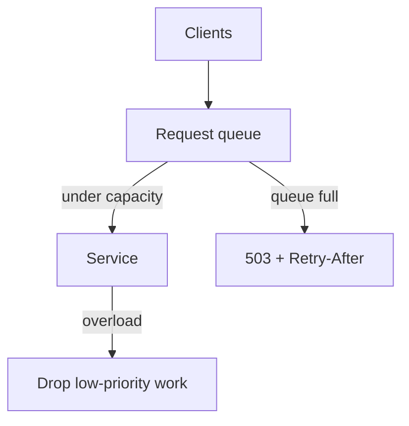

# 2026-06-08 — Backpressure and Graceful Degradation

> When load exceeds capacity, shed work deliberately instead of dying from timeouts and OOM kills.

## Problem

Traffic spike → thread pools saturated → requests queue in memory → GC pressure → **cascading failure**. Every request waits 30s and fails. Users see errors; ops can't tell overload from bugs.

Healthy systems **signal overload** early and **drop low-value work** first.

## Constraints

- **Scale:** Designed for 5k RPS; spike to 12k
- **SLA:** Core checkout path protected; recommendations can degrade
- **Signals:** Queue depth, CPU, latency p99, thread pool saturation
- **Client contract:** `503` + `Retry-After`; idempotent retries

## Architecture



Diagram source: [`diagrams/2026-06-08-backpressure-graceful-degradation.mmd`](../diagrams/2026-06-08-backpressure-graceful-degradation.mmd)

### Components

| Component | Role |
|-----------|------|
| **Bounded queue** | Fixed-size ingress; reject when full |
| **Admission control** | Token bucket on in-flight requests |
| **Priority tiers** | `checkout` > `browse` > `recommendations` |
| **Degraded mode** | Skip non-critical downstream calls |
| **Load shedder** | Return cached/stale data or partial HTML |

### Flow

1. Ingress queue at 90% → start rejecting **low-priority** routes with 503
2. At 100% → reject new connections; keep processing queued critical work
3. Service disables recommendation service calls → faster product page
4. Metrics: `rejected_requests`, `degraded_responses`
5. Spike ends → queue drains → normal mode automatically

### Implementation sketch

```typescript
const semaphore = new Semaphore(MAX_IN_FLIGHT);

app.use(async (req, res, next) => {
  if (!semaphore.tryAcquire()) {
    if (req.path.startsWith('/api/recommendations')) {
      return res.status(503).set('Retry-After', '5').json({ degraded: true });
    }
    return res.status(503).set('Retry-After', '2').end();
  }
  try {
    await next();
  } finally {
    semaphore.release();
  }
});
```

## Trade-offs

| Choice | Pros | Cons |
|--------|------|------|
| **Backpressure (reject early)** | Stable under overload | Errors visible to users |
| **Unbounded queue** | No immediate rejects | OOM / latency death spiral |
| **Auto-scale only** | Hands-off | Scale lag minutes behind spike |
| **Graceful degradation** | Core path survives | Stale/incomplete UX |

## When to use

- ✅ Clear priority between revenue path and nice-to-have features
- ✅ Clients retry with backoff (mobile, browsers, gateways)
- ✅ You measure saturation before total failure

- ❌ Don't shed without metrics — blind drops confuse debugging
- ❌ Don't return 200 with empty body for errors — breaks clients
- ❌ Don't rely only on degradation without ingress limits — still need bounds

## References

- [Google SRE — Handling overload](https://sre.google/sre-book/handling-overload/)
- [Reactive Streams — backpressure](https://www.reactive-streams.org/)

---

**Tags:** `#backpressure` `#resilience` `#load-shedding` `#scaling` `#sla`
