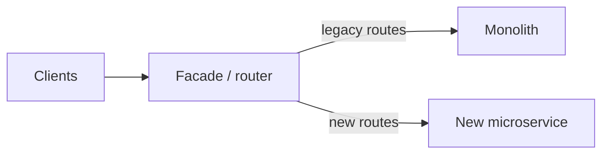

# 2026-06-09 — Strangler Fig Migration

> Incrementally replace a legacy monolith by routing slices of traffic to new services without a big-bang rewrite.

## Problem

10-year monolith: **2M LOC**, undeployable weekly, one bug takes down everything. Full rewrite takes 2 years and usually fails. You need to extract **bounded contexts** one at a time while revenue keeps flowing.

## Constraints

- **Risk:** Migrate one domain (e.g. notifications) per quarter
- **Routing:** Facade/proxy decides monolith vs new service per URL
- **Data:** Dual-write or sync until cutover; no big-bang DB split day one
- **Team:** Parallel work on new service while monolith maintenance continues

## Architecture



Diagram source: [`diagrams/2026-06-09-strangler-fig-migration.mmd`](../diagrams/2026-06-09-strangler-fig-migration.mmd)

### Components

| Component | Role |
|-----------|------|
| **Strangler facade** | API gateway, nginx, or modular monolith router |
| **Anti-corruption layer** | Translates legacy models ↔ new domain models |
| **Sync job** | Keeps read models consistent during transition |
| **Feature flags** | % traffic to new implementation |
| **Monolith shrink** | Delete migrated modules after soak |

### Flow

1. Route `POST /notifications` to new **notifications-service** (5% canary)
2. Monolith still owns `GET /users` — unchanged
3. Dual-write notifications to both DBs; compare metrics
4. Increase canary to 100%; remove monolith notification code
5. Repeat for next bounded context (billing, catalog, ...)

### Implementation sketch

```typescript
// Facade router
function route(req: Request) {
  if (req.path.startsWith('/notifications') && flags.notificationsV2) {
    return proxyTo('http://notifications-service');
  }
  return proxyTo('http://legacy-monolith');
}
```

## Trade-offs

| Choice | Pros | Cons |
|--------|------|------|
| **Strangler fig** | Continuous delivery; reduced risk | Long transition; dual maintenance |
| **Big-bang rewrite** | Clean slate fantasy | High failure rate |
| **Modular monolith first** | Easier extract later | Still one deploy unit initially |
| **Lift-and-shift to K8s** | Ops win | Doesn't fix architecture |

## When to use

- ✅ Legacy system must stay online during migration
- ✅ Domains can be separated by URL or message boundaries
- ✅ Leadership accepts multi-year incremental plan

- ❌ Don't extract without data ownership clarity — split-brain writes
- ❌ Don't migrate without integration tests on facade routes
- ❌ Don't leave strangler proxy forever — plan monolith retirement

## References

- [Martin Fowler — Strangler Fig Application](https://martinfowler.com/bliki/StranglerFigApplication.html)
- [Microsoft — Strangler fig pattern](https://learn.microsoft.com/en-us/azure/architecture/patterns/strangler-fig)

---

**Tags:** `#strangler-fig` `#migration` `#legacy` `#microservices` `#architecture`
