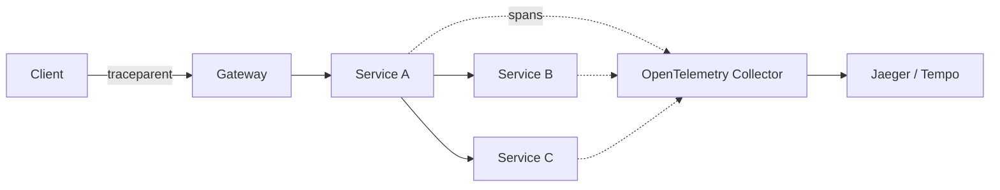

# 2026-06-10 — Distributed Tracing with OpenTelemetry

> Follow one user request across gateways, services, and queues when logs alone can't explain p99 latency.

## Problem

Checkout is slow. Logs show 12 services, each "looks fine." The delay is **one hidden serial call** in service D and **queue wait** in service F — you can't correlate without a shared **trace ID**.

Debugging production without tracing = grep roulette.

## Constraints

- **Scale:** Sample 10% of traces at steady state; 100% on errors
- **Standard:** OpenTelemetry SDK → OTLP → Jaeger/Tempo/Datadog
- **Cardinality:** Avoid high-cardinality labels on every span (user_id OK as attribute, not metric label)
- **Overhead:** < 3% CPU with batch export

## Architecture



Diagram source: [`diagrams/2026-06-10-distributed-tracing-opentelemetry.mmd`](../diagrams/2026-06-10-distributed-tracing-opentelemetry.mmd)

### Components

| Component | Role |
|-----------|------|
| **Trace** | Tree of spans for one logical request |
| **Span** | Named operation with start/end, attributes, status |
| **Context propagation** | W3C `traceparent` / `tracestate` headers |
| **OTel Collector** | Receives OTLP; exports to backends; tail sampling |
| **Baggage** | Cross-cutting key-values (use sparingly) |

### Flow

1. Mobile app starts trace (or gateway creates root span)
2. Gateway injects `traceparent` → Service A child span `HTTP GET /orders`
3. A calls B with propagated context → B span nested under A
4. Slow span highlighted in UI waterfall: `payment.charge` 2.4s
5. Link trace_id to logs via structured logging

### Implementation sketch

```typescript
import { trace } from '@opentelemetry/api';

const tracer = trace.getTracer('orders-service');

async function getOrder(id: string) {
  return tracer.startActiveSpan('getOrder', async (span) => {
    span.setAttribute('order.id', id);
    const order = await db.find(id);
    span.end();
    return order;
  });
}
```

```yaml
# Auto-instrumentation (Node): @opentelemetry/auto-instrumentations-node
OTEL_EXPORTER_OTLP_ENDPOINT: http://otel-collector:4318
OTEL_SERVICE_NAME: orders-service
```

## Trade-offs

| Choice | Pros | Cons |
|--------|------|------|
| **OpenTelemetry** | Vendor-neutral; one SDK | Collector ops |
| **Proprietary APM** | Turnkey UI | Lock-in, cost |
| **Logs only** | Simple | No causal waterfall |
| **100% sampling** | Full fidelity | Expensive at scale |

## When to use

- ✅ More than 3 services in a user-facing path
- ✅ Async pipelines (publish span links to consumer traces)
- ✅ SLO debugging and incident response

- ❌ Don't log PII in span attributes — treat traces as semi-public
- ❌ Don't skip propagation on internal HTTP/gRPC calls
- ❌ Don't ignore collector failure — buffer or drop gracefully

## References

- [OpenTelemetry documentation](https://opentelemetry.io/docs/)
- [W3C Trace Context](https://www.w3.org/TR/trace-context/)

---

**Tags:** `#opentelemetry` `#tracing` `#observability` `#microservices` `#debugging`
