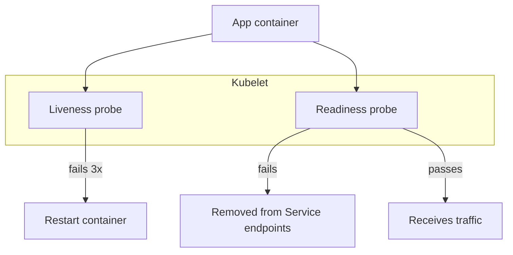

# 2026-06-11 — Liveness and Readiness Probes

> Tell Kubernetes when to restart a stuck pod vs when to stop sending traffic — without killing healthy instances during slow startup.

## Problem

A pod **deadlocks** but the process still runs — Kubernetes keeps routing traffic → 500s forever. Or: app needs **40s to warm caches** on boot, but the load balancer sends requests at 5s → flapping restarts or error spikes.

One health endpoint conflates two questions: "Is the process alive?" and "Can this instance serve traffic right now?"

## Constraints

- **Scale:** 200 pods; rolling deploy replaces 25% at a time
- **Startup:** JVM/app warm-up 30–60s before ready
- **Failure:** Detect deadlock within 30s; restart only that container
- **Dependency:** DB down → readiness fails, liveness may still pass

## Architecture



Diagram source: [`diagrams/2026-06-11-liveness-readiness-probes.mmd`](../diagrams/2026-06-11-liveness-readiness-probes.mmd)

### Components

| Component | Role |
|-----------|------|
| **Liveness probe** | "Process is wedged?" → kubelet **restarts** container |
| **Readiness probe** | "Can handle requests?" → removed from Service **endpoints** |
| **Startup probe** | (K8s 1.16+) Disables liveness until slow boot completes |
| **HTTP /health/live** | Minimal check: event loop responsive |
| **HTTP /health/ready** | Checks DB pool, cache, required deps |

### Flow

1. Pod starts → startup probe allows 60s warm-up
2. Readiness fails until migrations + cache load complete
3. Readiness passes → Service adds pod to endpoints → traffic flows
4. Later: DB connection pool exhausted → readiness fails → traffic drained, **no restart**
5. Deadlock: liveness fails → kubelet restarts container → brief unready period

### Implementation sketch

```yaml
readinessProbe:
  httpGet:
    path: /health/ready
    port: 8080
  initialDelaySeconds: 5
  periodSeconds: 10
  failureThreshold: 3

livenessProbe:
  httpGet:
    path: /health/live
    port: 8080
  periodSeconds: 15
  failureThreshold: 3

startupProbe:
  httpGet:
    path: /health/ready
    port: 8080
  failureThreshold: 30
  periodSeconds: 2
```

```typescript
app.get('/health/live', (_, res) => res.send('ok'));

app.get('/health/ready', async (_, res) => {
  if (!(await db.ping())) return res.status(503).end();
  res.send('ok');
});
```

## Trade-offs

| Choice | Pros | Cons |
|--------|------|------|
| **Separate live/ready** | Correct restart vs drain behavior | Two endpoints to maintain |
| **Single /health** | Simple | Restarts on transient DB blips |
| **TCP probe only** | Easy | Doesn't detect app deadlock |
| **Exec probe** | Custom scripts | Slower; harder to debug |

## When to use

- ✅ Kubernetes Deployments behind a Service or Ingress
- ✅ Apps with non-trivial startup (migrations, cache warm-up)
- ✅ You distinguish "broken process" from "temporarily unavailable"

- ❌ Don't put heavy checks on **liveness** — restarts are expensive
- ❌ Don't fail readiness on optional deps unless you must
- ❌ Don't use readiness for autoscaling metrics — use metrics-server/HPA instead

## References

- [Kubernetes configure probes](https://kubernetes.io/docs/tasks/configure-pod-container/configure-liveness-readiness-startup-probes/)
- [Google SRE — health checking](https://sre.google/workbook/non-abstract-design/)

---

**Tags:** `#kubernetes` `#health-checks` `#devops` `#reliability` `#deployment`
