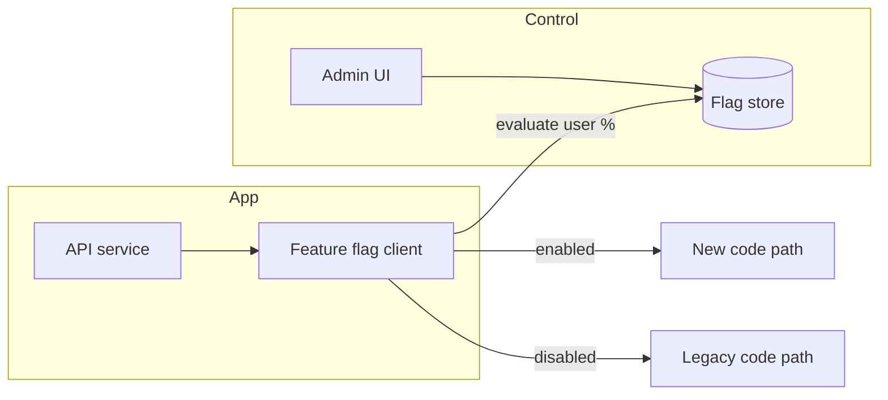

# 2026-06-12 — Feature Flags for Progressive Delivery

> Ship code to production daily but expose new behavior to 1% of users first — decouple deploy from release.

## Problem

**Deploy == release** means every push is a full blast radius. A bug in checkout affects 100% of revenue. Rolling back requires redeploy. Product wants A/B tests and kill switches without emergency hotfixes at 2am.

You need runtime control over which code path runs for which user.

## Constraints

- **Scale:** Flag evaluation < 1ms; 8k RPS checkout
- **Targeting:** By user ID, tenant, region, or percentage rollout
- **Safety:** Kill switch disables feature globally in seconds
- **Audit:** Who changed `new-checkout` from 5% → 100%?

## Architecture



Diagram source: [`diagrams/2026-06-12-feature-flags-progressive-delivery.mmd`](../diagrams/2026-06-12-feature-flags-progressive-delivery.mmd)

### Components

| Component | Role |
|-----------|------|
| **Flag store** | LaunchDarkly, Unleash, or Postgres + cache |
| **SDK / client** | Local cache with TTL; background sync |
| **Evaluation context** | `userId`, `tenantId`, `environment` |
| **Percentage rollout** | Consistent hash on user ID — same user always sees same variant |
| **Kill switch** | Boolean flag default `false`; flip without redeploy |

### Flow

1. Deploy new checkout code behind `if (flags.isEnabled('new-checkout', user))`
2. Set flag to 1% in staging → validate metrics
3. Ramp 5% → 25% → 100% over days while watching error rate
4. Bug found → disable flag globally; old path serves all traffic instantly
5. Remove flag + dead code after soak period

### Implementation sketch

```typescript
const enabled = await flags.isEnabled('new-checkout', {
  userId: user.id,
  tenantId: user.tenantId,
});

if (enabled) {
  return newCheckoutFlow(cart);
}
return legacyCheckoutFlow(cart);
```

```typescript
// Consistent percentage: hash(userId + flagKey) % 100 < rolloutPercent
function isInRollout(userId: string, flagKey: string, percent: number): boolean {
  const bucket = hash(`${userId}:${flagKey}`) % 100;
  return bucket < percent;
}
```

## Trade-offs

| Choice | Pros | Cons |
|--------|------|------|
| **Feature flags** | Instant rollback; gradual rollout | Flag debt; branching complexity |
| **Deploy-only releases** | Simpler code | All-or-nothing risk |
| **Canary deploy (infra)** | Traffic split at LB | Coarser than user-level targeting |
| **Env vars** | Simple | Requires redeploy to change |

## When to use

- ✅ High-risk features (payments, auth, pricing)
- ✅ A/B experiments and gradual rollouts
- ✅ Long-lived branches you'd otherwise maintain

- ❌ Don't flag every `if` statement — focus on release boundaries
- ❌ Don't leave stale flags forever — schedule cleanup
- ❌ Don't evaluate flags on every line in hot loops without caching

## References

- [Martin Fowler — Feature Toggles](https://martinfowler.com/articles/feature-toggles.html)
- [Unleash documentation](https://docs.getunleash.io/)

---

**Tags:** `#feature-flags` `#deployment` `#progressive-delivery` `#reliability` `#product`
