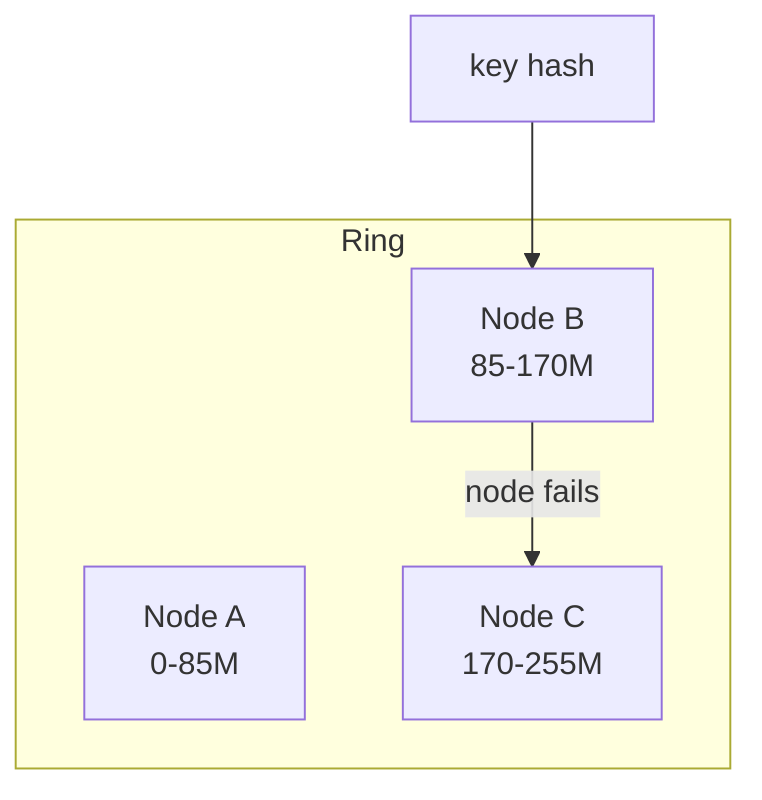

# 2026-06-13 — Consistent Hashing

> Add or remove cache nodes without remapping every key — only a fraction of keys move when the ring changes.

## Problem

Modulo sharding `hash(key) % N` breaks when **N changes**: add one Redis node → almost all keys remap → **cache stampede** on DB. You need minimal key movement on cluster resize.

## Constraints

- **Scale:** 6 Redis nodes; occasional scale to 7
- **Goal:** ~1/N keys move when one node added/removed
- **Use:** Distributed cache, session store, rate limit shards

## Architecture

Diagram source: [`diagrams/2026-06-13-consistent-hashing.mmd`](../diagrams/2026-06-13-consistent-hashing.mmd)

### Components

| Component | Role |
|-----------|------|
| **Hash ring** | 0..2³²-1 circle; nodes placed at hash positions |
| **Virtual nodes** | Multiple points per physical node for even distribution |
| **Key lookup** | Walk clockwise from key hash to first node |
| **Replication** | N successor nodes for fault tolerance |

### Flow

1. `hash("user:42")` → position on ring → node B
2. Node B fails → keys on B walk to next live node C only
3. Add node D → only keys between neighbors of D migrate
4. Clients or proxy (Redis Cluster, Mcrouter) handle routing

## Trade-offs

| Choice | Pros | Cons |
|--------|------|------|
| **Consistent hashing** | Minimal remapping on resize | More complex than modulo |
| **Modulo** | Simple | Full remap on N change |
| **Managed cluster** | Redis Cluster handles it | Ops learning curve |

## When to use

- ✅ Distributed caches that grow/shrink
- ✅ Sharded rate limiters or session stores

- ❌ Don't hand-roll without virtual nodes — uneven load
- ❌ Don't use for relational sharding alone — see tenant sharding note

## References

- [Wikipedia — Consistent hashing](https://en.wikipedia.org/wiki/Consistent_hashing)

---

**Tags:** `#consistent-hashing` `#redis` `#distributed-cache` `#scaling`
