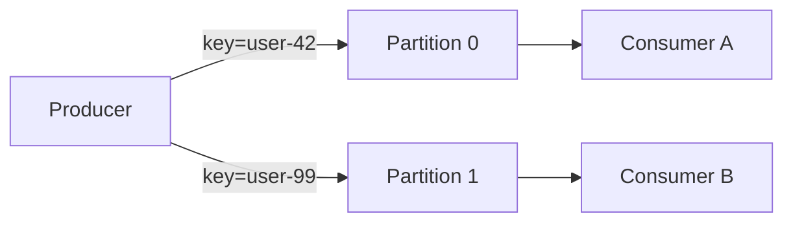

# 2026-06-14 — Kafka Partitions and Ordering

> Guarantee event order per entity while still scaling consumers horizontally across partitions.

## Problem

**Global order** in one Kafka topic = one partition = one consumer → no parallelism. But `OrderCreated` must arrive before `OrderShipped` **for the same order**. You need **partition-scoped ordering**.

## Constraints

- **Scale:** 100k events/sec topic; 20 consumers in group
- **Key:** All events for `order_id` → same partition
- **Delivery:** At-least-once; consumers idempotent

## Architecture



Diagram source: [`diagrams/2026-06-14-kafka-partitions-ordering.mmd`](../diagrams/2026-06-14-kafka-partitions-ordering.mmd)

### Components

| Component | Role |
|-----------|------|
| **Partition** | Ordered log slice; unit of parallelism |
| **Message key** | `hash(key) % partitionCount` chooses partition |
| **Consumer group** | One consumer per partition max (per group) |
| **Offset** | Per-partition cursor; commit after process |

### Flow

1. Producer sends `{ key: orderId, value: OrderShipped }`
2. Same `orderId` always → partition 3
3. Single consumer owns partition 3 → strict order within partition
4. Scale partitions + consumers together; reorder only across keys

### Implementation sketch

```typescript
await producer.send({
  topic: 'orders',
  messages: [{ key: order.id, value: JSON.stringify(event) }],
});
```

## Trade-offs

| Choice | Pros | Cons |
|--------|------|------|
| **Key-based partitioning** | Order per entity | Hot keys → hot partitions |
| **Single partition** | Global order | No scale |
| **More partitions** | Parallelism | Cross-key order not guaranteed |

## When to use

- ✅ Event pipelines where entity-level order matters
- ✅ Competing consumers in one group

- ❌ Don't expect global order across entire topic
- ❌ Don't change partition count without rekey strategy
- ❌ Don't skip idempotent consumers — at-least-once redelivers

## References

- [Kafka documentation — partitions](https://kafka.apache.org/documentation/#intro_concepts_and_terms)

---

**Tags:** `#kafka` `#messaging` `#ordering` `#event-driven` `#scaling`
