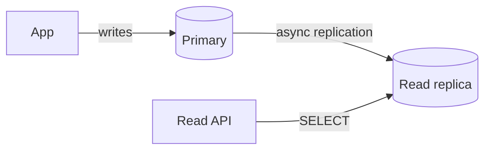

# 2026-06-15 — Read Replicas and Replication Lag

> Offload read traffic to replicas without pretending they're instantly consistent with the primary.

## Problem

Primary Postgres at **80% CPU** on reads. Adding replicas helps — until users **refresh after update** and see stale data because replication lag is 2–5 seconds.

Reads scaled; **consistency** didn't.

## Constraints

- **Scale:** 2k writes/sec; 15k reads/sec
- **Lag SLA:** p99 replication lag < 500ms under normal load
- **Routing:** Writes → primary; reads → replica pool
- **Critical reads:** After own write, read from primary or wait

## Architecture

Diagram source: [`diagrams/2026-06-15-read-replicas-replication-lag.mmd`](../diagrams/2026-06-15-read-replicas-replication-lag.mmd)

### Components

| Component | Role |
|-----------|------|
| **Primary** | All INSERT/UPDATE/DELETE |
| **Replica(s)** | Streaming replication; read-only |
| **Router** | ORM read/write split or ProxySQL |
| **Lag monitor** | `pg_stat_replication`; alert if lag > threshold |
| **Read-your-writes** | Session stickiness to primary briefly after write |

### Flow

1. `POST /profile` → write primary → return 201
2. Client `GET /profile` → route to replica → may lag → stale avatar URL
3. Fix: `GET` with `?consistent=true` or cookie routes to primary for 2s
4. Dashboard aggregates → replica OK (eventual consistency)

## Trade-offs

| Choice | Pros | Cons |
|--------|------|------|
| **Read replicas** | Cheap read scale | Lag; routing complexity |
| **Primary for all reads** | Strong consistency | No read scale |
| **CQRS read models** | Tailored views | More moving parts |

## When to use

- ✅ Read-heavy OLTP; lag-tolerant list/search pages
- ✅ Reporting queries isolated from primary

- ❌ Don't read replica for financial balance without lag bounds
- ❌ Don't ignore replica lag metrics during incidents
- ❌ Don't assume synchronous replication without explicit sync config

## References

- [PostgreSQL replication](https://www.postgresql.org/docs/current/high-availability.html)

---

**Tags:** `#postgresql` `#read-replicas` `#consistency` `#scaling` `#database`
