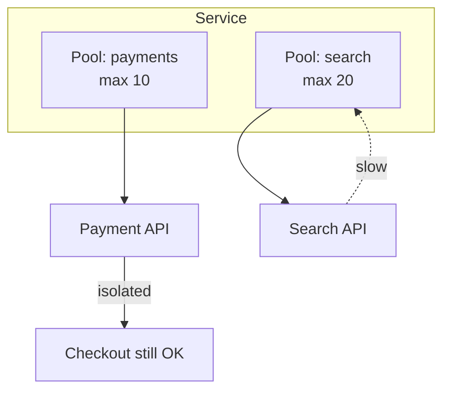

# 2026-06-16 — Bulkhead Pattern

> Isolate thread pools and connection limits per dependency so one slow service can't exhaust all resources.

## Problem

Search service hangs → shared thread pool of 200 threads fills → **checkout can't get threads** → revenue stops because of a non-critical feature.

Shared pools create **hidden coupling**.

## Constraints

- **Scale:** Checkout 1k RPS; search 500 RPS (when healthy)
- **Isolation:** Search may use max 30 threads; checkout reserved 100
- **Failure:** Search timeout doesn't block checkout pool

## Architecture

Diagram source: [`diagrams/2026-06-16-bulkhead-pattern.mmd`](../diagrams/2026-06-16-bulkhead-pattern.mmd)

### Components

| Component | Role |
|-----------|------|
| **Bulkhead** | Separate semaphores / thread pools per downstream |
| **Timeout** | Per-call limit inside bulkhead |
| **Fallback** | Empty search results when bulkhead saturated |
| **Metrics** | `bulkhead_rejected`, pool utilization |

### Flow

1. Checkout calls payment pool (10 slots) — independent
2. Product page calls search pool (20 slots)
3. Search degrades → pool full → fast-fail fallback, checkout unaffected
4. Tune pool sizes from measured p99 concurrency

## Trade-offs

| Choice | Pros | Cons |
|--------|------|------|
| **Bulkheads** | Fault isolation | Fixed capacity; tuning |
| **Shared pool** | Simple | Cascading failure |
| **Separate services** | Hard isolation | Network overhead |

## When to use

- ✅ Multiple downstream calls in one service
- ✅ Mixed criticality (revenue vs nice-to-have)
- ✅ With circuit breaker + timeout (see circuit breaker note)

- ❌ Don't create 50 bulkheads — focus on critical boundaries
- ❌ Don't set pools too small — false saturation

## References

- [Microsoft — Bulkhead pattern](https://learn.microsoft.com/en-us/azure/architecture/patterns/bulkhead)

---

**Tags:** `#bulkhead` `#resilience` `#microservices` `#fault-tolerance`
