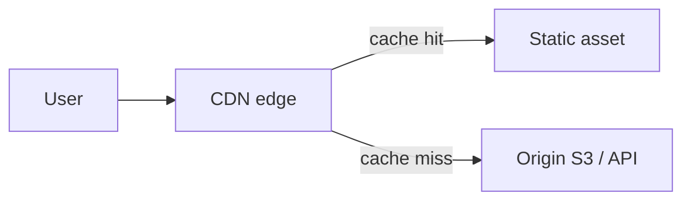

# 2026-06-17 — CDN Edge Caching

> Serve static assets and cacheable API responses from PoPs near users — cut origin load and latency.

## Problem

Product images and JS bundles hit your origin from **global users**. Sydney user loads from `us-east-1` → **300ms+ TTFB**. Black Friday multiplies bandwidth cost on S3/ALB.

CDN moves bytes closer to eyeballs.

## Constraints

- **Scale:** 50M asset requests/day; 90% cacheable
- **TTL:** Images 1 year (hashed filenames); API fragments 60s
- **Invalidation:** Purge on deploy; versioned URLs preferred
- **Provider:** CloudFront, Cloudflare, Fastly

## Architecture

Diagram source: [`diagrams/2026-06-17-cdn-edge-caching.mmd`](../diagrams/2026-06-17-cdn-edge-caching.mmd)

### Components

| Component | Role |
|-----------|------|
| **Edge PoP** | Regional cache node |
| **Cache-Control** | `max-age`, `s-maxage`, `immutable` |
| **Origin shield** | Optional mid-tier reduces origin hits |
| **Signed URLs** | Private content with expiry |
| **Brotli/gzip** | Compression at edge |

### Flow

1. Browser `GET /assets/app.a1b2c3.js` → nearest PoP
2. Hit → 20ms; miss → origin fetch → cache for TTL
3. Deploy new build → new filename hash → no purge needed
4. HTML `Cache-Control: no-cache` while assets long-lived

## Trade-offs

| Choice | Pros | Cons |
|--------|------|------|
| **CDN** | Latency + cost at scale | Invalidation complexity |
| **Origin only** | Simple | Slow globally; expensive |
| **Long TTL + hashed names** | Zero purge | Requires build pipeline discipline |

## When to use

- ✅ Static assets, public images, downloadable files
- ✅ Cacheable GET APIs (product catalog fragments)

- ❌ Don't CDN personalized authenticated HTML without careful Vary headers
- ❌ Don't cache POST responses at edge by default
- ❌ Don't forget HTTPS and cert management at edge

## References

- [CloudFront caching](https://docs.aws.amazon.com/AmazonCloudFront/latest/DeveloperGuide/UnderstandingCaching.html)

---

**Tags:** `#cdn` `#caching` `#performance` `#edge` `#scaling`
