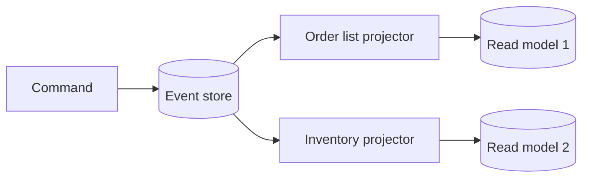

# 2026-06-18 — Event Sourcing

> Store state as an append-only sequence of domain events — rebuild any projection and audit every change.

## Problem

Updating a row in place **loses history**. "Who changed the price and when?" requires bolt-on audit tables. Rebuilding a new read model from current state alone is impossible if you discarded past facts.

Event sourcing treats **events as the source of truth**.

## Constraints

- **Scale:** 5k events/sec append; 7-year retention for compliance
- **Snapshots:** Every N events to avoid replay from genesis
- **Versioning:** Upcast old event schemas on replay

## Architecture

Diagram source: [`diagrams/2026-06-18-event-sourcing.mmd`](../diagrams/2026-06-18-event-sourcing.mmd)

### Components

| Component | Role |
|-----------|------|
| **Event store** | Append-only log per aggregate (`order-123`) |
| **Aggregate** | Rebuilt by folding events: `apply(OrderCreated)`, `apply(Shipped)` |
| **Projectors** | Build read models from stream |
| **Snapshots** | Cached aggregate state at version N |
| **Optimistic concurrency** | Expected version on append |

### Flow

1. `ShipOrder` → load events for `order-123` → apply business rules
2. Append `OrderShipped` at version 5
3. Projectors consume stream → update list views
4. New report needed → add projector, replay from offset 0

## Trade-offs

| Choice | Pros | Cons |
|--------|------|------|
| **Event sourcing** | Audit; flexible projections | Complexity; eventual consistency |
| **CRUD + audit table** | Simpler | Weaker replay story |
| **CQRS only** | Read/write split | May not store full history |

**Event sourcing ≠ CQRS** — often paired but separable (see CQRS note).

## When to use

- ✅ Strong audit/compliance requirements
- ✅ Multiple views from same write stream
- ✅ Domain with rich lifecycle (orders, accounts)

- ❌ Don't event-source simple CRUD admin panels
- ❌ Don't skip schema migration strategy for old events
- ❌ Don't confuse with "we log to Kafka" without aggregate versioning

## References

- [Martin Fowler — Event Sourcing](https://martinfowler.com/eaaDev/EventSourcing.html)

---

**Tags:** `#event-sourcing` `#architecture` `#audit` `#event-driven`
