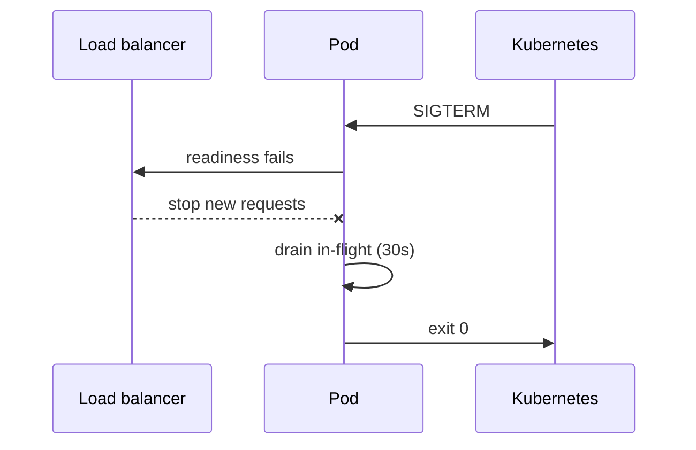

# 2026-06-19 — Graceful Shutdown

> Drain in-flight requests before killing a pod so deploys and scale-downs don't drop active connections.

## Problem

Kubernetes sends **SIGTERM** during rolling update → process exits immediately → users get **502** mid-request. Load balancer still sends traffic for seconds while readiness is stale.

Shutdown must be **coordinated**.

## Constraints

- **Drain window:** 30s `terminationGracePeriodSeconds`
- **LB:** Remove from endpoints on readiness fail first
- **Workers:** Finish queue jobs or return to broker
- **Infra:** K8s + Ingress or cloud LB

## Architecture



Diagram source: [`diagrams/2026-06-19-graceful-shutdown.mmd`](../diagrams/2026-06-19-graceful-shutdown.mmd)

### Components

| Component | Role |
|-----------|------|
| **SIGTERM handler** | Stop accepting new work |
| **Readiness fail** | `/health/ready` → 503 immediately |
| **In-flight tracker** | Wait for active HTTP/queue jobs |
| **preStop hook** | Optional sleep for LB propagation delay |
| **Grace period** | Hard kill SIGKILL after timeout |

### Flow

1. K8s deletes pod → SIGTERM
2. App sets `shuttingDown=true`; readiness returns 503
3. `preStop sleep 5` — LB catches up
4. Await open requests ≤ 30s
5. Close DB pools; exit 0

### Implementation sketch

```typescript
let shuttingDown = false;
let inFlight = 0;

process.on('SIGTERM', async () => {
  shuttingDown = true;
  const deadline = Date.now() + 25_000;
  while (inFlight > 0 && Date.now() < deadline) {
    await sleep(100);
  }
  await db.close();
  process.exit(0);
});
```

## Trade-offs

| Choice | Pros | Cons |
|--------|------|------|
| **Graceful drain** | No dropped requests | Slower rollouts |
| **Immediate kill** | Fast deploy | User errors |
| **Long preStop** | Safer LB sync | Slower scale-in |

## When to use

- ✅ Kubernetes rolling updates and HPA scale-down
- ✅ Long-lived HTTP requests or WebSockets
- ✅ Queue consumers with ack-after-process

- ❌ Don't ignore SIGTERM in Node/Java — register handlers
- ❌ Don't set grace period longer than LB + drain need without reason
- ❌ Don't accept new queue messages after SIGTERM

## References

- [Kubernetes pod termination](https://kubernetes.io/docs/concepts/workloads/pods/pod-lifecycle/#pod-termination)

---

**Tags:** `#kubernetes` `#deployment` `#reliability` `#graceful-shutdown`
