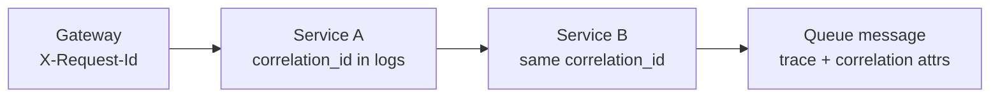

# 2026-06-20 — Correlation IDs and Structured Logging

> Tie every log line and downstream call to one request ID so incidents debug in minutes, not hours.

## Problem

Checkout fails. Logs show errors in gateway, orders, and payment — **no shared key** to filter. Engineers grep timestamps and guess. P99 spike with 50 services = impossible without **correlation**.

## Constraints

- **Format:** JSON logs; `correlation_id`, `service`, `level`, `message`
- **Propagation:** HTTP header + message attributes
- **Retention:** 14 days hot; link to trace_id when OpenTelemetry enabled
- **PII:** Never log full card numbers

## Architecture



Diagram source: [`diagrams/2026-06-20-correlation-ids-structured-logging.mmd`](../diagrams/2026-06-20-correlation-ids-structured-logging.mmd)

### Components

| Component | Role |
|-----------|------|
| **Correlation ID** | UUID per inbound request; `X-Request-Id` or `X-Correlation-Id` |
| **Structured logger** | pino, winston JSON — machine-parseable |
| **Context middleware** | AsyncLocalStorage / CLS carries ID through async chain |
| **Trace ID** | OpenTelemetry span ID — complementary, not replacement |

### Flow

1. Gateway generates `correlation_id` if client didn't send one
2. All services log `{ correlation_id, msg: "payment failed", orderId }`
3. Outbound HTTP forwards header; Kafka message includes attribute
4. Incident: `correlation_id=abc` → single timeline across services

### Implementation sketch

```typescript
app.use((req, res, next) => {
  const id = req.headers['x-request-id'] ?? randomUUID();
  req.correlationId = id;
  res.setHeader('X-Request-Id', id);
  logger.child({ correlation_id: id }).run(next);
});
```

## Trade-offs

| Choice | Pros | Cons |
|--------|------|------|
| **Correlation ID** | Simple; works without tracing | No automatic span hierarchy |
| **Distributed tracing** | Rich waterfalls | Heavier setup |
| **Plain text logs** | Human-readable | Hard to query at scale |

## When to use

- ✅ Any multi-service system
- ✅ Before or alongside OpenTelemetry (see tracing note)

- ❌ Don't generate new ID per internal hop — propagate same ID
- ❌ Don't log unstructured strings only in production
- ❌ Don't confuse correlation_id with user_id

## References

- [OpenTelemetry — context propagation](https://opentelemetry.io/docs/concepts/context-propagation/)

---

**Tags:** `#logging` `#observability` `#debugging` `#microservices`
