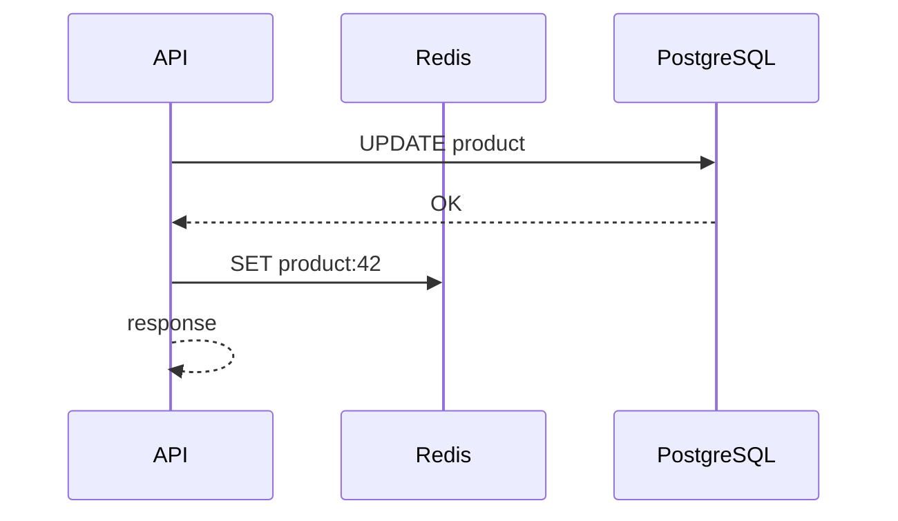

# 2026-06-21 — Write-Through Cache

> Update cache and database together on writes so reads always hit warm, consistent data — at the cost of write latency.

## Problem

Cache-aside (May 27) leaves a **stale window** after writes until invalidation or TTL. For **inventory counts** or **session state**, stale reads cause oversell or wrong UX. You want cache updated **in the write path**.

## Constraints

- **Scale:** 2k writes/sec; reads must see write within 10ms
- **Consistency:** Cache matches DB after successful write
- **Failure:** If cache write fails, roll back or retry DB transaction

## Architecture

Diagram source: [`diagrams/2026-06-21-write-through-cache.mmd`](../diagrams/2026-06-21-write-through-cache.mmd)

### Components

| Component | Role |
|-----------|------|
| **Write-through layer** | App or cache library writes DB then cache |
| **Read path** | Always cache first; rarely misses after write |
| **Write-behind (async)** | Variant: queue cache update — faster write, riskier |
| **Transaction ordering** | DB commit before cache set |

### Flow

1. `PUT /product/42` → update Postgres
2. On commit success → `SET product:42` in Redis
3. `GET /product/42` → cache hit with fresh data
4. DB fails → cache not updated

## Trade-offs

| Choice | Pros | Cons |
|--------|------|------|
| **Write-through** | Consistent reads | Slower writes; caches unused keys |
| **Cache-aside** | Fast writes; lazy fill | Stale window |
| **Write-behind** | Fastest writes | Complex failure recovery |

## When to use

- ✅ Read-after-write must be fresh (stock, permissions)
- ✅ Write rate moderate; cache size manageable

- ❌ Don't write-through rarely read keys — wasted cache RAM
- ❌ Don't update cache before DB commit
- ❌ Don't use for multi-region without invalidation strategy

## References

- [AWS — Caching best practices](https://docs.aws.amazon.com/AmazonElastiCache/latest/dg/Strategies.html)

---

**Tags:** `#caching` `#redis` `#consistency` `#write-through` `#architecture`
