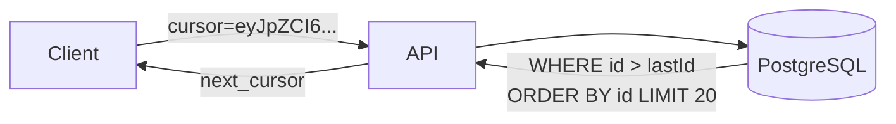

# 2026-06-22 — Cursor Pagination

> Paginate large, live datasets with stable cursors instead of OFFSET — avoid skipped rows and full table scans on page 5000.

## Problem

`GET /orders?offset=100000&limit=20` on a busy table:

- Postgres scans and discards **100k rows** every request
- New rows inserted while user pages → **duplicates or skips**
- Deep pages take **seconds**; mobile clients timeout

OFFSET pagination doesn't scale for feeds, admin tables, or infinite scroll.

## Constraints

- **Scale:** 50M orders; users scroll through thousands of pages
- **SLA:** p99 list < 50ms at any cursor depth
- **Stability:** No duplicate/skip when data changes between requests
- **API:** Opaque cursor token; no internal IDs exposed raw (optional encoding)

## Architecture



Diagram source: [`diagrams/2026-06-22-cursor-pagination.mmd`](../diagrams/2026-06-22-cursor-pagination.mmd)

### Components

| Component | Role |
|-----------|------|
| **Cursor** | Encoded `(sort_key, id)` tuple from last row of previous page |
| **Keyset query** | `WHERE (created_at, id) < ($1, $2) ORDER BY created_at DESC, id DESC` |
| **Index** | Composite index matching sort columns |
| **next_cursor / has_more** | Client passes cursor forward; no page numbers |

### Flow

1. First request: `GET /orders?limit=20` → returns 20 rows + `next_cursor`
2. Client: `GET /orders?limit=20&cursor=eyJ...`
3. API decodes cursor → keyset filter from last seen `(created_at, id)`
4. Index seek — cost **O(limit)**, not O(offset)
5. No rows inserted "above" cursor affect result set consistency

### Implementation sketch

```typescript
async function listOrders(cursor: string | null, limit: number) {
  const decoded = cursor ? decodeCursor(cursor) : null;
  const rows = await db.query(`
    SELECT * FROM orders
    WHERE ($1::timestamptz IS NULL)
       OR (created_at, id) < ($1, $2)
    ORDER BY created_at DESC, id DESC
    LIMIT $3
  `, [decoded?.createdAt ?? null, decoded?.id ?? null, limit + 1]);

  const hasMore = rows.length > limit;
  const page = rows.slice(0, limit);
  const next = hasMore ? encodeCursor(page.at(-1)) : null;
  return { data: page, next_cursor: next };
}
```

## Trade-offs

| Choice | Pros | Cons |
|--------|------|------|
| **Cursor / keyset** | Fast at depth; stable under writes | Can't jump to arbitrary page number |
| **OFFSET** | Simple; random page access | Slow + inconsistent at scale |
| **Seek + total count** | UX with "page 3 of 50" | `COUNT(*)` expensive on huge tables |

## When to use

- ✅ Infinite scroll, activity feeds, export-by-batch
- ✅ Tables with monotonic or indexed sort keys
- ✅ APIs where clients only move forward/back one page

- ❌ Don't use OFFSET for deep pagination on million-row tables
- ❌ Don't cursor without composite index on sort columns
- ❌ Don't expose raw internal cursors if they leak sensitive sort keys — encode/sign

## References

- [Use The Index, Luke — Pagination](https://use-the-index-luke.com/no-offset)
- [GitHub REST API — pagination with Link cursors](https://docs.github.com/en/rest/guides/using-the-rest-api)

---

**Tags:** `#pagination` `#postgresql` `#api-design` `#performance` `#scaling`
