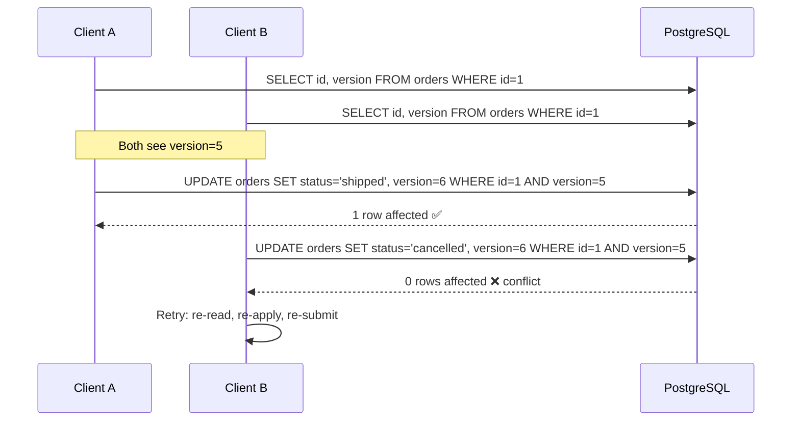

# 2026-06-23 — Optimistic Locking

> Prevent lost updates on concurrent writes without holding row locks — use a version column instead of pessimistic serialisation.

## Problem

Two users load the same order record at the same time. Both modify it. The second write silently overwrites the first:

- **User A** reads `version=5`, sets `status=shipped`
- **User B** reads `version=5`, sets `status=cancelled`
- User B commits first. User A commits — **User B's change is gone**

Pessimistic locking (`SELECT FOR UPDATE`) blocks reads during writes and kills throughput at scale.

## Constraints

- **Scale:** 10k concurrent writes/sec on a shared resource table
- **SLA:** Write p99 < 20ms; no long-held locks
- **Correctness:** Lost updates are never acceptable
- **Retry budget:** Clients can retry on conflict; conflicts should be rare under normal load

## Architecture



Diagram source: [`diagrams/2026-06-23-optimistic-locking.mmd`](../diagrams/2026-06-23-optimistic-locking.mmd)

### Components

| Component | Role |
|-----------|------|
| **version column** | Integer or timestamp incremented on every write |
| **conditional UPDATE** | `WHERE id=$1 AND version=$2` — atomically checks and updates |
| **affected rows check** | 0 rows → conflict; retry from fresh read |
| **application retry** | Re-read latest state, re-apply business logic, re-submit |

### Implementation sketch

```typescript
async function shipOrder(orderId: string, expectedVersion: number) {
  const result = await db.query(`
    UPDATE orders
    SET status = 'shipped', version = version + 1, updated_at = NOW()
    WHERE id = $1
      AND version = $2
      AND status = 'pending'
  `, [orderId, expectedVersion]);

  if (result.rowCount === 0) {
    throw new OptimisticLockError('Concurrent update detected — retry');
  }
}

// Caller
let retries = 3;
while (retries--) {
  const order = await db.query('SELECT * FROM orders WHERE id=$1', [id]);
  try {
    await shipOrder(order.id, order.version);
    break;
  } catch (e) {
    if (!(e instanceof OptimisticLockError) || retries === 0) throw e;
    await sleep(jitter(50)); // exponential backoff with jitter
  }
}
```

### version vs timestamp

Prefer an integer `version` column over `updated_at` timestamps:
- Clocks can skew across app servers
- Two writes in the same millisecond both pass the timestamp check
- Integer increment is monotonically safe

## Trade-offs

| Choice | Pros | Cons |
|--------|------|------|
| **Optimistic locking** | No locks; high read concurrency; simple schema | Retry logic in app; bad under high write contention |
| **Pessimistic locking** (`FOR UPDATE`) | No retries needed; strong serialisation | Locks held during business logic; latency spikes |
| **SERIALIZABLE isolation** | Database handles conflicts automatically | High abort rate; complex to tune at scale |

## When to use

- ✅ Low-to-moderate write contention on the same row (e-commerce orders, user profiles)
- ✅ Long read-modify-write cycles (user edits a form for 30s)
- ✅ Distributed systems where you can't hold a DB lock across service calls

- ❌ Don't use when writes on the same row are constant — retry storms will degrade throughput
- ❌ Don't forget to propagate version to the client so they can send it back on save
- ❌ Don't use `updated_at` as the version field — prefer an explicit integer counter

## References

- [Martin Fowler — Optimistic Offline Lock](https://martinfowler.com/eaaCatalog/optimisticOfflineLock.html)
- [PostgreSQL — Explicit Locking](https://www.postgresql.org/docs/current/explicit-locking.html)

---

**Tags:** `#concurrency` `#postgresql` `#database` `#consistency` `#patterns`
