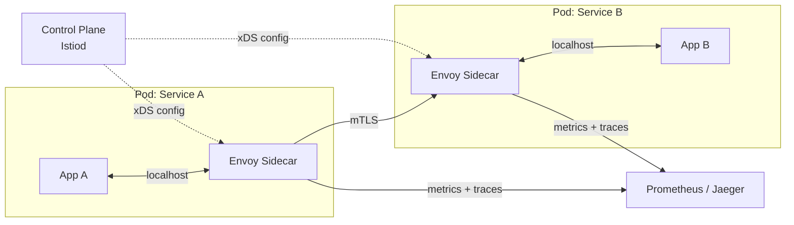

# 2026-06-24 — Service Mesh and Sidecar Proxy

> Inject a sidecar proxy beside every service pod to handle retries, mTLS, circuit breaking, and telemetry — without changing app code.

## Problem

In a 40-service architecture, each team independently solves:

- How to retry failed downstream calls (inconsistently)
- How to authenticate service-to-service traffic (or not at all)
- How to emit traces and metrics (different libraries, different formats)
- How to circuit-break a slow dependency

The result: **cross-cutting concerns scattered across every codebase**, version mismatches, security gaps, and blind spots in observability.

## Constraints

- **Scale:** 40+ services, multiple languages (Node, Go, Python)
- **Security:** mTLS between every pair of services — zero-trust network
- **Observability:** Uniform traces and metrics without per-team instrumentation
- **Operational:** Mesh configuration must be declarative and version-controlled

## Architecture



Diagram source: [`diagrams/2026-06-24-service-mesh-sidecar-proxy.mmd`](../diagrams/2026-06-24-service-mesh-sidecar-proxy.mmd)

### Components

| Component | Role |
|-----------|------|
| **Sidecar proxy** (Envoy) | Intercepts all inbound/outbound traffic for the pod |
| **Control plane** (Istiod) | Pushes routing rules, certs, and policy via xDS API |
| **mTLS** | Automatic certificate rotation; each sidecar proves its identity |
| **VirtualService / DestinationRule** | Declarative retries, timeouts, circuit breakers, traffic splits |
| **Telemetry** | Sidecars emit spans and metrics without app code changes |

### What moves out of app code

```yaml
# DestinationRule — circuit breaker, no app code change
apiVersion: networking.istio.io/v1beta1
kind: DestinationRule
metadata:
  name: payment-service
spec:
  host: payment-service
  trafficPolicy:
    outlierDetection:
      consecutive5xxErrors: 5
      interval: 10s
      baseEjectionTime: 30s
    connectionPool:
      http:
        http1MaxPendingRequests: 100
        http2MaxRequests: 1000
```

```yaml
# VirtualService — retries and timeout
apiVersion: networking.istio.io/v1beta1
kind: VirtualService
metadata:
  name: payment-service
spec:
  hosts:
    - payment-service
  http:
    - retries:
        attempts: 3
        perTryTimeout: 2s
        retryOn: 5xx,reset,connect-failure
      timeout: 8s
      route:
        - destination:
            host: payment-service
```

## Trade-offs

| Choice | Pros | Cons |
|--------|------|------|
| **Service mesh** | Uniform policy, zero app changes, mTLS everywhere | Latency overhead per hop (~1ms); operational complexity |
| **Library-based** (e.g. Resilience4j) | No sidecar overhead | Per-language, per-team; diverges quickly |
| **API gateway only** | Simple north-south control | No east-west (service-to-service) coverage |

### Latency overhead

Each sidecar hop adds ~0.5–1ms. For a chain of 5 services that's ~5ms added at p50. Acceptable for most workloads; measure before blaming the mesh.

## When to use

- ✅ 10+ services where cross-cutting concerns need uniform enforcement
- ✅ Zero-trust security requirement (mTLS, RBAC between services)
- ✅ Multi-language environment where library approach diverges
- ✅ Progressive traffic splitting for canary deployments

- ❌ Don't add a mesh to a monolith or 3-service app — overkill
- ❌ Don't ignore the control plane as a single point of failure — run it HA
- ❌ Don't rely on the mesh alone for application-level idempotency and retries

## References

- [Istio — Architecture](https://istio.io/latest/docs/ops/deployment/architecture/)
- [Envoy Proxy — Getting Started](https://www.envoyproxy.io/docs/envoy/latest/start/start)
- [CNCF — Service Mesh Landscape](https://landscape.cncf.io/card-mode?category=service-mesh)

---

**Tags:** `#service-mesh` `#istio` `#envoy` `#kubernetes` `#zero-trust` `#observability`
