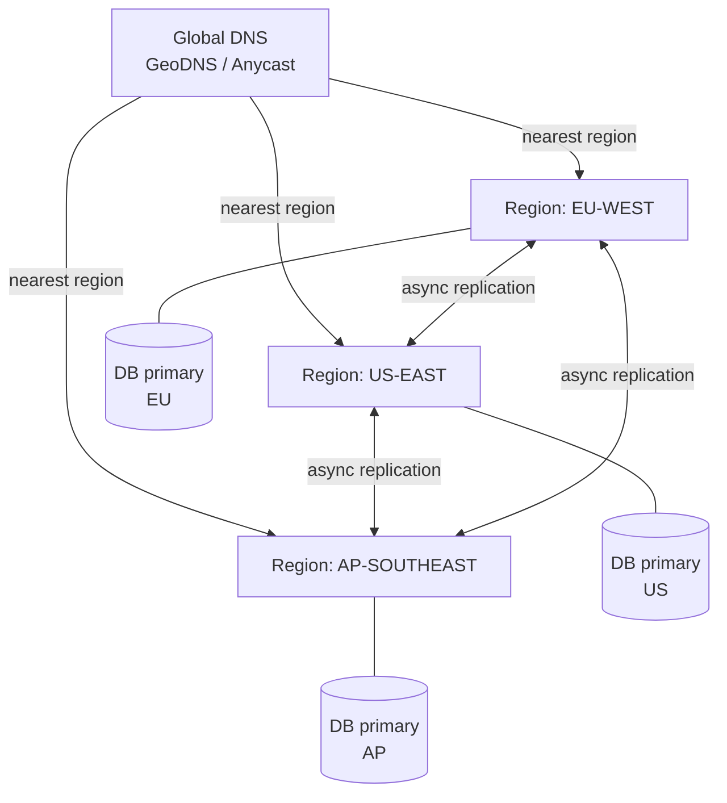

# 2026-06-25 — Multi-region Active-Active

> Serve writes from multiple regions simultaneously so users get low latency globally and the system survives a full region outage without manual failover.

## Problem

A single-region deployment means:

- **Latency:** Users in Tokyo wait 150ms+ for writes routed to us-east-1
- **Availability:** One regional outage takes the whole product down
- **RTO:** Manual failover to a standby region takes 5–30 minutes

Active-passive (primary + warm standby) reduces RTO but still exposes a window of downtime and doesn't solve latency for distant users.

## Constraints

- **Scale:** 500k writes/day spread across three continents
- **RTO:** < 60 seconds on full region failure — automatic, no pager
- **RPO:** < 5 seconds of data loss accepted on catastrophic region loss
- **Consistency:** Eventual consistency within 1s between regions acceptable; strong consistency per-entity within a region

## Architecture



Diagram source: [`diagrams/2026-06-25-multi-region-active-active.mmd`](../diagrams/2026-06-25-multi-region-active-active.mmd)

### Components

| Component | Role |
|-----------|------|
| **GeoDNS / Anycast** | Routes each user to the nearest healthy region |
| **Regional write primary** | Accepts writes locally; no cross-region round-trip |
| **Async replication** | Propagates writes to peer regions; CockroachDB, Cassandra, or DynamoDB Global Tables |
| **Conflict resolution** | Last-write-wins (LWW) or application-level CRDT merge |
| **Health checks** | DNS TTL set low (30–60s); unhealthy region removed from rotation |

### Conflict resolution strategies

```
Last-write-wins (LWW):
  - Each write carries a timestamp (or logical clock)
  - On conflict, highest timestamp wins
  - Risk: clock skew silently drops updates

CRDT (Conflict-free Replicated Data Type):
  - Counters, sets, registers designed to merge without coordination
  - No conflicts by definition — order of merge doesn't matter
  - Use for: shopping cart (add-only set), view counters, presence

Sticky sessions:
  - Route a given user's writes to one region for their session
  - Prevents per-user conflicts; still async replication
  - Breaks if user region is unavailable mid-session
```

### Failure scenario

1. EU-WEST health check fails at 14:02:05
2. GeoDNS propagates EU removal within 30–60s (TTL)
3. EU traffic shifts to US-EAST and AP-SOUTHEAST
4. In-flight EU writes replicated before partition → RPO < 5s
5. EU recovers at 14:25 — rejoins replication ring, catches up via WAL replay

## Trade-offs

| Choice | Pros | Cons |
|--------|------|------|
| **Active-active** | Low latency everywhere; survive region loss automatically | Conflict resolution complexity; higher operational burden |
| **Active-passive** | Simple; no conflicts | Writes always go to primary region; RTO on manual failover |
| **Active-active (strong consistency)** | No conflicts; linearisable | Requires synchronous cross-region quorum — 100–200ms write latency |

### What "eventual consistency" actually means here

Replication lag between us-east-1 and eu-west-1 is typically 50–150ms in practice (CockroachDB, DynamoDB Global Tables). Users only see stale reads if they immediately read from a different region after a write — mitigate with session pinning or read-your-writes tokens.

## When to use

- ✅ Global user base where region-level latency matters (SaaS, gaming, fintech)
- ✅ SLA requires automatic recovery, not pager-based failover
- ✅ Write volume distributable across regions (not a single hot shard)

- ❌ Don't go active-active if your data model can't tolerate conflicts — serialisable transactions require synchronous replication
- ❌ Don't underestimate DNS TTL propagation — it's the floor on your RTO
- ❌ Don't mix active-active and strict foreign key constraints across regions

## References

- [AWS — Multi-region Active-Active Architecture](https://aws.amazon.com/solutions/implementations/multi-region-application-architecture/)
- [CockroachDB — Multi-region docs](https://www.cockroachlabs.com/docs/stable/multiregion-overview.html)
- [DynamoDB Global Tables](https://docs.aws.amazon.com/amazondynamodb/latest/developerguide/GlobalTables.html)

---

**Tags:** `#multi-region` `#availability` `#replication` `#dns` `#consistency` `#disaster-recovery`
