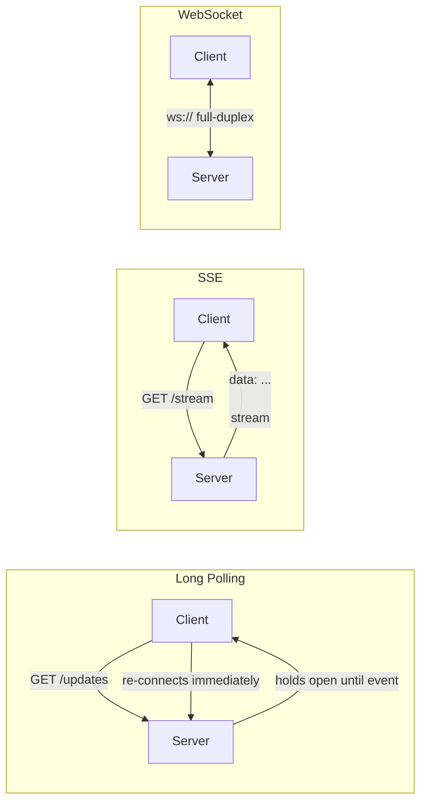

# 2026-06-26 — Long Polling vs SSE vs WebSockets

> Choose the right real-time transport for your use case — not every live feature needs a full-duplex WebSocket connection.

## Problem

Your product needs live updates: a notification bell, a chat inbox, a live dashboard. You need to push data from server to client without the client polling every second.

Three options exist. Teams frequently pick WebSockets by default, adding stateful connection management overhead for features that only ever push data one way.

## Constraints

- **Scale:** 200k concurrent connected clients
- **Latency:** Updates delivered within 500ms
- **Infrastructure:** Clients behind corporate proxies and mobile networks
- **Bidirectional need:** Varies by feature (chat vs. notifications vs. dashboards)

## Architecture



Diagram source: [`diagrams/2026-06-26-long-polling-sse-websockets.mmd`](../diagrams/2026-06-26-long-polling-sse-websockets.mmd)

### Comparison

| | Long Polling | SSE | WebSocket |
|--|---|---|---|
| **Direction** | Server → Client | Server → Client | Full-duplex |
| **Protocol** | HTTP/1.1 | HTTP/1.1 or HTTP/2 | ws:// upgrade |
| **Proxy / firewall** | ✅ Works everywhere | ✅ Works everywhere | ⚠️ Some proxies block |
| **Reconnect** | App code (re-request) | Browser built-in | App code |
| **Multiplexing (HTTP/2)** | Limited | ✅ 6 streams per connection | N/A |
| **State on server** | Stateless per request | Stateful connection | Stateful connection |
| **Overhead at scale** | High (re-connect churn) | Low | Low |
| **Best for** | Legacy infra, simple triggers | Notifications, feeds, dashboards | Chat, collaboration, gaming |

### Long Polling

Client sends a request. Server holds it open until an event fires or a timeout (~30s). Client immediately re-connects after receiving a response.

```typescript
// Server (NestJS)
@Get('/updates')
async longPoll(@Req() req, @Res() res) {
  const event = await this.eventBus.waitForEvent(req.user.id, { timeout: 30_000 });
  res.json(event ?? { type: 'timeout' });
}
```

**Problem:** 200k clients × 1 request each = 200k open connections; re-connect storm on server restart.

### Server-Sent Events (SSE)

One persistent HTTP connection. Server pushes `data:` frames. Browser `EventSource` API handles reconnect automatically with `Last-Event-ID`.

```typescript
// Server (NestJS)
@Sse('/notifications/stream')
stream(@Req() req): Observable<MessageEvent> {
  return this.notificationService
    .streamForUser(req.user.id)
    .pipe(map(event => ({ data: event })));
}

// Client
const es = new EventSource('/notifications/stream');
es.onmessage = (e) => dispatch(JSON.parse(e.data));
// Auto-reconnects on drop; sends Last-Event-ID header
```

SSE over HTTP/2 multiplexes multiple streams per TCP connection — scales better than WebSocket at high connection counts.

### WebSocket

Full-duplex persistent connection. Required when the client also sends high-frequency data (keystrokes, cursor positions, game state).

```typescript
// NestJS Gateway
@WebSocketGateway({ namespace: 'chat' })
export class ChatGateway {
  @SubscribeMessage('message')
  handleMessage(@MessageBody() dto: MessageDto, @ConnectedSocket() client: Socket) {
    this.chatService.broadcast(dto.roomId, dto);
  }
}
```

**Scaling WebSockets:** Connections are sticky. Use Redis Pub/Sub (Socket.IO adapter) or a dedicated real-time layer (Ably, Pusher) so any app server can publish to any connected client.

## Trade-offs

| Concern | Recommendation |
|---------|----------------|
| Notifications, news feed | **SSE** — simple, scalable, no extra libs |
| Chat, collaborative editing | **WebSocket** — bidirectional is the point |
| Third-party / embedded widget | **Long polling** — no proxy issues, works everywhere |
| 1M+ concurrent connections | **SSE over HTTP/2** or dedicated real-time infra |

## When to use

- ✅ **SSE** for anything server-push-only: notifications, live counters, log tailing
- ✅ **WebSocket** when the client sends frequent messages: chat, multiplayer, live cursors
- ✅ **Long polling** when SSE/WebSocket are blocked by infra you don't control

- ❌ Don't use WebSocket for one-way dashboards — SSE is simpler and easier to scale
- ❌ Don't use SSE if you need binary framing or sub-protocol negotiation
- ❌ Don't forget to handle reconnect and replay missed events on both SSE and WebSocket

## References

- [MDN — Server-Sent Events](https://developer.mozilla.org/en-US/docs/Web/API/Server-sent_events/Using_server-sent_events)
- [MDN — WebSockets API](https://developer.mozilla.org/en-US/docs/Web/API/WebSockets_API)
- [HTTP/2 multiplexing — RFC 7540](https://www.rfc-editor.org/rfc/rfc7540)

---

**Tags:** `#realtime` `#websocket` `#sse` `#long-polling` `#api-design` `#scaling`
