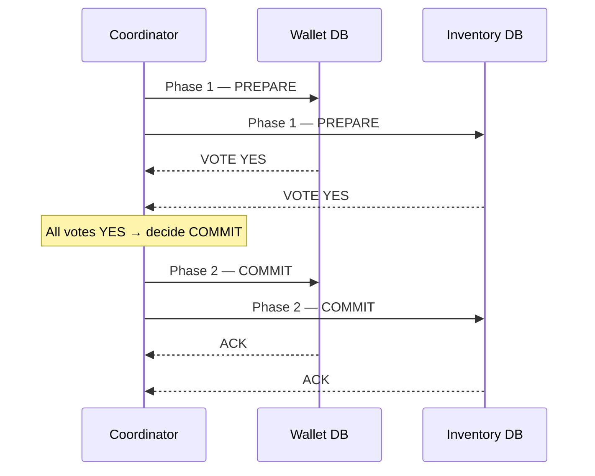

# 2026-06-27 — Two-Phase Commit (2PC)

> Atomically commit a write across multiple databases or services — either all nodes commit or all roll back, with no partial success.

## Problem

An order checkout must debit the wallet **and** reserve inventory. Both live in separate databases. If you commit to one and the other fails:

- Wallet debited, inventory not reserved → lost money
- Inventory reserved, wallet not debited → free goods

Simple sequential writes can't guarantee atomicity across service boundaries.

## Constraints

- **Correctness:** All-or-nothing — partial commits are never acceptable
- **Scale:** Hundreds of transactions per second across two services
- **Latency budget:** Checkout p99 < 500ms; 2PC adds one round-trip per participant
- **Failure model:** Any participant or coordinator can crash at any point

## Architecture



Diagram source: [`diagrams/2026-06-27-two-phase-commit.mmd`](../diagrams/2026-06-27-two-phase-commit.mmd)

### Phase 1 — Prepare

Coordinator sends `PREPARE` to all participants. Each participant:
1. Acquires locks and writes to its undo/redo log
2. Votes `YES` (can commit) or `NO` (must abort)
3. Holds locks — **no release until Phase 2**

### Phase 2 — Commit or Abort

- If **all votes are YES** → coordinator broadcasts `COMMIT`
- If **any vote is NO** → coordinator broadcasts `ABORT`
- Participants release locks and apply (or roll back) the transaction

### Failure modes

| Failure point | Outcome |
|---------------|---------|
| Participant crashes before PREPARE | Coordinator times out → ABORT |
| Participant crashes after voting YES | On recovery, participant queries coordinator for decision |
| **Coordinator crashes after PREPARE, before COMMIT** | Participants block indefinitely holding locks — **the blocking problem** |
| Coordinator crashes after COMMIT sent to some | Partial commit until coordinator recovers and replays log |

The coordinator crash between phases is the fundamental weakness of 2PC. Participants hold locks with no way to proceed — this is why 2PC is called a **blocking protocol**.

### Coordinator recovery

```
Coordinator WAL entry on decision:
  { txnId: "abc", decision: "COMMIT", participants: ["wallet", "inventory"] }

On restart: replay log, re-send COMMIT/ABORT to any participant
that hasn't ACKed. Participants must be idempotent to COMMIT.
```

## Trade-offs

| Choice | Pros | Cons |
|--------|------|------|
| **2PC** | Strong atomicity; well-understood | Blocking on coordinator failure; latency per round-trip |
| **Saga pattern** | Non-blocking; eventual consistency | Requires compensating transactions; business logic complexity |
| **Outbox + event** | Decoupled; resilient | Eventual consistency only; no cross-service rollback |

### When 2PC is used in practice

- **XA transactions** — JDBC/ODBC standard, used inside application servers
- **PostgreSQL + distributed FDW** — foreign data wrappers with 2PC
- **Google Spanner / CockroachDB** — implement a variant (Paxos-based 2PC) behind the scenes for cross-shard atomicity
- **Kafka transactions** — produce + consumer offset commit atomically uses a 2PC-like protocol internally

## When to use

- ✅ Financial transactions where partial failure is unacceptable and latency tolerance exists
- ✅ You control both databases and can tolerate coordinator single-point-of-failure risk
- ✅ Your database supports XA or distributed transactions natively

- ❌ Don't use 2PC across microservices you don't own — the blocking risk is real in production
- ❌ Don't use when p99 latency is critical — two synchronous round-trips across services add up
- ❌ Don't forget that coordinator crash leaves participants stuck — design for coordinator HA or use Saga instead

## References

- [Gray & Lamport — Consensus on Transaction Commit (2006)](https://lamport.azurewebsites.net/video/consensus-on-transaction-commit.pdf)
- [Martin Fowler — Two-Phase Commit](https://martinfowler.com/articles/patterns-of-distributed-systems/two-phase-commit.html)
- [PostgreSQL — Two-Phase Transactions](https://www.postgresql.org/docs/current/two-phase.html)

---

**Tags:** `#distributed-systems` `#transactions` `#consistency` `#database` `#atomicity`
