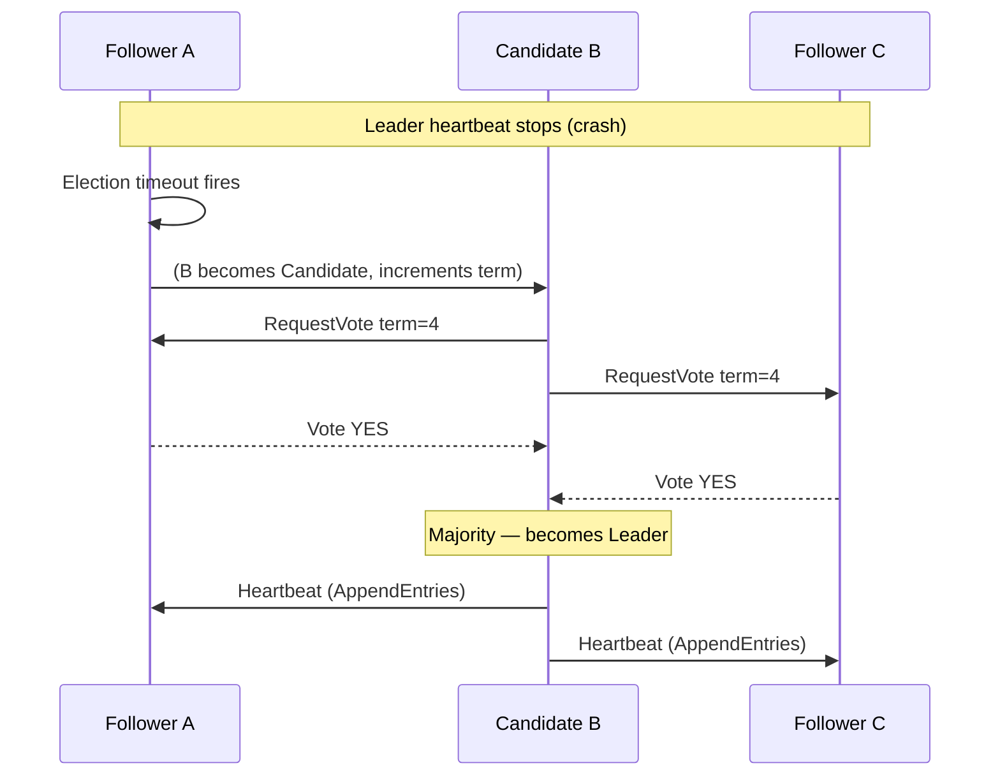

# 2026-06-28 — Leader Election and Raft

> Elect a single authoritative node among peers automatically — so a cluster can coordinate writes, scheduling, or locks without a human deciding who is in charge.

## Problem

A cluster of 5 database replicas must agree on which node accepts writes. Without a leader:

- Two nodes accept writes simultaneously → split-brain → data diverges
- A crashed primary leaves the cluster in limbo until an operator intervenes
- Manual failover takes minutes; SLA requires automatic recovery in seconds

## Constraints

- **Safety:** At most one leader at any time — split-brain is never acceptable
- **Liveness:** A new leader must be elected within seconds of a failure
- **Fault tolerance:** Survive failure of up to `floor((n-1)/2)` nodes (majority quorum)
- **Consistency:** Elected leader must have all committed log entries

## Architecture



Diagram source: [`diagrams/2026-06-28-leader-election-raft.mmd`](../diagrams/2026-06-28-leader-election-raft.mmd)

### Raft roles

| Role | Behaviour |
|------|-----------|
| **Follower** | Passive; resets election timer on each heartbeat from leader |
| **Candidate** | Election timeout fired; requests votes from peers |
| **Leader** | Accepts client writes; sends heartbeats to suppress new elections |

### Election flow

1. Follower's election timeout fires (randomised 150–300ms) — no heartbeat received
2. Follower increments its `term`, transitions to Candidate, votes for itself
3. Sends `RequestVote(term, lastLogIndex, lastLogTerm)` to all peers
4. Peer grants vote if: it hasn't voted this term AND candidate's log is at least as up-to-date
5. Candidate wins majority → becomes Leader, sends immediate heartbeat to cancel other elections
6. If no majority before timeout → restart election with `term + 1`

### Why randomised timeouts prevent split votes

All followers use a randomised election timeout. The first to expire becomes a candidate and usually collects votes before others wake up. Without randomisation, all followers timeout simultaneously → every node votes for itself → no majority → livelock.

### Log safety rule

A candidate must have a log at least as up-to-date as the majority. "Up-to-date" = higher last log term, or same term with longer log. This guarantees the elected leader holds all committed entries — no committed write is ever lost.

### Implementations you interact with daily

| System | Uses Raft / Paxos for |
|--------|-----------------------|
| **etcd** | Kubernetes control plane consensus |
| **CockroachDB** | Per-range leader election |
| **Consul** | Service discovery leader |
| **MongoDB** | Replica set primary election |
| **PostgreSQL Patroni** | HA leader election via etcd/Consul |

### Practical: etcd leader watch

```bash
# Check which etcd member is leader
etcdctl endpoint status --cluster -w table

# Watch leader changes
etcdctl watch --prefix /registry/leases/coordination.k8s.io/
```

## Trade-offs

| Concern | Notes |
|---------|-------|
| **Split-brain risk** | Prevented by requiring majority quorum — minority partition cannot elect a leader |
| **Election latency** | 150–500ms with randomised timeouts; tunable for your SLA |
| **Even node counts** | Avoid — 4-node cluster tolerates 1 failure same as 3-node; use odd numbers |
| **Network partition** | Minority partition stalls (safe); majority partition elects new leader and proceeds |

## When to use

- ✅ Any stateful cluster where exactly one node must be authoritative (DB primary, queue leader, scheduler)
- ✅ Distributed lock services — leader holds the lock, followers wait
- ✅ Kubernetes operators — use leader election via `coordination.k8s.io/Lease` to avoid duplicate reconciliation

- ❌ Don't hand-roll Raft — use etcd, Consul, or ZooKeeper; the edge cases are subtle and dangerous
- ❌ Don't use even-numbered clusters — risk of permanent split vote
- ❌ Don't confuse leader election with distributed locking — they overlap but serve different purposes

## References

- [Raft paper — In Search of an Understandable Consensus Algorithm](https://raft.github.io/raft.pdf)
- [The Secret Lives of Data — Raft visualization](http://thesecretlivesofdata.com/raft/)
- [etcd — How etcd works](https://etcd.io/docs/v3.5/learning/why/)

---

**Tags:** `#distributed-systems` `#consensus` `#raft` `#leader-election` `#high-availability`
