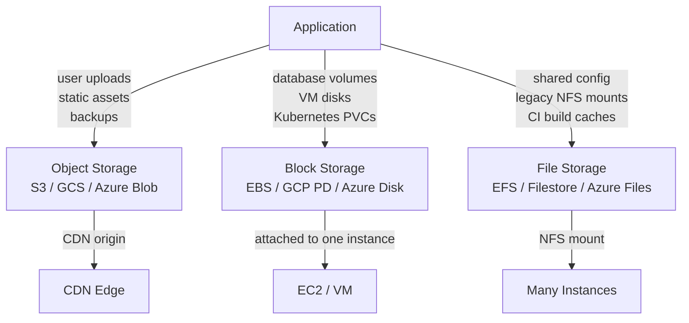

# 2026-06-29 — Object Storage vs Block Storage vs File Storage

> Pick the right storage primitive before you build — the wrong choice causes either performance ceilings, cost explosions, or architectural dead ends.

## Problem

A new feature needs to store user-uploaded videos, database WAL files, and shared config across app servers. An engineer defaults to "just put it on S3." But:

- Database WAL on object storage → 10–100ms per write, unusable
- Shared config on block storage → not accessible from multiple instances simultaneously
- Videos on a NAS file system → no CDN-native URLs, cost scales badly

Each storage type has fundamentally different semantics, cost profiles, and scaling properties.

## Constraints

- **Durability:** 99.999999999% (eleven 9s) for user data
- **Throughput:** Video uploads up to 5 GB/file; database I/O < 1ms per write
- **Access patterns:** CDN delivery for media; random byte-range reads for DB; shared mount for legacy config
- **Cost:** Storage cost dominates at petabyte scale

## Architecture



Diagram source: [`diagrams/2026-06-29-object-block-file-storage.mmd`](../diagrams/2026-06-29-object-block-file-storage.mmd)

### Comparison

| | Object Storage | Block Storage | File Storage |
|--|---|---|---|
| **Examples** | S3, GCS, Azure Blob | EBS, GCP PD, Azure Disk | EFS, Filestore, Azure Files |
| **Access** | HTTP API (GET/PUT) | Raw disk (read/write bytes) | POSIX file system (NFS/SMB) |
| **Concurrent access** | ✅ Unlimited clients | ❌ One instance at a time | ✅ Many instances |
| **Latency** | 10–100ms | < 1ms (SSD) | 1–10ms |
| **Throughput** | Very high (parallelisable) | High, sequential-friendly | Moderate |
| **Mutability** | Append or replace whole object | Byte-level random writes | Full POSIX read/write |
| **Cost** | Cheapest at scale | Most expensive | Moderate |
| **Best for** | Media, backups, static assets, data lake | Database volumes, OS disks | Shared mounts, legacy apps |

### Object storage — key properties

- **Flat namespace:** No real directories; prefixes emulate hierarchy
- **Eventual consistency** (historically) — S3 now offers strong read-after-write consistency
- **Versioning:** Built-in; retain every version of an object
- **Lifecycle rules:** Auto-tier to Glacier / Coldline after N days
- **Pre-signed URLs:** Delegate time-limited direct uploads/downloads to clients — offload bandwidth from your app servers

```typescript
// Generate pre-signed PUT URL for client-side upload
const url = await s3.getSignedUrlPromise('putObject', {
  Bucket: 'user-uploads',
  Key: `videos/${userId}/${filename}`,
  Expires: 300,          // 5 minutes
  ContentType: 'video/mp4',
});
// Client uploads directly to S3 — your server never touches the bytes
```

### Block storage — key properties

- **Attached to one instance:** EBS volume is exclusive to one EC2 instance at a time (except EBS Multi-Attach, which is limited)
- **Snapshot-based backup:** Point-in-time snapshots → restore or clone volumes
- **IOPS provisioning:** Provision dedicated IOPS for database workloads; don't share with noisy neighbours
- **Encryption at rest:** Transparent, key managed by KMS

### File storage — key properties

- **POSIX semantics:** `open()`, `read()`, `write()`, `flock()` — legacy apps work unmodified
- **Multi-attach:** NFS mount on dozens of instances simultaneously
- **Performance modes:** General Purpose vs Max I/O on EFS; tune for metadata-heavy vs throughput-heavy
- **Use sparingly in cloud-native:** Shared file systems are a scaling bottleneck — prefer object storage where possible

## Trade-offs

| Decision | Recommendation |
|----------|----------------|
| User media (images, video, docs) | Object storage + CDN — always |
| PostgreSQL / MySQL data volume | Block storage (gp3/io2) — always |
| Kubernetes StatefulSet volumes | Block storage PVCs |
| Multi-pod shared mount | File storage (EFS) — only if truly needed |
| ML training datasets | Object storage (data lake pattern) |
| WAL archiving / DB backups | Object storage (S3 compatible) |

## When to use

- ✅ **Object:** Everything you can access via URL or batch API — media, logs, backups, artifacts
- ✅ **Block:** Any workload that needs low-latency random I/O — databases, caches, VM boot volumes
- ✅ **File:** Legacy apps needing shared POSIX mounts; CI systems sharing build caches

- ❌ Don't put a database on object storage — the latency will destroy performance
- ❌ Don't use block storage for static assets — no CDN integration, pay per IOPS
- ❌ Don't use file storage as your default — it's a crutch that hides stateful design problems

## References

- [AWS — Storage types overview](https://aws.amazon.com/products/storage/)
- [Cloudflare R2 — Object storage without egress fees](https://developers.cloudflare.com/r2/)
- [EBS volume types — gp3 vs io2](https://docs.aws.amazon.com/AWSEC2/latest/UserGuide/ebs-volume-types.html)

---

**Tags:** `#storage` `#s3` `#object-storage` `#block-storage` `#infrastructure` `#cloud`
