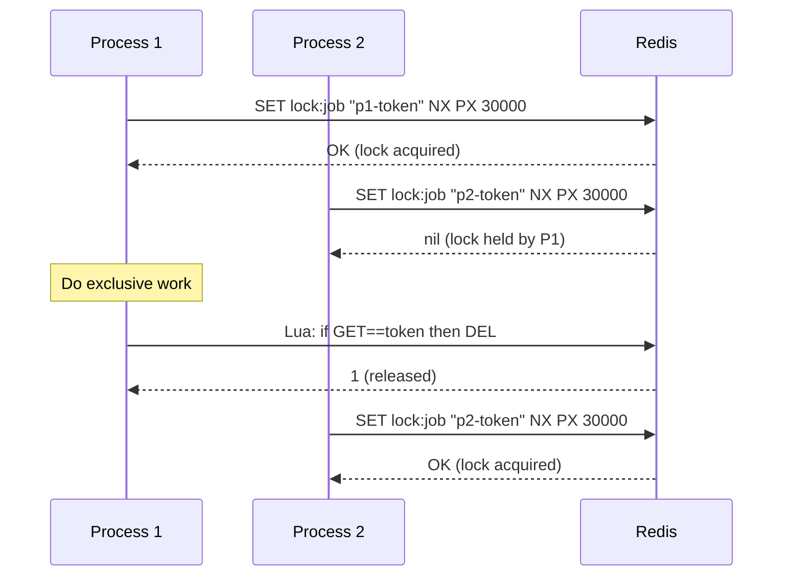

# 2026-06-30 — Distributed Locking with Redis

> Coordinate exclusive access to a shared resource across multiple processes or servers — prevent double-processing, duplicate sends, and race conditions at scale.

## Problem

A cron job runs on 5 app servers simultaneously. All 5 query the same table, find 1000 pending emails, and each sends all 1000 — users receive 5 duplicate emails.

A single database `SELECT FOR UPDATE` works within one process. Across multiple servers or pods, you need a lock store that all processes agree on.

## Constraints

- **Correctness:** At most one process holds the lock at any time
- **Safety on crash:** Lock must expire automatically if holder crashes — no deadlock
- **Scale:** Thousands of lock acquisitions per second
- **Latency:** Lock acquire/release < 5ms

## Architecture



Diagram source: [`diagrams/2026-06-30-distributed-locking-redis.mmd`](../diagrams/2026-06-30-distributed-locking-redis.mmd)

### Core primitives

**Acquire:**
```
SET lock:{resource} {unique-token} NX PX {ttl-ms}
```
- `NX` — only set if key does not exist (atomic)
- `PX {ttl}` — auto-expire if holder crashes; prevents deadlock
- `{unique-token}` — random UUID per attempt; proves ownership on release

**Release (Lua script — atomic):**
```lua
if redis.call("GET", KEYS[1]) == ARGV[1] then
  return redis.call("DEL", KEYS[1])
else
  return 0
end
```
Without the Lua script, a crashed process or slow network can cause Process 1 to accidentally delete Process 2's lock.

### Implementation sketch

```typescript
import { Redis } from 'ioredis';
import { randomUUID } from 'crypto';

const RELEASE_SCRIPT = `
  if redis.call("GET", KEYS[1]) == ARGV[1] then
    return redis.call("DEL", KEYS[1])
  else return 0 end
`;

async function withLock<T>(
  redis: Redis,
  key: string,
  ttlMs: number,
  fn: () => Promise<T>,
): Promise<T | null> {
  const token = randomUUID();
  const acquired = await redis.set(key, token, 'NX', 'PX', ttlMs);

  if (!acquired) return null; // another process holds it

  try {
    return await fn();
  } finally {
    await redis.eval(RELEASE_SCRIPT, 1, key, token);
  }
}

// Usage
await withLock(redis, 'lock:send-emails', 30_000, async () => {
  const emails = await db.query('SELECT * FROM pending_emails LIMIT 100');
  await sendAll(emails);
});
```

### TTL — the hard problem

The TTL must be longer than the longest possible execution of your critical section. If the lock expires while work is still in progress:

1. Process 1 is still running — lock has expired
2. Process 2 acquires the lock — both now run concurrently
3. Duplicate work

**Mitigations:**
- Set TTL conservatively high (2–5× expected runtime)
- Use a watchdog that extends the TTL while the process is alive (Redisson does this)
- Make the critical section idempotent so double-execution is safe

### Redlock (multi-node)

Single-node Redis: if the master crashes before expiry, the lock is lost and a new holder can acquire it before the original holder's TTL expires.

Redlock acquires the lock on `N` independent Redis nodes (majority quorum):

```
for each of N nodes:
  SET lock:{key} {token} NX PX {ttl}
if acquired on ⌈N/2⌉+1 nodes within drift window:
  lock is held
else:
  release all acquired nodes, fail
```

Martin Fowler and others argue Redlock is still unsafe under GC pauses and clock drift. For hard safety requirements — use a proper consensus system (etcd, ZooKeeper) instead.

## Trade-offs

| Choice | Pros | Cons |
|--------|------|------|
| **Redis single-node** | Simple, fast, < 1ms | Not safe if Redis master crashes |
| **Redlock (multi-node)** | Survives one Redis node failure | Complex; clock drift edge cases remain |
| **etcd / ZooKeeper** | Strong consistency, well-proven | Higher latency; more infra to operate |
| **DB advisory lock** | No extra infra | Ties lock lifetime to DB connection; doesn't scale |

## When to use

- ✅ Cron jobs / scheduled tasks that must not run concurrently across pods
- ✅ Idempotency enforcement on payment or notification workflows
- ✅ Leader election for lightweight coordination (not for consensus — use Raft for that)

- ❌ Don't skip the unique token — releasing another process's lock causes split-brain
- ❌ Don't set TTL too short — lock expiry during execution is worse than no lock
- ❌ Don't use Redis locks as a substitute for database-level consistency; they are advisory

## References

- [Redis — Distributed locks](https://redis.io/docs/manual/patterns/distributed-locks/)
- [Martin Kleppmann — How to do distributed locking](https://martin.kleppmann.com/2016/02/08/how-to-do-distributed-locking.html)
- [Redisson — Java Redis client with Redlock](https://redisson.org/)

---

**Tags:** `#redis` `#distributed-systems` `#locking` `#concurrency` `#patterns`
