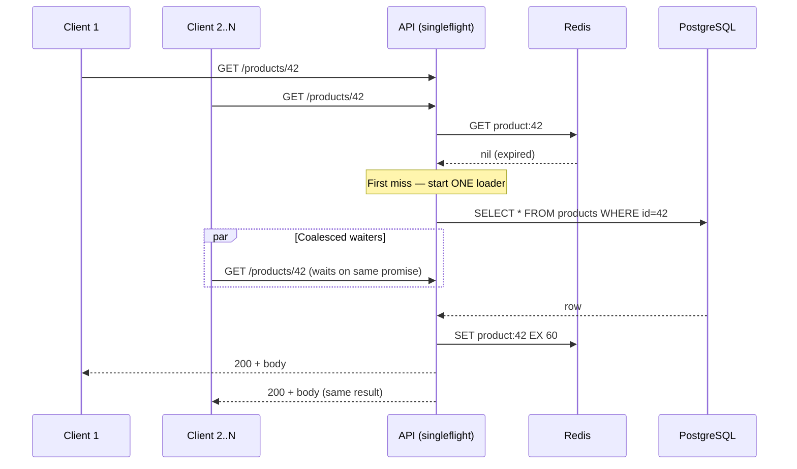

# 2026-07-01 — Thundering Herd and Request Coalescing

> When a hot cache key expires, collapse thousands of identical misses into one database query — stop the stampede before it takes down PostgreSQL.

## Problem

A product page is cached in Redis with a 60-second TTL. At second 61, the key expires. Within 50ms, 2,000 concurrent requests all miss cache and hit PostgreSQL for the same product:

- Database connections spike from 20 to 2,000
- p99 latency jumps from 15ms to 8 seconds
- One slow query × 2,000 copies → cascading timeouts across the fleet

This is the **thundering herd** (cache stampede). It happens on every popular key expiry, deploy cold-start, or viral traffic spike.

## Constraints

- **Scale:** 5k RPS on a handful of hot keys
- **SLA:** p99 read < 50ms even immediately after cache expiry
- **Correctness:** All clients get the same fresh value — no stale split responses
- **Simplicity:** Solution must work in a stateless API tier (multiple pods)

## Architecture



Diagram source: [`diagrams/2026-07-01-thundering-herd-request-coalescing.mmd`](../diagrams/2026-07-01-thundering-herd-request-coalescing.mmd)

### Components

| Component | Role |
|-----------|------|
| **Singleflight** | In-process dedup — concurrent callers share one in-flight loader |
| **Distributed lock** (optional) | Cross-pod coalescing via `SET lock:product:42 NX` |
| **Stale-while-revalidate** | Serve expired value while one worker refreshes in background |
| **Jittered TTL** | `TTL = base + random(0, 10%)` — keys don't all expire at once |
| **Probabilistic early refresh** | Refresh before expiry when load is high (XFetch algorithm) |

### In-process singleflight (Go / Node)

```typescript
const inflight = new Map<string, Promise<Product>>();

async function getProduct(id: string): Promise<Product> {
  const cached = await redis.get(`product:${id}`);
  if (cached) return JSON.parse(cached);

  if (!inflight.has(id)) {
    inflight.set(id, loadAndCache(id).finally(() => inflight.delete(id)));
  }
  return inflight.get(id)!;
}

async function loadAndCache(id: string): Promise<Product> {
  const row = await db.query('SELECT * FROM products WHERE id = $1', [id]);
  await redis.set(`product:${id}`, JSON.stringify(row), 'EX', 60);
  return row;
}
```

Works within one pod. Across 50 pods you still get up to 50 concurrent DB hits on expiry — usually acceptable. For truly hot keys, add a distributed lock.

### Stale-while-revalidate

```typescript
const entry = await redis.get(`product:${id}`);
if (entry) {
  const { value, fetchedAt } = JSON.parse(entry);
  const age = Date.now() - fetchedAt;
  if (age < 60_000) return value;           // fresh
  if (age < 120_000) {
    refreshInBackground(id);                 // serve stale, one async refresh
    return value;
  }
}
return loadAndCache(id);                     // hard miss
```

Clients never wait on refresh. Only one background job runs per key if you guard it with singleflight or a lock.

### Jittered TTL

```typescript
const ttl = 60 + Math.floor(Math.random() * 6); // 60–65s
await redis.set(key, value, 'EX', ttl);
```

Spreads expiry times so 10,000 keys don't expire in the same second after a bulk warm.

## Trade-offs

| Choice | Pros | Cons |
|--------|------|------|
| **Singleflight (in-process)** | Zero extra infra; trivial to add | Doesn't coalesce across pods |
| **Distributed lock on miss** | One DB hit cluster-wide | Lock contention on hottest keys |
| **Stale-while-revalidate** | Zero user-visible latency on refresh | Clients may see slightly stale data |
| **Probabilistic early refresh** | Smooth load; no expiry cliff | More complex; tuning required |

## When to use

- ✅ Hot keys with short TTL (product pages, config, rate-limit counters)
- ✅ Cache-aside pattern where expiry causes measurable DB spikes
- ✅ Read-heavy APIs where the same resource is fetched thousands of times per second

- ❌ Don't add singleflight to every endpoint — only keys with measurable stampede risk
- ❌ Don't use a distributed lock without TTL — a crashed holder blocks all refreshes
- ❌ Don't set identical TTLs on millions of keys warmed at deploy time — always jitter

## References

- [Go singleflight package](https://pkg.go.dev/golang.org/x/sync/singleflight)
- [Facebook — Scaling Memcache at Facebook (lease/get)](https://www.usenix.org/conference/nsdi13/technical-sessions/presentation/nishtala)
- [AWS — Caching best practices](https://docs.aws.amazon.com/AmazonElastiCache/latest/red-ug/Strategies.html)

---

**Tags:** `#caching` `#redis` `#performance` `#scaling` `#patterns`
