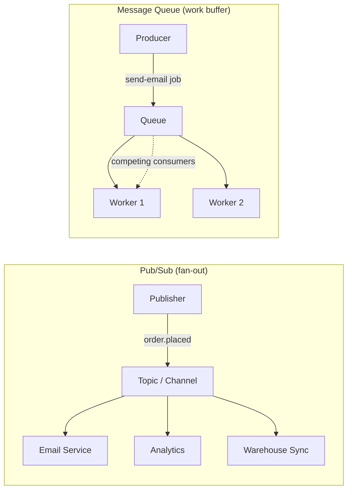

# 2026-07-02 — Pub/Sub vs Message Queues

> Fan-out events to many subscribers, or buffer work for one consumer — pick the wrong primitive and you lose messages, duplicate work, or build the wrong scaling model.

## Problem

A team needs to notify three downstream systems when an order is placed: send email, update analytics, and sync to a warehouse. They put the event on a **queue** (SQS / RabbitMQ). Only one consumer receives it — the email service. Analytics and warehouse never see the order.

Another team uses **Pub/Sub** (Redis Pub/Sub) for payment processing. The payment worker is restarting during deploy. The message is published, no subscriber is connected — **the payment is lost**.

Same transport family, opposite guarantees. The choice depends on delivery semantics, not brand.

## Constraints

- **Fan-out:** One order event must reach 3–10 independent consumers
- **Durability:** Payment and inventory events must survive consumer downtime
- **Ordering:** Per-order sequence must be preserved for inventory
- **Scale:** 50k events/sec peak; consumers scale independently

## Architecture



Diagram source: [`diagrams/2026-07-02-pubsub-vs-message-queues.mmd`](../diagrams/2026-07-02-pubsub-vs-message-queues.mmd)

### Comparison

| | Pub/Sub | Message Queue |
|--|---------|---------------|
| **Delivery** | Push to all current subscribers | One consumer per message (competing consumers) |
| **Persistence** | Fire-and-forget (Redis Pub/Sub); durable in Kafka/SNS | Durable until ACK (SQS, RabbitMQ, Kafka consumer group) |
| **Replay** | No (unless log-based like Kafka) | Yes — re-read from offset or DLQ |
| **Backpressure** | Slow subscriber drops messages (Redis) or lags (Kafka) | Queue buffers; consumer pulls at own pace |
| **Ordering** | No global order across subscribers | Per-partition or FIFO queue order |
| **Best for** | Notifications, cache invalidation, event broadcast | Job processing, task queues, async workflows |

### Pub/Sub — when each subscriber needs the same event

```typescript
// NestJS EventEmitter (in-process) or Redis Pub/Sub (cross-service)
await eventBus.publish('order.placed', { orderId, userId, total });

// Three independent handlers — all receive the event
@OnEvent('order.placed')
async sendConfirmationEmail(payload) { ... }

@OnEvent('order.placed')
async trackAnalytics(payload) { ... }

@OnEvent('order.placed')
async syncToWarehouse(payload) { ... }
```

**Kafka as durable pub/sub:** Each consumer group is an independent subscriber. The log retains messages; each group tracks its own offset. This is pub/sub semantics with queue-like durability.

### Message Queue — when one worker must process each unit of work

```typescript
// Producer enqueues a job
await queue.add('send-email', { to, template, data }, {
  attempts: 3,
  backoff: { type: 'exponential', delay: 5000 },
});

// Worker — competing consumers; each job processed once
@Processor('send-email')
async handle(job: Job) {
  await mailer.send(job.data);
}
```

**SQS FIFO:** Adds ordering + exactly-once processing within a message group — hybrid of queue and ordered stream.

### Decision matrix

| Use case | Choose |
|----------|--------|
| Invalidate cache on 5 services after write | Pub/Sub (Redis, SNS, NATS) |
| Process 10k image resize jobs | Queue (SQS, BullMQ, RabbitMQ) |
| Audit log consumed by 4 teams independently | Kafka (log-based pub/sub) |
| Payment capture — must not lose message | Queue with durable ACK + DLQ |
| Real-time dashboard tick | Pub/Sub (loss acceptable) |

### Hybrid pattern — outbox + fan-out

```
1. Write order to DB + outbox row (same transaction)
2. Outbox relay publishes to Kafka topic
3. Kafka → consumer group A (email)
4. Kafka → consumer group B (analytics)
5. Kafka → consumer group C (warehouse)
```

One durable write, many independent consumers, replay on failure. This is how most production event-driven systems actually work.

## Trade-offs

| Choice | Pros | Cons |
|--------|------|------|
| **Redis Pub/Sub** | Sub-millisecond; trivial setup | No persistence; subscriber must be online |
| **SNS / NATS** | Managed fan-out; filtering | No replay without extra storage |
| **SQS / RabbitMQ** | Durable; ACK-based; DLQ built-in | One consumer per message — not fan-out natively |
| **Kafka** | Durable log + independent consumer groups | Operational complexity; overkill for simple jobs |

## When to use

- ✅ **Pub/Sub** when N services must react to the same event independently
- ✅ **Queue** when work must be processed exactly once by one worker
- ✅ **Kafka** when you need both — durable fan-out with replay and per-consumer offsets

- ❌ Don't use Redis Pub/Sub for anything that can't be lost (payments, inventory)
- ❌ Don't use a queue when you need fan-out — you'll duplicate messages manually and regret it
- ❌ Don't confuse Kafka "topics" with queues — consumer groups make it pub/sub; a single group with competing consumers makes it a queue

## References

- [AWS — SNS vs SQS](https://aws.amazon.com/sns/faqs/)
- [RabbitMQ — Pub/Sub vs Work Queues](https://www.rabbitmq.com/tutorials)
- [Kafka — Consumer Groups](https://kafka.apache.org/documentation/#consumerconfigs)

---

**Tags:** `#messaging` `#pubsub` `#queues` `#kafka` `#event-driven` `#architecture`
