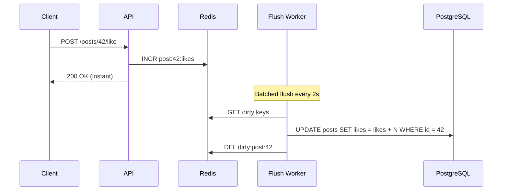

# 2026-07-03 — Write-Behind Caching

> Acknowledge writes immediately by updating cache first and flushing to the database asynchronously — trade consistency for write throughput when the database is the bottleneck.

## Problem

A social feed records every like with a write-through cache. Each like updates Redis **and** PostgreSQL synchronously:

- Write p99 = 45ms (cache) + 80ms (DB) = 125ms
- Viral post gets 10k likes/sec → PostgreSQL saturates at 3k writes/sec
- Users see spinner on a button that should feel instant

Write-through optimises read freshness. Write-behind optimises write throughput.

## Constraints

- **Throughput:** 10k counter updates/sec on hot keys
- **Latency:** Write ACK < 10ms to the client
- **Durability:** Losing up to 5 seconds of increments on crash is acceptable
- **Consistency:** Eventual — readers may see slightly stale counts for a few seconds

## Architecture



Diagram source: [`diagrams/2026-07-03-write-behind-caching.mmd`](../diagrams/2026-07-03-write-behind-caching.mmd)

### Components

| Component | Role |
|-----------|------|
| **Cache (write target)** | First write destination — client gets ACK here |
| **Dirty set** | Tracks keys pending flush (`SADD dirty:keys post:42:likes`) |
| **Flush worker** | Batch-reads dirty keys, writes to DB, clears dirty flag |
| **Flush interval** | Time window before DB sync (1–5s typical) |
| **Crash recovery** | On restart, re-flush all dirty keys before accepting new writes |

### Implementation sketch

```typescript
async function likePost(postId: string): Promise<number> {
  const key = `post:${postId}:likes`;
  const count = await redis.incr(key);
  await redis.sadd('dirty:keys', key);
  return count;
}

// Flush worker — runs every 2 seconds
async function flushDirtyKeys() {
  const keys = await redis.smembers('dirty:keys');
  for (const key of keys) {
    const delta = await redis.getset(key, 0); // atomic read-and-reset
    if (!delta || delta === '0') continue;

    const postId = key.split(':')[1];
    await db.query(
      'UPDATE posts SET likes = likes + $1 WHERE id = $2',
      [Number(delta), postId],
    );
    await redis.srem('dirty:keys', key);
  }
}
```

Use `GETSET` or a Lua script to atomically read the accumulated delta and reset the counter — two separate commands risk losing increments.

### Write-behind vs write-through vs cache-aside

| Pattern | Write path | Read freshness | Durability risk |
|---------|-----------|----------------|-----------------|
| **Cache-aside** | DB first, invalidate cache | Stale until next read | Low |
| **Write-through** | Cache + DB synchronously | Fresh | Low |
| **Write-behind** | Cache first, DB async | Slightly stale | Medium — window before flush |

## Trade-offs

| Choice | Pros | Cons |
|--------|------|------|
| **Write-behind** | Fast writes; batches DB load | Data loss window on crash; harder to reason about |
| **Write-through** | Always consistent | DB is on every write path |
| **Counter in Redis only** | Maximum speed | No durable source of truth without periodic snapshots |

### Data loss window

If the API pod crashes after `INCR` but before the flush worker runs, those increments exist only in Redis. Mitigate with:
- Redis AOF persistence (`appendfsync everysec`)
- Shorter flush intervals on critical counters
- Accept the loss for non-critical metrics (view counts, likes)

## When to use

- ✅ High-frequency counter increments (likes, views, analytics)
- ✅ Write-heavy workloads where DB is the bottleneck
- ✅ Data where seconds of staleness or small loss is acceptable

- ❌ Don't use for financial balances, inventory, or anything requiring strong consistency
- ❌ Don't flush one row at a time — batch or you'll recreate the DB bottleneck
- ❌ Don't skip the dirty-set tracking — you need to know what hasn't been flushed

## References

- [AWS — Caching strategies (write-behind)](https://docs.aws.amazon.com/AmazonElastiCache/latest/red-ug/Strategies.html)
- [Martin Fowler — Patterns of Enterprise Application Architecture](https://martinfowler.com/eaaCatalog/)

---

**Tags:** `#caching` `#redis` `#performance` `#write-path` `#eventual-consistency`
