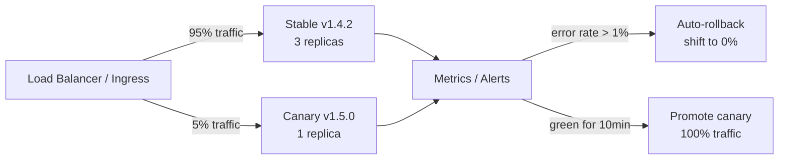

# 2026-07-04 — Canary Deployments

> Route a small slice of real traffic to a new version first — catch regressions on 1% of users before the other 99% ever see the broken build.

## Problem

Blue-green deploys swap 100% of traffic instantly. If the new version has a subtle bug — a memory leak, a wrong default, a broken edge case — every user hits it at once. Rollback takes minutes. Incident declared.

Feature flags gate behaviour inside one binary. Canary deploys gate **the entire binary** — a separate deployment running alongside stable, receiving a controlled traffic share.

## Constraints

- **Blast radius:** At most 1–5% of users on new version during validation
- **Rollback:** < 30 seconds to shift traffic back to stable
- **Metrics:** Error rate and latency compared per version in real time
- **Automation:** Auto-promote on green metrics; auto-rollback on red

## Architecture



Diagram source: [`diagrams/2026-07-04-canary-deployments.mmd`](../diagrams/2026-07-04-canary-deployments.mmd)

### Components

| Component | Role |
|-----------|------|
| **Stable deployment** | Current production version; receives majority traffic |
| **Canary deployment** | New version; receives small traffic slice |
| **Traffic splitter** | Ingress weight, service mesh VirtualService, or LB rule |
| **Metric gates** | Compare error rate, p99 latency, business KPIs per version |
| **Promotion / rollback** | Automated or manual traffic weight adjustment |

### Kubernetes + Istio canary

```yaml
apiVersion: networking.istio.io/v1beta1
kind: VirtualService
metadata:
  name: api
spec:
  hosts:
    - api
  http:
    - route:
        - destination:
            host: api
            subset: stable
          weight: 95
        - destination:
            host: api
            subset: canary
          weight: 5
```

Shift weights gradually: 5% → 25% → 50% → 100% over 30–60 minutes if metrics stay green.

### Argo Rollouts — automated analysis

```yaml
apiVersion: argoproj.io/v1alpha1
kind: Rollout
metadata:
  name: api
spec:
  strategy:
    canary:
      steps:
        - setWeight: 5
        - pause: { duration: 10m }
        - setWeight: 25
        - pause: { duration: 10m }
        - setWeight: 100
      analysis:
        templates:
          - templateName: error-rate-check
        startingStep: 1
```

Argo queries Prometheus during each pause. If error rate on canary exceeds stable by > 1%, rollout aborts automatically.

### What to compare during canary

| Metric | Threshold |
|--------|-----------|
| HTTP 5xx rate | Canary ≤ stable + 0.5% |
| p99 latency | Canary ≤ stable × 1.2 |
| Business KPI | Conversion, checkout success — no drop > 2% |
| Memory / CPU | No leak trend on canary pods |

## Trade-offs

| Choice | Pros | Cons |
|--------|------|------|
| **Canary** | Small blast radius; real traffic validation | Two versions running; metric plumbing required |
| **Blue-green** | Instant cutover; simple mental model | 100% exposure on switch |
| **Rolling update** | No extra replicas | Mixed versions during rollout; hard to isolate metrics |
| **Feature flags** | Granular per-feature control | Same binary — can't catch infra-level regressions |

### Canary vs feature flags

They complement each other:
- **Canary** validates the new binary (memory, startup, dependency versions)
- **Feature flags** validate new behaviour inside a proven binary

Run canary first, then enable flags progressively inside the promoted version.

## When to use

- ✅ Any production deploy where a bad release affects all users
- ✅ Services with measurable error rate and latency in Prometheus/Datadog
- ✅ Teams doing daily deploys who need confidence without full blue-green cost

- ❌ Don't canary without automated rollback — manual detection is too slow
- ❌ Don't promote on latency alone — check business metrics too
- ❌ Don't run canary at 5% for 5 minutes and call it done — need enough traffic for statistical significance

## References

- [Argo Rollouts — Canary](https://argo-rollouts.readthedocs.io/en/stable/features/canary/)
- [Istio — Traffic management](https://istio.io/latest/docs/concepts/traffic-management/)
- [Google SRE — Canary releases](https://sre.google/workbook/canarying-releases/)

---

**Tags:** `#deployment` `#canary` `#kubernetes` `#istio` `#reliability` `#progressive-delivery`
