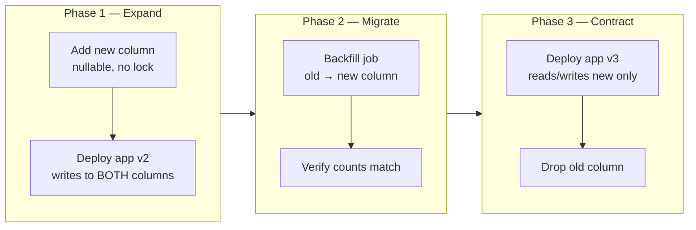

# 2026-07-05 — Zero-Downtime Database Migrations

> Rename a column, split a table, or change a type without locking users out — use the expand/contract pattern so old and new code coexist during rollout.

## Problem

`ALTER TABLE users RENAME COLUMN name TO full_name` runs in 200ms on staging. In production — 80M rows, active traffic — Postgres takes an `ACCESS EXCLUSIVE` lock. Every read and write blocks for 4 minutes. Deploy is rolled back. Team learns the hard way that schema changes are deploys.

## Constraints

- **Availability:** Zero user-visible downtime during migration
- **Compatibility:** Old and new app versions must run simultaneously during rollout
- **Rollback:** Must be able to revert app code without reverting schema
- **Data integrity:** No orphaned rows or partial transforms

## Architecture



Diagram source: [`diagrams/2026-07-05-zero-downtime-database-migrations.mmd`](../diagrams/2026-07-05-zero-downtime-database-migrations.mmd)

### The expand/contract pattern

Each breaking schema change is split into three safe phases:

**1. Expand** — add new structure; old code ignores it
```sql
ALTER TABLE users ADD COLUMN full_name TEXT;  -- instant, no rewrite
```

**2. Migrate** — backfill data; dual-write from app
```sql
-- Backfill in batches to avoid long locks
UPDATE users SET full_name = name
WHERE id BETWEEN $1 AND $2 AND full_name IS NULL;
```

**3. Contract** — remove old structure after all code uses new
```sql
ALTER TABLE users DROP COLUMN name;  -- safe once nothing reads it
```

### Dual-write during transition

```typescript
// App v2 — writes to both columns during migration
async function updateUser(id: string, fullName: string) {
  await db.query(
    'UPDATE users SET name = $1, full_name = $1 WHERE id = $2',
    [fullName, id],
  );
}

// App v3 — reads new column only
async function getUser(id: string) {
  return db.query('SELECT full_name FROM users WHERE id = $1', [id]);
}
```

Deploy order: expand schema → deploy v2 (dual-write) → backfill → deploy v3 (new only) → contract schema.

### Safe vs dangerous operations

| Operation | Lock type | Safe approach |
|-----------|-----------|---------------|
| `ADD COLUMN nullable` | Brief | Do directly — fast on PG 11+ |
| `ADD COLUMN NOT NULL` | Rewrite | Add nullable → backfill → `SET NOT NULL` |
| `RENAME COLUMN` | Exclusive | Add new → dual-write → drop old |
| `CHANGE TYPE` | Rewrite | Add new column → backfill → swap |
| `ADD INDEX` | Share lock | `CREATE INDEX CONCURRENTLY` |
| `DROP COLUMN` | Exclusive | Stop reading first → deploy → then drop |
| `ADD FOREIGN KEY` | Share lock | `NOT VALID` → `VALIDATE CONSTRAINT` separately |

### Backfill without melting the DB

```sql
-- Batch backfill with sleep between batches
DO $$
DECLARE
  batch_size INT := 1000;
  last_id BIGINT := 0;
BEGIN
  LOOP
    UPDATE users SET full_name = name
    WHERE id > last_id AND full_name IS NULL
    ORDER BY id LIMIT batch_size
  RETURNING id INTO last_id;

    EXIT WHEN NOT FOUND;
    PERFORM pg_sleep(0.1);  -- throttle
  END LOOP;
END $$;
```

Run during low traffic. Monitor replication lag if backfill runs against a primary with replicas.

## Trade-offs

| Choice | Pros | Cons |
|--------|------|------|
| **Expand/contract** | Zero downtime; rollback-friendly | 3 deploy cycles per change; temporary redundancy |
| **Maintenance window** | Simple; one-shot ALTER | Downtime; unacceptable for most SaaS |
| **Online schema change tools** (gh-ost, pg-osc) | Automated expand/contract | Extra tooling; still need dual-write discipline |

## When to use

- ✅ Any production schema change on a table with active traffic
- ✅ Column renames, type changes, table splits, adding NOT NULL constraints
- ✅ Teams deploying multiple times per day — schema and code must decouple

- ❌ Don't rename a column in one deploy — always expand first
- ❌ Don't drop a column while old app versions still SELECT *
- ❌ Don't backfill 80M rows in one transaction — batch and throttle

## References

- [Stripe — Online migrations](https://stripe.com/blog/online-migrations)
- [PostgreSQL — CREATE INDEX CONCURRENTLY](https://www.postgresql.org/docs/current/sql-createindex.html#SQL-CREATEINDEX-CONCURRENTLY)
- [GitHub gh-ost](https://github.com/github/gh-ost)

---

**Tags:** `#database` `#migrations` `#postgresql` `#zero-downtime` `#deployment`
