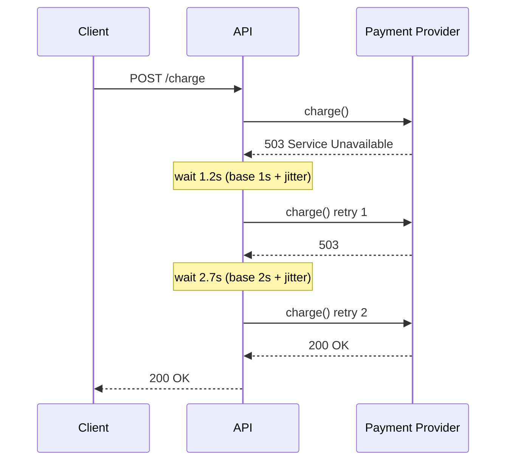

# 2026-07-06 — Exponential Backoff and Jitter

> Retry failed calls with increasing delays and randomised spread — absorb transient failures without synchronised retry storms that take down the recovering service.

## Problem

A payment provider blips for 3 seconds. 500 API servers each retry immediately on failure:

- Second 4: all 500 retry at once → 500 concurrent requests
- Provider is still recovering → all 500 fail again
- Second 5: all 500 retry again simultaneously
- Provider never recovers — **retry storm**

Fixed-interval retries are worse than no retries when failure is correlated across clients.

## Constraints

- **Transient failures:** Network blips, 503s, connection resets — resolve in < 30s
- **Max attempts:** 3–5 retries before giving up or routing to DLQ
- **Total timeout:** Caller must not block longer than upstream SLA allows
- **Thundering herd:** Retries from N clients must not align on the same millisecond

## Architecture



Diagram source: [`diagrams/2026-07-06-exponential-backoff-jitter.mmd`](../diagrams/2026-07-06-exponential-backoff-jitter.mmd)

### The formula

```
delay = min(cap, base × 2^attempt) + random(0, delay × jitter_factor)

Example: base=1s, cap=30s, jitter=0.5
  attempt 0: 1s  + random(0, 0.5s)  → 1.0–1.5s
  attempt 1: 2s  + random(0, 1.0s)  → 2.0–3.0s
  attempt 2: 4s  + random(0, 2.0s)  → 4.0–6.0s
  attempt 3: 8s  + random(0, 4.0s)  → 8.0–12.0s
```

**Full jitter** (AWS recommended): `delay = random(0, min(cap, base × 2^attempt))` — spreads retries across the entire window, not just the upper half.

### Implementation sketch

```typescript
async function withRetry<T>(
  fn: () => Promise<T>,
  opts = { maxAttempts: 4, baseMs: 1000, capMs: 30_000 },
): Promise<T> {
  for (let attempt = 0; attempt < opts.maxAttempts; attempt++) {
    try {
      return await fn();
    } catch (err) {
      if (attempt === opts.maxAttempts - 1) throw err;
      if (!isRetryable(err)) throw err;

      const exp = Math.min(opts.capMs, opts.baseMs * 2 ** attempt);
      const delay = Math.random() * exp; // full jitter
      await sleep(delay);
    }
  }
  throw new Error('unreachable');
}

function isRetryable(err: unknown): boolean {
  const status = (err as any)?.response?.status;
  return !status || status === 429 || status >= 500;
}
```

### What to retry vs not

| Retry | Don't retry |
|-------|-------------|
| 408, 429, 500, 502, 503, 504 | 400, 401, 403, 404, 422 |
| Connection reset, timeout | Business logic errors |
| Idempotent operations (GET, PUT with key) | Non-idempotent POST without idempotency key |

Always pair retries on mutating operations with **idempotency keys** — a network timeout after the server processed the request means the retry is a duplicate.

### Jitter prevents alignment

```
Without jitter — 500 clients, all fail at t=0:
  t=1s: 500 retries hit provider simultaneously

With full jitter — 500 clients:
  t=0.1–1.0s: retries spread across 1 second
  Provider handles ~50/sec instead of 500 at once
```

## Trade-offs

| Choice | Pros | Cons |
|--------|------|------|
| **Exponential + full jitter** | Spreads load; proven at AWS scale | Longer tail latency on persistent failures |
| **Fixed interval** | Predictable timing | Retry storms on correlated failures |
| **Exponential, no jitter** | Better than fixed | All clients still align on same backoff window |
| **Circuit breaker + retry** | Stops retrying when provider is clearly down | More moving parts |

Combine with circuit breaker: after N consecutive failures, stop retrying for 30s and fail fast. Retries resume when circuit half-opens.

## When to use

- ✅ Any HTTP client calling external APIs or internal microservices
- ✅ Message queue consumers retrying failed jobs
- ✅ Database connection re-establishment after failover

- ❌ Don't retry 4xx errors (except 429) — they won't succeed on retry
- ❌ Don't retry without idempotency keys on payment or order creation
- ❌ Don't set maxAttempts=10 with no cap — total wait can exceed minutes

## References

- [AWS — Exponential Backoff And Jitter](https://aws.amazon.com/blogs/architecture/exponential-backoff-and-jitter/)
- [Google Cloud — Retry strategy](https://cloud.google.com/iot/docs/how-tos/exponential-backoff)
- [Polly (.NET) / axios-retry — library implementations](https://github.com/softonic/axios-retry)

---

**Tags:** `#resilience` `#retries` `#networking` `#patterns` `#reliability`
