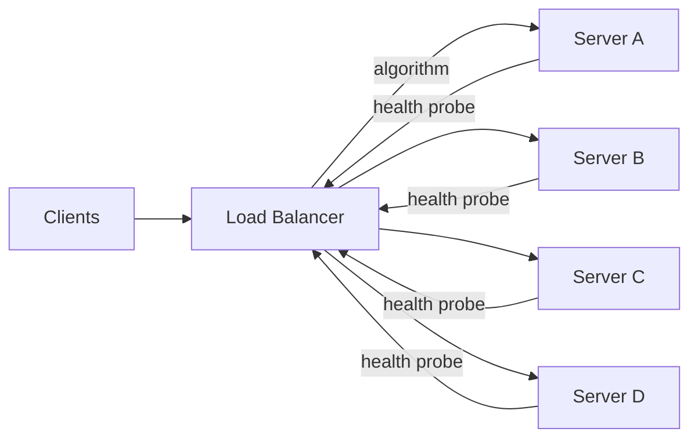

# 2026-07-07 — Load Balancing Strategies

> Distribute incoming traffic across healthy backends — pick the wrong algorithm and one server handles 80% of load while three others sit idle.

## Problem

Four API servers sit behind a load balancer. Round-robin sends request 1 to A, 2 to B, 3 to C, 4 to D — evenly distributed. But:

- Server A holds 200 open WebSocket connections (long-lived)
- Servers B, C, D each hold 10 connections
- Round-robin keeps sending new HTTP requests to A because it "looks" equally loaded by request count
- Server A runs out of memory and OOMs

Request count ≠ load. The algorithm must match the workload shape.

## Constraints

- **Scale:** 8 backends, 20k RPS, mixed short HTTP and long-lived connections
- **Health:** Unhealthy backends removed within 5 seconds
- **Stickiness:** Some sessions must land on the same backend (WebSocket, local cache)
- **Fairness:** No backend should exceed 150% of average load for > 30 seconds

## Architecture



Diagram source: [`diagrams/2026-07-07-load-balancing-strategies.mmd`](../diagrams/2026-07-07-load-balancing-strategies.mmd)

### Algorithms

| Algorithm | How it works | Best for |
|-----------|-------------|----------|
| **Round robin** | Rotate through backends in order | Stateless, equal-cost requests |
| **Weighted round robin** | Round robin with capacity weights | Mixed instance sizes (2x CPU = 2x weight) |
| **Least connections** | Route to backend with fewest active connections | Long-lived connections, variable request duration |
| **Least response time** | Route to backend with lowest p99 latency | Heterogeneous hardware or warm-cache effects |
| **IP hash / consistent hash** | `hash(client_ip) % N` → sticky backend | Session affinity without cookies |
| **Random** | Pick any healthy backend | Simple; statistically fair at high volume |
| **Maglev** | Consistent hashing with minimal disruption on change | Large clusters; CDN-style routing |

### Least connections — why it beats round robin

```
Round robin at t=0 (all servers start fresh):
  A: 200 WS connections (from before LB config change)
  B: 10, C: 10, D: 10

  New request → A (its "turn")
  New request → B
  New request → C
  New request → D
  New request → A again...

Least connections:
  New request → B (10 connections — lowest)
  New request → C
  New request → D
  New request → B
  A drains slowly as WS close; no new HTTP routed there
```

### Sticky sessions

```nginx
# NGINX — cookie-based stickiness
upstream api {
    ip_hash;  # or hash $cookie_sessionid consistent;
    server 10.0.1.1:3000;
    server 10.0.1.2:3000;
    server 10.0.1.3:3000;
}
```

**Trade-off:** Sticky sessions break even load distribution and complicate deploys (draining a sticky backend means waiting for sessions to expire). Prefer external session stores (Redis) over stickiness when possible.

### Health checks

| Check type | What it validates | Risk |
|------------|------------------|------|
| **TCP** | Port is open | Backend accepts connections but app is broken |
| **HTTP** | `GET /health` returns 200 | App is alive but DB dependency is down |
| **Deep / readiness** | App + critical dependencies healthy | Slower; may flap on transient DB blips |

Remove unhealthy backends quickly. Re-add slowly (ramp-up period) to avoid thundering herd on a recovering server.

### Layer 4 vs Layer 7

| | L4 (TCP) | L7 (HTTP) |
|--|----------|-----------|
| **Sees** | IP + port | Headers, path, cookies |
| **Routing** | IP hash, round robin | Path-based, header-based, canary weights |
| **Overhead** | Minimal | Parses HTTP; slightly higher latency |
| **Use** | Raw TCP, WebSocket passthrough | REST APIs, canary deploys, path routing |

## Trade-offs

| Choice | Pros | Cons |
|--------|------|------|
| **Round robin** | Simple; stateless | Ignores connection count and server load |
| **Least connections** | Adapts to long-lived and variable-duration requests | Slightly more state in LB |
| **Consistent hash** | Sticky without cookies; minimal remap on scale | Uneven if key distribution is skewed |
| **External LB** (ALB, NGINX) | Battle-tested; health checks built-in | Another component to configure |

## When to use

- ✅ **Least connections** for WebSocket gateways, gRPC, any long-lived connection pool
- ✅ **Weighted round robin** when instance sizes differ (spot + on-demand mix)
- ✅ **Consistent hash** for cache-heavy backends where local state matters
- ✅ **L7** when you need path routing, canary weights, or header-based routing

- ❌ Don't use round robin for workloads with long-lived connections
- ❌ Don't enable stickiness by default — it hides state that should live in Redis
- ❌ Don't use TCP-only health checks for HTTP APIs — you'll route traffic to broken apps

## References

- [NGINX — Load balancing methods](https://docs.nginx.com/nginx/admin-guide/load-balancer/http-load-balancer/)
- [AWS ALB — Target group algorithms](https://docs.aws.amazon.com/elasticloadbalancing/latest/application/load-balancer-target-groups.html)
- [Google Maglev paper](https://research.google/pubs/maglev-a-fast-and-reliable-software-network-load-balancer/)

---

**Tags:** `#load-balancing` `#networking` `#scaling` `#high-availability` `#infrastructure`
