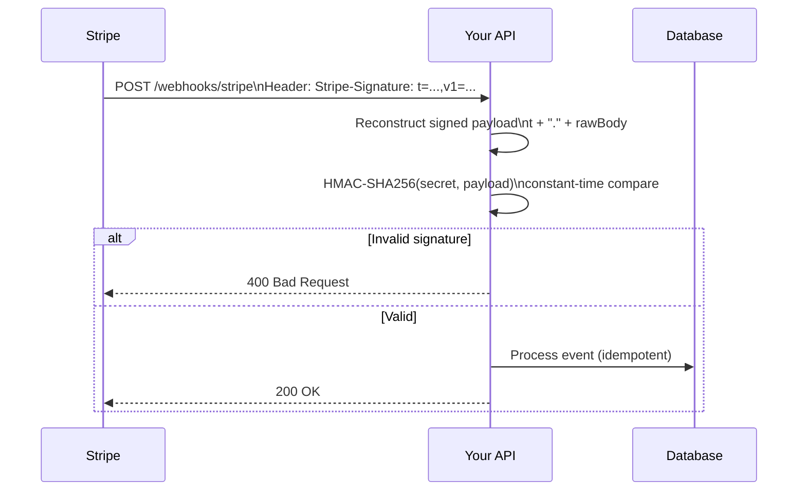

# 2026-07-08 — Webhook Signature Verification

> Prove that an incoming webhook actually came from the sender — reject forged payloads before they trigger payments, account changes, or data corruption.

## Problem

Your API exposes `POST /webhooks/stripe` to receive payment events. An attacker discovers the URL and sends:

```json
{ "type": "payment_intent.succeeded", "data": { "amount": 0, "metadata": { "userId": "attacker" } } }
```

Without verification, your app marks an order as paid. Free product.

Webhooks are public HTTP endpoints. Authentication isn't optional — it's the first line of defense.

## Constraints

- **Security:** Reject any request that fails signature verification — no exceptions
- **Replay protection:** Reject payloads replayed outside a time window (e.g. 5 minutes)
- **Timing safety:** Comparison must be constant-time to prevent timing attacks
- **Idempotency:** Same event delivered twice (retries) must not double-process

## Architecture



Diagram source: [`diagrams/2026-07-08-webhook-signature-verification.mmd`](../diagrams/2026-07-08-webhook-signature-verification.mmd)

### How HMAC signing works

```
signed_payload = timestamp + "." + raw_request_body
signature      = HMAC-SHA256(webhook_secret, signed_payload)
```

Sender includes `timestamp` and `signature` in a header. Receiver:
1. Reads **raw body** (before JSON parsing — whitespace matters)
2. Reconstructs `signed_payload`
3. Computes expected signature with shared secret
4. Compares using constant-time equality
5. Rejects if timestamp is older than tolerance (replay protection)

### Implementation sketch (Stripe-style)

```typescript
import { createHmac, timingSafeEqual } from 'crypto';

function verifyWebhook(
  rawBody: Buffer,
  signatureHeader: string,
  secret: string,
  toleranceSec = 300,
): boolean {
  const parts = Object.fromEntries(
    signatureHeader.split(',').map(p => p.split('=') as [string, string]),
  );

  const timestamp = Number(parts.t);
  const signature = parts.v1;

  if (Math.abs(Date.now() / 1000 - timestamp) > toleranceSec) {
    return false; // replay
  }

  const signedPayload = `${timestamp}.${rawBody.toString('utf8')}`;
  const expected = createHmac('sha256', secret)
    .update(signedPayload)
    .digest('hex');

  const sigBuf = Buffer.from(signature, 'hex');
  const expBuf = Buffer.from(expected, 'hex');

  if (sigBuf.length !== expBuf.length) return false;
  return timingSafeEqual(sigBuf, expBuf);
}

// NestJS — must use raw body, not parsed JSON
@Post('webhooks/stripe')
async handle(@Req() req: RawBodyRequest<Request>) {
  const sig = req.headers['stripe-signature'] as string;
  if (!verifyWebhook(req.rawBody, sig, process.env.STRIPE_WEBHOOK_SECRET)) {
    throw new BadRequestException('Invalid signature');
  }
  const event = JSON.parse(req.rawBody.toString());
  await this.processEventIdempotent(event);
  return { received: true };
}
```

### Critical implementation details

| Mistake | Consequence |
|---------|-------------|
| Parse JSON before verifying | Body bytes change; signature never matches (or you verify the wrong payload) |
| Use `===` for signature compare | Timing attack can forge signature byte-by-byte |
| Skip timestamp check | Attacker replays a captured valid webhook indefinitely |
| No idempotency on event ID | Legitimate retries double-charge or duplicate orders |
| Log the webhook secret | Secret in logs = game over |

### Raw body in NestJS / Express

```typescript
// main.ts — preserve raw body for webhook route only
app.use('/webhooks', express.raw({ type: 'application/json' }));
app.use(express.json()); // other routes parse normally
```

### Idempotency after verification

```typescript
async function processEventIdempotent(event: StripeEvent) {
  const inserted = await db.query(`
    INSERT INTO processed_webhook_events (event_id, type, processed_at)
    VALUES ($1, $2, NOW())
    ON CONFLICT (event_id) DO NOTHING
    RETURNING event_id
  `, [event.id, event.type]);

  if (!inserted.rowCount) return; // already processed — safe retry

  await handleEvent(event);
}
```

Verification proves authenticity. Idempotency handles legitimate duplicates from the sender's retry system.

## Trade-offs

| Choice | Pros | Cons |
|--------|------|------|
| **HMAC-SHA256** | Industry standard; Stripe/GitHub/Shopify use it | Shared secret must be rotated carefully |
| **RSA signature** | Asymmetric — no shared secret on receiver | Heavier; sender must manage key pairs |
| **mTLS** | Transport-level auth | Complex for SaaS webhooks; senders won't support it |
| **IP allowlist** | Simple | IPs change; not sufficient alone |

## When to use

- ✅ Every inbound webhook from a third-party provider (Stripe, GitHub, Shopify, Twilio)
- ✅ Any callback URL that triggers state changes (payments, provisioning, user deletion)
- ✅ Internal service-to-service callbacks exposed over the public internet

- ❌ Don't verify after parsing JSON — always use raw body bytes
- ❌ Don't skip replay protection — captured webhooks are valid forever without timestamp checks
- ❌ Don't return 200 before processing — return 200 after durable idempotency record is written

## References

- [Stripe — Webhook signatures](https://docs.stripe.com/webhooks/signatures)
- [GitHub — Validating webhook deliveries](https://docs.github.com/en/webhooks/using-webhooks/validating-webhook-deliveries)
- [OWASP — Webhook security](https://cheatsheetseries.owasp.org/cheatsheets/Webhook_Security_Cheat_Sheet.html)

---

**Tags:** `#security` `#webhooks` `#hmac` `#api-design` `#authentication`
