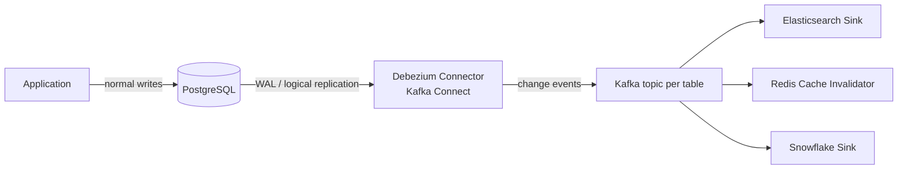

# 2026-07-09 — Change Data Capture with Debezium

> Stream every database change to Kafka by reading the replication log — sync caches, search indexes, and warehouses without polling or dual-writes.

## Problem

Product data lives in PostgreSQL. Three systems need to stay in sync:

- Elasticsearch for search
- Redis for the product cache
- Snowflake for analytics

Naive approaches all fail:

- **Dual-write from app code:** app writes DB then Elasticsearch — a crash between the two leaves them diverged forever
- **Polling `updated_at`:** misses deletes, hammers the DB, and lags by the poll interval
- **Triggers:** add write latency and couple business tables to sync logic

## Constraints

- **Completeness:** Every insert, update, and delete captured — including deletes
- **Ordering:** Changes to the same row arrive in commit order
- **Latency:** Downstream systems updated within 1–2 seconds
- **Zero app changes:** Capture happens below the application layer

## Architecture



Diagram source: [`diagrams/2026-07-09-change-data-capture-debezium.mmd`](../diagrams/2026-07-09-change-data-capture-debezium.mmd)

### Components

| Component | Role |
|-----------|------|
| **WAL (write-ahead log)** | Postgres already records every change here for crash recovery |
| **Logical replication slot** | Postgres feature exposing decoded WAL to consumers |
| **Debezium connector** | Reads the slot, converts changes to structured events, publishes to Kafka |
| **Kafka topics** | One per table (`db.public.products`); keyed by primary key for ordering |
| **Sink connectors / consumers** | Apply changes to Elasticsearch, Redis, warehouse |

### Change event shape

```json
{
  "op": "u",
  "before": { "id": 42, "price": 100, "name": "Widget" },
  "after":  { "id": 42, "price": 120, "name": "Widget" },
  "source": { "table": "products", "lsn": 349835723, "ts_ms": 1752582000000 }
}
```

`op` is `c` (create), `u` (update), `d` (delete), or `r` (snapshot read). Deletes carry `before` — this is what polling can never give you.

### Setup essentials (PostgreSQL)

```sql
-- postgresql.conf
wal_level = logical

-- Create publication for tracked tables
CREATE PUBLICATION dbz_pub FOR TABLE products, orders;
```

```json
// Debezium connector config
{
  "connector.class": "io.debezium.connector.postgresql.PostgresConnector",
  "database.hostname": "pg-primary",
  "table.include.list": "public.products,public.orders",
  "publication.name": "dbz_pub",
  "slot.name": "dbz_slot",
  "snapshot.mode": "initial"
}
```

`snapshot.mode: initial` reads the full table once, then switches to streaming the WAL — new consumers get complete state plus the live tail.

### The replication slot trap

A replication slot forces Postgres to **retain WAL** until the consumer confirms it. If Debezium is down for a weekend:

- WAL accumulates → disk fills → **database goes read-only or crashes**

Monitor `pg_replication_slots.restart_lsn` lag and alert on slot retention above a threshold. Drop abandoned slots.

## Trade-offs

| Choice | Pros | Cons |
|--------|------|------|
| **CDC (log-based)** | Complete, ordered, includes deletes, no app changes | Kafka Connect infra; slot management |
| **Outbox pattern** | App controls event shape; business-level events | Requires app changes; only captures what you emit |
| **Polling** | No infra | Misses deletes; lag; DB load |
| **App dual-write** | Simple to start | Guaranteed drift on partial failure |

### CDC vs outbox

CDC emits **row-level** changes (`price: 100 → 120`). The outbox pattern emits **domain events** (`ProductRepriced`). Use CDC for data sync (caches, search, warehouse); use outbox when consumers need business meaning. Debezium supports both — its outbox event router reads an outbox table via CDC.

## When to use

- ✅ Keeping search indexes and caches in sync with the primary database
- ✅ Feeding a data warehouse near-real-time without ETL batch windows
- ✅ Migrating off a monolith database — stream changes to the new system while both run

- ❌ Don't consume CDC events as your public API contract — table schema changes will break consumers
- ❌ Don't leave replication slots unmonitored — WAL retention can take down the primary
- ❌ Don't use CDC when you need domain events with business intent — use the outbox pattern

## References

- [Debezium — PostgreSQL connector docs](https://debezium.io/documentation/reference/stable/connectors/postgresql.html)
- [Martin Kleppmann — Turning the database inside out](https://martin.kleppmann.com/2015/11/05/database-inside-out-at-oredev.html)
- [Debezium — Outbox event router](https://debezium.io/documentation/reference/stable/transformations/outbox-event-router.html)

---

**Tags:** `#cdc` `#debezium` `#kafka` `#postgresql` `#data-sync` `#event-driven`
